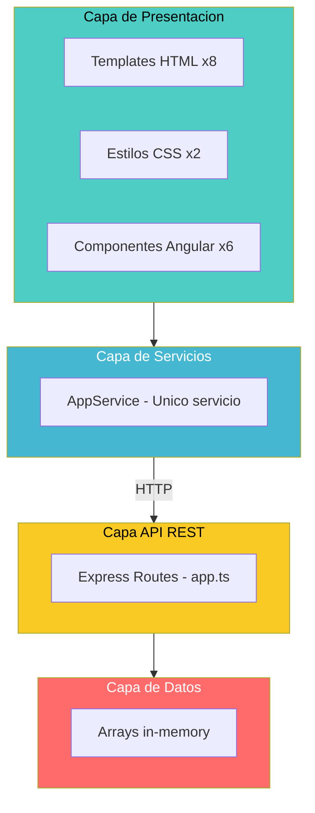

# QuoteFlow — Estructura del Programa

## Árbol Completo del Proyecto

```
quoteflow/
├── backend/
│   ├── package.json                          ← Manifest Node.js (Express 4.16, TS 3.9)
│   ├── tsconfig.json                         ← TypeScript config (target: es6, strict: false)
│   └── src/
│       └── app.ts                            ← GOD FILE: ~700 LOC, todo el backend
│
├── frontend/
│   ├── package.json                          ← Manifest Angular 12.2.13
│   ├── package-lock.json                     ← Lock file (~609KB)
│   ├── angular.json                          ← Angular CLI config
│   ├── tsconfig.json                         ← TS config (strict: false)
│   ├── tsconfig.app.json                     ← TS config compilación app
│   ├── proxy.conf.json                       ← Proxy dev → localhost:3000
│   └── src/
│       ├── index.html                        ← HTML host (CDN Bootstrap + jQuery)
│       ├── main.ts                           ← Bootstrap Angular
│       ├── polyfills.ts                      ← Zone.js import
│       ├── styles.css                        ← Estilos globales (~70 LOC)
│       ├── environments/
│       │   ├── environment.ts                ← Config desarrollo
│       │   └── environment.prod.ts           ← Config producción (idéntico a dev)
│       └── app/
│           ├── app.module.ts                 ← Módulo raíz (todo declarado aquí)
│           ├── app-routing.module.ts         ← Rutas sin guards
│           ├── app.component.ts              ← Shell component
│           ├── app.component.html            ← Navbar + router-outlet
│           ├── app.component.css             ← Estilos shell
│           ├── services/
│           │   └── app.service.ts            ← GOD SERVICE: ~240 LOC, toda la lógica
│           ├── login/
│           │   ├── login.component.ts        ← Auth component (~60 LOC)
│           │   └── login.component.html      ← Template login
│           ├── dashboard/
│           │   ├── dashboard.component.ts    ← Dashboard component (~50 LOC)
│           │   └── dashboard.component.html  ← Template dashboard KPIs
│           ├── clientes/
│           │   ├── clientes.component.ts     ← CRUD clientes (~170 LOC)
│           │   └── clientes.component.html   ← Template clientes
│           ├── catalogo/
│           │   ├── catalogo.component.ts     ← Productos + Listas (~155 LOC)
│           │   └── catalogo.component.html   ← Template catálogo
│           ├── cotizacion/
│           │   ├── cotizacion.component.ts   ← GOD COMPONENT: ~295 LOC
│           │   └── cotizacion.component.html ← Template cotizaciones (mayor HTML)
│           └── aprobacion/
│               ├── aprobacion.component.ts   ← Flujo aprobación (~135 LOC)
│               └── aprobacion.component.html ← Template aprobaciones
```

## Clasificación por Capas



El diagrama muestra la separación lógica en 4 capas, aunque la implementación real concentra la lógica en un servicio (frontend) y un archivo (backend).

## Inventario de Archivos por Tipo

| Tipo | Cantidad | LOC (de _cloc-report.txt) | Archivos |
|------|----------|---------------------------|----------|
| TypeScript | 15 | 1,508 | app.ts, app.module.ts, app-routing.module.ts, app.component.ts, app.service.ts, login.component.ts, dashboard.component.ts, clientes.component.ts, catalogo.component.ts, cotizacion.component.ts, aprobacion.component.ts, main.ts, polyfills.ts, environment.ts, environment.prod.ts |
| HTML | 8 | 1,568 | index.html, app.component.html, login.component.html, dashboard.component.html, clientes.component.html, catalogo.component.html, cotizacion.component.html, aprobacion.component.html |
| CSS | 2 | 70 | styles.css, app.component.css |
| JSON (config) | 8 | 16,398 | 2×package.json, package-lock.json, angular.json, 2×tsconfig.json, tsconfig.app.json, proxy.conf.json |
| **Total** | **33** | **19,544** | — |

## Componentes Principales y Responsabilidades

| Componente | Archivo | LOC aprox | Responsabilidad | Anti-patrón |
|-----------|---------|-----------|-----------------|-------------|
| `app.ts` (backend) | `backend/src/app.ts` | ~700 | Auth + CRUD Clientes + CRUD Productos + CRUD Cotizaciones + Dashboard + Listas Precios | **God File** — toda la app en un archivo |
| `AppService` | `frontend/src/app/services/app.service.ts` | ~240 | Auth + HTTP Clientes + HTTP Productos + HTTP Cotizaciones + Dashboard + Cálculos + Formateo | **God Service** — viola SRP e ISP |
| `CotizacionComponent` | `frontend/src/app/cotizacion/cotizacion.component.ts` | ~295 | Lista + Crear + Detalle + Duplicar + Cambio estado + PDF (simulado) + Email (simulado) | **God Component** — 20+ propiedades |
| `ClientesComponent` | `frontend/src/app/clientes/clientes.component.ts` | ~170 | Lista + Crear + Editar + Detalle + Eliminar + Filtros | Viola SRP (debería ser 3 componentes) |
| `CatalogoComponent` | `frontend/src/app/catalogo/catalogo.component.ts` | ~155 | Productos (CRUD) + Listas de Precios (CRUD) | Viola SRP (2 entidades en 1 componente) |
| `AprobacionComponent` | `frontend/src/app/aprobacion/aprobacion.component.ts` | ~135 | Lista pendientes + Aprobar + Rechazar + Solicitar ajustes | Duplica lógica de CotizacionComponent |

## Dependencias del Proyecto

### Frontend (`frontend/package.json`)

| Dependencia | Versión | Tipo | Propósito |
|-------------|---------|------|-----------|
| @angular/core | ~12.2.13 | Directa | Framework SPA |
| @angular/forms | ~12.2.13 | Directa | Formularios (FormsModule + ReactiveFormsModule) |
| @angular/router | ~12.2.13 | Directa | Enrutamiento |
| @angular/common | ~12.2.13 | Directa | Módulos comunes (HttpClientModule) |
| rxjs | ~6.6.7 | Directa | Observables |
| zone.js | ~0.11.4 | Directa | Change detection |
| tslib | ^2.3.0 | Directa | Helpers TypeScript |
| typescript | ~4.3.5 | Dev | Compilador TS |
| @angular/cli | ~12.2.13 | Dev | Build tooling |
| @angular-devkit/build-angular | ~12.2.13 | Dev | Webpack builder |

### Backend (`backend/package.json`)

| Dependencia | Versión | Tipo | Propósito |
|-------------|---------|------|-----------|
| express | ^4.16.4 | Directa | HTTP framework |
| body-parser | ^1.18.3 | Directa | Parsing JSON/URL-encoded |
| cors | ^2.8.5 | Directa | CORS middleware |
| typescript | ~3.9.10 | Dev | Compilador TS |
| ts-node | ^8.10.2 | Dev | Ejecución TS directa |
| nodemon | ^2.0.7 | Dev | Hot reload desarrollo |
| @types/express | ^4.16.1 | Dev | Tipos Express |
| @types/body-parser | ^1.17.1 | Dev | Tipos body-parser |
| @types/cors | ^2.8.6 | Dev | Tipos CORS |
| @types/node | ^12.12.0 | Dev | Tipos Node.js |

### Dependencias CDN (index.html)

| Recurso | Versión | Propósito |
|---------|---------|-----------|
| Bootstrap CSS | 4.5.2 | Estilos UI |
| Font Awesome | 5.15.4 | Iconografía |
| jQuery slim | 3.5.1 | Dependencia de Bootstrap JS |
| Popper.js | 1.16.1 | Tooltips/Popovers |
| Bootstrap JS | 4.5.2 | Componentes interactivos |

## Hallazgos Clave

- **33 archivos totales** — proyecto pequeño pero con mala distribución de responsabilidades
- **Sin tests**: No se detectaron archivos `*.spec.ts`, ni configuración de Karma/Jasmine, ni Jest
- **Sin lazy loading**: Todas las rutas cargan eagerly en un solo bundle
- **Sin feature modules**: Todo declarado en `AppModule`
- **Sin guards de autenticación**: Rutas protegidas accesibles directamente por URL
- **Sin interceptors HTTP**: No hay manejo centralizado de tokens ni errores
- **Sin interfaces/tipos**: Todo el código usa `any`

## Referencias

- [Visión General del Proyecto](../project-overview.md)
- [Documentación Especializada](../specialized/specialized-documentation.md)
