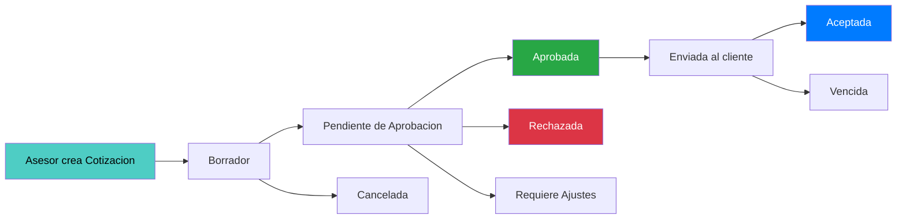

# QuoteFlow — Documentación Especializada

## Integraciones Detectadas desde Archivos de Configuración

### Mapeo Config → Implementación

| Config Key / Archivo | Valor | Consumer | Propósito |
|---------------------|-------|----------|-----------|
| `proxy.conf.json` → `/api` | `http://localhost:3000` | Angular CLI dev server | Proxy de desarrollo: redirige `/api/*` al backend Express |
| `environment.ts` → `apiUrl` | `http://localhost:3000/api` | No consumido (hardcodeado en servicio) | URL del backend (declarada pero ignorada) |
| `environment.prod.ts` → `apiUrl` | `http://localhost:3000/api` | No consumido | Idéntico a dev — sin diferenciación de ambientes |
| `AppService` → `API_URL` | `/api` (hardcodeado como `var`) | `app.service.ts:14` | URL base real usada por HttpClient |
| `backend app.ts` → `PORT` | `3000` | `app.ts:25` | Puerto del servidor Express |
| `angular.json` → `port` | `4200` | Angular CLI serve | Puerto del frontend en desarrollo |

### Inconsistencia Detectada

La URL del API está definida en **3 lugares** con valores diferentes:
1. `environment.ts`: `http://localhost:3000/api` (absoluta, no usada)
2. `app.service.ts`: `/api` (relativa, usada realmente)
3. `proxy.conf.json`: target `http://localhost:3000` (proxy config)

El `environment.ts` se ignora completamente — `AppService` usa una variable `var API_URL = '/api'` hardcodeada.

## Dominio de Negocio

### Contexto: Gestión Comercial B2B

QuoteFlow opera en el dominio de **ventas corporativas B2B** (Business-to-Business) para una empresa que vende software, servicios de consultoría y hardware. El flujo de negocio detectado:

El diagrama muestra la máquina de estados de una cotización, que transita por hasta 9 estados diferentes según las acciones del asesor y el supervisor.

### Entidades del Dominio

| Entidad | Campos Principales | Relaciones |
|---------|-------------------|------------|
| **Cliente** | id, identificación (NIT), razónSocial, contacto, correo, teléfono, dirección, condiciónTributaria, estado, totalCotizado | 1 Cliente → N Cotizaciones |
| **Producto** | id, código, nombre, descripción, precio, impuesto, tipo (Producto/Servicio), estado | N Productos → N Items Cotización |
| **Lista de Precios** | id, nombre, segmento, vigenciaDesde, vigenciaHasta, descuentoMáximo, estado | 1 Lista → N Cotizaciones |
| **Cotización** | id, número (COT-YYYY-###), clienteId, asesorId, moneda, vigencia, estado, subtotal, descuento, impuestos, total, items[], historialEstados[] | Composite: contiene Items y Historial |
| **Item Cotización** | productoId, código, nombre, cantidad, precio, descuento, impuesto, subtotal | Embedded en Cotización |
| **Usuario** | id, nombre, email, password (texto plano!), rol | Asesores y Supervisores |

### Condiciones Tributarias Soportadas

- `RESPONSABLE_IVA`
- `NO_RESPONSABLE`
- `GRAN_CONTRIBUYENTE`

### Moneda

Solo se detecta `COP` (Pesos Colombianos) hardcodeado. Sin soporte multi-moneda real.

## Multi-Tenancy

**No detectado.** La aplicación opera para una sola organización. No hay discriminadores de tenant (TenantId, CompanyId, etc.) ni configuraciones por empresa.

## Particularidades del Dominio

### Regulación Colombiana

El sistema incluye conceptos del régimen tributario colombiano:
- **NIT** como identificación de clientes (formato `XXXXXXXXX-Y`)
- **Condiciones tributarias** según DIAN (Responsable IVA, Gran Contribuyente)
- **IVA del 19%** como impuesto default (magic number en código)
- **Moneda COP** con formato `$ X.XXX.XXX` usando `toLocaleString('es-CO')`

### Flujo de Aprobación

El sistema implementa un flujo de aprobación de cotizaciones:
- Descuentos por encima del máximo de la lista de precios requieren aprobación del supervisor
- El supervisor puede: Aprobar, Rechazar (con motivo obligatorio), o Solicitar ajustes
- No hay validación de transiciones de estado — cualquier cambio es permitido por el backend

### Funcionalidades Simuladas

Dos funcionalidades están simuladas con `alert()` sin implementación real:
- **Generación de PDF**: `cotizacion.component.ts` → `generarPDF()` muestra alert
- **Envío de correo**: `cotizacion.component.ts` → `enviarCorreo()` muestra alert

## Herramientas de Transformación Aplicables

| Herramienta | Aplicabilidad | Justificación |
|-------------|--------------|---------------|
| **Angular Migration Guide** (12→17+) | Alta | Angular tiene path de migración oficial con `ng update` |
| **TypeScript Upgrade** (3.9→5.x) | Alta | Upgrade incremental posible |
| **Express → NestJS/Fastify** | Alta | El backend es tan simple que una reescritura es trivial |
| **AWS Amplify / Firebase** | Media | Para reemplazar el backend in-memory con BaaS |
| **Angular Material** | Alta | Reemplazar Bootstrap 4 + jQuery con componentes Angular nativos |
| **nx/monorepo** | Media | Para organizar frontend + backend en un workspace estructurado |

## Configuración de Build

### Frontend Build

- **Builder**: `@angular-devkit/build-angular:browser`
- **Output**: `dist/quoteflow`
- **Bundle budgets**: Warning a 500KB, Error a 1MB (initial bundle)
- **Source maps**: Solo en modo development
- **Optimización**: Solo en production
- **Nota**: Usa `--openssl-legacy-provider` en scripts (indicador de incompatibilidad con Node.js 17+)

### Backend Build

- **Compilador**: `tsc` (TypeScript compiler directo)
- **Output**: `./dist`
- **Target**: ES6
- **Module**: CommonJS
- **Dev**: `nodemon --exec ts-node src/app.ts`
- **Prod**: `node dist/app.js` (requiere `tsc` previo)

## Hallazgos Clave

- **Aplicación deliberadamente defectuosa**: Los comentarios en el código indican que las malas prácticas son intencionadas (texto "MALAS PRACTICAS IMPLEMENTADAS" en `app.ts` línea 3)
- **Sin .gitignore detectado**: No se encontró archivo `.gitignore` en el workspace
- **Sin README**: No hay documentación del proyecto
- **Sin Dockerfile**: Sin containerización
- **Sin CI/CD**: Sin pipelines de integración continua
- **Sin tests**: Cero archivos de test en todo el proyecto
- **jQuery en Angular**: Anti-patrón — jQuery incluido vía CDN en una app Angular

## Referencias

- [Visión General del Proyecto](../project-overview.md)
- [Estructura del Programa](../reference/program-structure.md)
