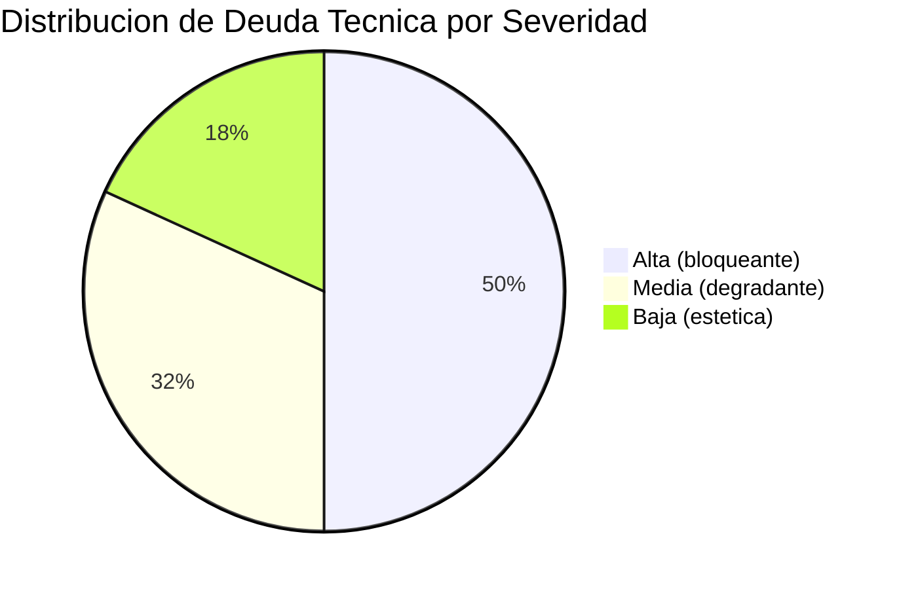

# QuoteFlow — Resumen Ejecutivo de Deuda Técnica

## Veredicto

QuoteFlow es un **prototipo/demostración educativa** con deuda técnica intencional (evidencia: comentario "VERSIONES OBSOLETAS intencionalmente" en `backend/package.json`). No es un sistema de producción y NO debe exponerse a internet ni desplegarse para usuarios reales en su estado actual.

## Distribución de Deuda

| Severidad | Cantidad | % del Total | Impacto Principal |
|---|---|---|---|
| 🔴 Alta | 11 | 50% | Stack EOL, zero seguridad, sin persistencia |
| 🟡 Media | 7 | 32% | Dependencias obsoletas, anti-patterns |
| 🟢 Baja | 4 | 18% | Code style, duplicación menor |
| **Total** | **22** | **100%** | |

## Top 5 Hallazgos Críticos

| # | Hallazgo | Riesgo | Costo de No Actuar |
|---|---|---|---|
| 1 | **Sin persistencia de datos** — arrays in-memory | Pérdida total de datos al reiniciar | Imposibilidad de operar en producción |
| 2 | **Autenticación simulada** — tokens fake sin firma | Zero seguridad, acceso por cualquiera | Exposición completa de datos |
| 3 | **Angular 12 + TypeScript 3.9 EOL** | Sin parches de seguridad desde 2022 | Vulnerabilidades sin fix disponible |
| 4 | **God File backend (700 LOC)** | Imposible testear, escalar o mantener | Parálisis del desarrollo |
| 5 | **0% cobertura de tests** | Cualquier cambio puede romper todo | Riesgo infinito de regresión |

## Recomendación

**Rebuild completo** (~36 días, equipo de 4 personas) con stack moderno:
- Angular 17 + NestJS + PostgreSQL + JWT + Docker
- Costo de rebuild < costo de refactoring incremental (dado el bajo LOC: ~1,578 líneas efectivas)
- Sin datos ni integraciones que migrar — solo requisitos funcionales

## Métricas de Calidad

| Métrica | Valor | Benchmark Industria | Gap |
|---|---|---|---|
| Clean Code Score | 2.7/10 | 6.0/10 | -3.3 |
| Production Readiness | 1/10 | 6.0/10 | -5.0 |
| Scalability | 1/10 | 5.0/10 | -4.0 |
| Test Coverage | 0% | 80% | -80% |
| Security (OWASP) | 3/10 vulnerables | 0 críticos | 7 categorías vulnerables |
| Legacy Readiness | D/D (2 componentes) | A/B | 75% en Seam-Poor o peor |

## Enlaces a Documentación Detallada

- [Deuda Técnica Detallada](technical-debt/summary.md)
- [Componentes Obsoletos](technical-debt/outdated-components.md)
- [Carga de Mantenimiento](technical-debt/maintenance-burden.md)
- [Plan de Remediación](technical-debt/remediation-plan.md)
- [Orden de Migración](migration/component-order.md)

## Referencias

- [Análisis de Deuda Técnica](analysis/tech-debt.md)
- [Production Readiness](analysis/production-readiness.md)
- [Análisis de Seguridad](analysis/security-patterns.md)
- [Modernization Assessment](analysis/modernization-assessment.md)
