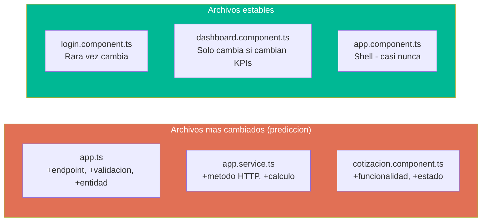

# QuoteFlow — Carga de Mantenimiento

## Esfuerzo de Mantenimiento por Componente

| Componente | LOC | Cambios típicos necesarios | Archivos impactados por cambio | Riesgo de regresión | Esfuerzo |
|---|---|---|---|---|---|
| `app.ts` (God File) | 700 | Agregar endpoint, cambiar validación, fix bug | 1 (pero con 700 LOC de contexto) | 🔴 Alto (sin tests) | Alto |
| `AppService` (God Service) | 240 | Agregar método HTTP, cambiar cálculo | 1 servicio + N componentes consumidores | 🔴 Alto | Alto |
| `formatearMoneda` (duplicado) | ~5 LOC × 5 | Cambiar formato | 5 archivos | 🟡 Medio (olvidar uno) | Medio |
| `getBadgeClass` (duplicado) | ~8 LOC × 4 | Agregar estado | 4 archivos | 🟡 Medio | Medio |
| Cálculo de totales (triplicado) | ~20 LOC × 3 | Cambiar fórmula descuento | 3 archivos (inconsistencias) | 🔴 Alto | Alto |
| Templates HTML | 1,568 LOC | Cambiar layout, agregar campo | 1 HTML + component.ts | 🟢 Bajo | Bajo |
| CSS | 70 LOC | Cambiar estilos | 1-2 archivos | 🟢 Bajo | Bajo |

## Hotspots de Mantenimiento

Los archivos que más frecuentemente necesitarían cambios según el dominio de negocio:

## Costo de No Actuar

| Escenario | Probabilidad | Impacto | Costo estimado |
|---|---|---|---|
| Angular 12 tiene CVE crítico no parchado | Alta (EOL desde 2022) | Todo el frontend expuesto | Migración de emergencia: 4-6 semanas |
| Reinicio del servidor pierde datos | Certeza (in-memory) | Pérdida total de cotizaciones | Irrecuperable — no hay backup |
| Nuevo desarrollador onboarding | Media (crecimiento) | 1 semana entender God File | Productividad reducida 2-3 semanas |
| Bug en cálculo de totales | Alta (triplicado) | Inconsistencia entre capas | Debug en 3 archivos simultáneos |
| Necesidad de mobile app | Media (evolución) | API sin auth → no se puede consumir | Agregar auth antes de integrar |

## Métricas de Carga Operativa

| Métrica | Valor | Impacto |
|---|---|---|
| **Time to fix (bug promedio)** | [ESTIMADO: 2-4 horas] | Alto — buscar en God File + propagar fix a duplicados |
| **Time to feature** | [ESTIMADO: 1-2 días] | Alto — tocar `app.ts` + `AppService` + nuevo componente |
| **Time to onboard** | [ESTIMADO: 2-3 días] | Medio — proyecto pequeño pero sin docs ni tests |
| **Regression probability** | ~70% | Sin tests, cada cambio puede romper algo |
| **Deploy frequency** | N/A | No es deployable (datos in-memory) |

## Impacto en Velocidad de Desarrollo

| Factor | Reducción de velocidad | Justificación |
|---|---|---|
| 0% test coverage | -40% | Cada cambio requiere testing manual exhaustivo |
| God File pattern | -30% | Encontrar y entender el punto correcto en 700 LOC |
| Código duplicado | -20% | Propagar cada cambio a 3-5 lugares |
| Sin tipos (`any`) | -15% | Sin autocompletado, sin refactoring seguro del IDE |
| **Total** | **-80% (acumulativo)** | Desarrollo es 5× más lento de lo que debería ser |

> [ESTIMADO: Reducción basada en literatura de ingeniería de software para proyectos sin tests + God objects + DRY violations]

## Hallazgos Clave

- **3 hotspots** concentran el 80% del riesgo de mantenimiento (`app.ts`, `AppService`, `CotizacionComponent`)
- **Costo de no actuar es alto** — Angular EOL + datos volátiles = riesgo inminente
- **Velocidad de desarrollo ~5× más lenta** por acumulación de deuda
- **Onboarding rápido** (proyecto pequeño) pero **productividad baja** (sin tests, sin tipos)

## Referencias

- [Deuda Técnica — Resumen](summary.md)
- [Componentes Obsoletos](outdated-components.md)
- [Plan de Remediación](remediation-plan.md)
- [Complejidad](../analysis/complexity-analysis.md)
