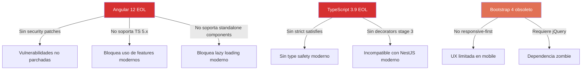

# QuoteFlow — Componentes Obsoletos

## Frameworks en End-of-Life

| Componente | Versión Actual | EOL Date | Versiones Atrás | Evidencia |
|---|---|---|---|---|
| **Angular** | 12.2.13 | Dic 2022 | 5 major (actual: 17+) | `frontend/package.json`:15 |
| **TypeScript** (backend) | 3.9.10 | — | 2 major (actual: 5.5+) | `backend/package.json`:16 |
| **TypeScript** (frontend) | 4.3.5 | — | 1 major (actual: 5.5+) | `frontend/package.json`:25 |
| **@types/node** | 12.12.0 | Node 12 EOL: Abr 2022 | 8 major | `backend/package.json`:19 |

## Dependencias Deprecated

| Paquete | Razón | Alternativa | Archivo |
|---|---|---|---|
| `body-parser` | Integrado en Express 4.16+ | `express.json()` | `backend/package.json`:12 |
| `Popper.js` 1.x (CDN) | Proyecto movido a `@popperjs/core` | npm: `@popperjs/core` | `frontend/src/index.html`:12 |

## Dependencias Innecesarias

| Paquete | Razón de Innecesariedad | Acción |
|---|---|---|
| jQuery 3.5.1 | Angular maneja DOM — jQuery conflicta con change detection | Eliminar |
| Bootstrap JS (CDN) | Solo se usa CSS, no JS components | Eliminar o migrar a npm |

## CDN sin Control de Versiones

| Recurso | Versión CDN | Riesgo |
|---|---|---|
| Bootstrap CSS | 4.5.2 | Sin SRI (Subresource Integrity), supply-chain attack posible |
| Font Awesome | 5.15.4 | Sin SRI |
| jQuery slim | 3.5.1 | Sin SRI + innecesario |
| Popper.js | 1.16.1 | Sin SRI + deprecated |
| Bootstrap JS | 4.5.2 | Sin SRI |

**Evidencia:** `frontend/src/index.html` líneas 8-14 — scripts cargados de CDN sin atributo `integrity`.

## Impacto de Obsolescencia

## Roadmap de Actualización Recomendado

| Prioridad | Componente | Target | Esfuerzo | Prerrequisito |
|---|---|---|---|---|
| P0 | TypeScript 3.9 → 5.x (backend) | TS 5.5 | 1-2 días | Ninguno |
| P1 | Angular 12 → 16+ (frontend) | Angular 17 | 2-3 semanas | TS 5.x en frontend |
| P2 | Eliminar jQuery + Popper CDN | — | 2 horas | Ninguno |
| P3 | Eliminar body-parser | — | 10 minutos | Ninguno |
| P4 | Bootstrap 4 → 5 o Angular Material | BS 5.3 | 1 semana | Angular 16+ |
| P5 | rxjs 6 → 7 | rxjs 7.8 | 2-3 días | Angular 16+ |

## Hallazgos Clave

- **2 frameworks en EOL** que bloquean la modernización (Angular 12, TypeScript 3.9)
- **5 recursos CDN sin SRI** — riesgo de supply-chain attack
- **3 dependencias eliminables inmediatamente** (body-parser, jQuery, Popper)
- **Upgrade path claro** pero requiere ~3-4 semanas de trabajo dedicado

## Referencias

- [Dependency Security Assessment](../analysis/dependency-security-assessment.md)
- [Dependencias del Proyecto](../architecture/dependencies.md)
- [Plan de Remediación](remediation-plan.md)
