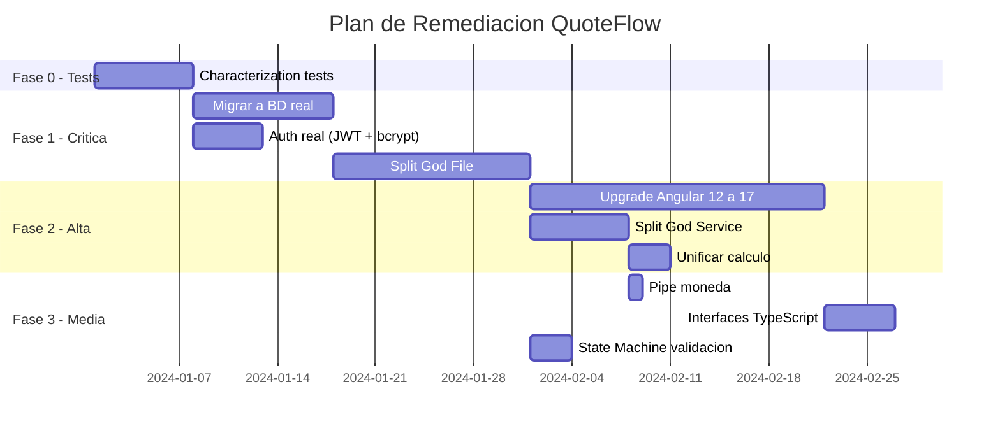

# QuoteFlow — Plan de Remediación

## Principio de Remediación

El plan sigue el framework de Refactoring Patterns (Fowler): cada item de deuda tiene un **smell nombrado** y un **refactoring específico** con mecánica paso a paso.

## Fase 0: Prerequisitos (antes de tocar código)

### DT-05: Agregar Tests de Caracterización

**Smell:** Legacy Code sin safety net
**Refactoring recomendado:** Write Characterization Tests (Feathers)
**Mecánica:**
1. Instalar framework de testing (Jest + Supertest para backend, Jasmine para Angular)
2. Escribir tests que capturen el comportamiento ACTUAL de cada endpoint
3. Escribir tests de cálculo de totales con datos conocidos
4. Golden master del dashboard KPIs
5. Tests de flujo de login/sesión
**Archivos afectados:** Nuevos archivos `*.spec.ts`
**Tests necesarios antes:** N/A (estos SON los primeros tests)
**Riesgo:** Bajo — no modifica código existente

---

## Fase 1: Remediación Crítica (bloquea producción)

### DT-09: Migrar Datos a Base de Datos Real

**Smell:** Temporal Coupling + Volatile State
**Refactoring recomendado:** Extract Data Store + Parameterize Constructor
**Mecánica:**
1. Instalar PostgreSQL (o SQLite para MVP)
2. Crear esquema con tablas: Clientes, Productos, ListasPrecios, Cotizaciones, Usuarios
3. Reemplazar `var CLIENTES: any[]` por queries al ORM (TypeORM o Prisma)
4. Extraer `DataAccess` module separado de handlers HTTP
5. Migrar datos semilla a seeds/migrations
**Archivos afectados:** `app.ts` (mayoritariamente), nuevo módulo `data/`
**Tests necesarios antes:** Characterization tests de Fase 0
**Riesgo:** Medio — cambio fundamental pero con tests de respaldo

### DT-06 + DT-07: Implementar Autenticación Real

**Smell:** Security Through Obscurity + Plaintext Credentials
**Refactoring recomendado:** Replace Type Code with Strategy (para auth) + Extract Class
**Mecánica:**
1. Instalar `bcrypt` — hashear passwords en la BD
2. Instalar `jsonwebtoken` — generar JWT firmados con secret
3. Crear middleware `authMiddleware` que verifica JWT en cada request
4. Aplicar middleware a todos los endpoints excepto `POST /auth/login`
5. Agregar `requireRole('supervisor')` middleware para endpoints de aprobación
**Archivos afectados:** `app.ts`, nuevo `middleware/auth.ts`
**Tests necesarios antes:** Tests de login + tests de endpoints
**Riesgo:** Medio — cambia contrato de API (requiere token en headers)

### DT-03: Extraer God File en Módulos

**Smell:** God Class / Divergent Change
**Refactoring recomendado:** Extract Class → Extract Module
**Mecánica:**
1. **Extract Method** — separar cada grupo de handlers en funciones nombradas
2. **Move Method** — mover funciones a archivos por dominio:
   - `routes/auth.ts` (handlers de auth)
   - `routes/clientes.ts` (handlers de clientes)
   - `routes/productos.ts` (handlers de productos)
   - `routes/cotizaciones.ts` (handlers de cotizaciones)
   - `routes/dashboard.ts` (handler de dashboard)
3. **Extract Class** — crear `services/cotizacion.service.ts` con lógica de cálculo
4. **Parameterize Constructor** — inyectar data access en servicios
5. Dejar `app.ts` solo como configuración + register de rutas
**Archivos afectados:** `app.ts` (split en 7+ archivos)
**Tests necesarios antes:** Characterization tests de TODOS los endpoints
**Riesgo:** Alto — reestructuración masiva, requiere tests completos

---

## Fase 2: Remediación Alta (bloquea escalamiento)

### DT-01: Upgrade Angular 12 → 17+

**Smell:** Outdated Framework (EOL)
**Refactoring recomendado:** Platform Migration (incremental via `ng update`)
**Mecánica:**
1. Actualizar Angular 12 → 13 (`ng update @angular/core@13`)
2. Repetir para 13→14, 14→15, 15→16, 16→17
3. En cada step: corregir breaking changes según migration guide
4. Migrar de `CommonModule` a standalone components (Angular 15+)
5. Actualizar rxjs 6 → 7 (deprecated pipe operators)
6. Eliminar jQuery + Popper CDN
7. Instalar Bootstrap 5 via npm (o migrar a Angular Material)
**Archivos afectados:** Todos los archivos frontend
**Tests necesarios antes:** Tests de componentes (al menos smoke tests)
**Riesgo:** Alto — 5 major upgrades, cada uno con breaking changes

### DT-04: Refactorizar God Service

**Smell:** God Class + Interface Segregation violation
**Refactoring recomendado:** Extract Class por dominio
**Mecánica:**
1. Crear `ClienteService` — extraer métodos de clientes de `AppService`
2. Crear `ProductoService` — extraer métodos de productos
3. Crear `CotizacionService` — extraer métodos de cotizaciones + cálculos
4. Crear `AuthService` — extraer login/logout/sesión
5. Crear `DashboardService` — extraer carga de dashboard
6. Actualizar cada componente para inyectar el servicio específico
7. Eliminar `AppService` cuando esté vacío
**Archivos afectados:** `app.service.ts` (split), todos los componentes (imports)
**Tests necesarios antes:** Characterization tests de servicio
**Riesgo:** Medio — muchos archivos pero cambio mecánico

### DT-11: Unificar Lógica de Cálculo

**Smell:** Shotgun Surgery + DRY violation
**Refactoring recomendado:** Move Method + Extract Function + Single Source of Truth
**Mecánica:**
1. Definir el cálculo SOLO en `CotizacionService` (o backend)
2. Eliminar duplicado en `AppService.calcularTotalesCotizacion()`
3. Eliminar duplicado parcial en `CotizacionComponent`
4. El frontend llama al servicio/backend — una sola fuente de verdad
**Archivos afectados:** `app.service.ts`, `cotizacion.component.ts`, `app.ts`
**Tests necesarios antes:** Tests de cálculo con casos edge (0 items, descuento 100%, etc.)
**Riesgo:** Medio — 3 archivos afectados

---

## Fase 3: Remediación Media (reduce velocidad)

### DT-18: Extraer formatearMoneda como Pipe

**Smell:** Duplicate Code (5 instancias)
**Refactoring recomendado:** Extract Method + Pull Up to Shared Utility → Angular Pipe
**Mecánica:**
1. Crear `pipes/moneda.pipe.ts` con `CurrencyPipe` custom
2. Registrar en `AppModule` (o standalone)
3. Reemplazar cada `formatearMoneda()` en templates por `| moneda`
4. Eliminar el método de cada componente y del servicio
**Archivos afectados:** 5 archivos con duplicado + nuevo pipe
**Tests necesarios antes:** Test unitario del pipe con valores conocidos
**Riesgo:** Bajo — cambio mecánico

### DT-15: Agregar Interfaces TypeScript

**Smell:** Primitive Obsession + No Type Safety
**Refactoring recomendado:** Replace Data Value with Object (Value Types)
**Mecánica:**
1. Crear `models/cliente.interface.ts` con `interface Cliente { ... }`
2. Crear `models/producto.interface.ts`, `cotizacion.interface.ts`, etc.
3. Reemplazar `any[]` por `Cliente[]`, `Producto[]`, etc.
4. Activar `strict: true` en `tsconfig.json` (gradualmente)
5. Corregir errores de tipo resultantes
**Archivos afectados:** Todos (agregar tipos a cada variable/parámetro)
**Tests necesarios antes:** Tests de Fase 0 como safety net
**Riesgo:** Bajo-Medio — muchos archivos pero IDE ayuda con refactoring

### DT-10: Implementar Validación de Transiciones de Estado

**Smell:** Insecure Design + Missing Business Rule
**Refactoring recomendado:** Replace Conditional with State Machine Pattern
**Mecánica:**
1. Crear `services/estado-machine.ts` con mapa de transiciones válidas
2. Método `canTransition(fromState, toState): boolean`
3. En endpoint PUT `/estado`: validar con state machine antes de aplicar
4. Retornar 400 si transición es inválida
5. Agregar tests para cada transición válida e inválida
**Archivos afectados:** `app.ts` (o nuevo `routes/cotizaciones.ts`), nuevo service
**Tests necesarios antes:** Test de cada transición definida en el diagrama
**Riesgo:** Bajo — agrega validación sin romper flujos existentes válidos

## Timeline Estimado

## Hallazgos Clave

- **Fase 0 (tests) es prerequisito obligatorio** — sin tests, todo refactoring es riesgoso
- **Fase 1 toma ~4 semanas** — transforma el prototipo en algo deployable
- **Fase 2 toma ~4 semanas** — elimina la deuda más costosa (Angular upgrade + God Service)
- **Total estimado: 10-12 semanas** para remediar toda la deuda técnica significativa
- **Refactorings nombrados de Fowler** aplicados: Extract Class, Extract Method, Move Method, Parameterize Constructor, Replace Conditional with State Machine

## Referencias

- [Deuda Técnica — Detalle](../analysis/tech-debt.md)
- [Componentes Obsoletos](outdated-components.md)
- [Carga de Mantenimiento](maintenance-burden.md)
- [Complejidad](../analysis/complexity-analysis.md)
