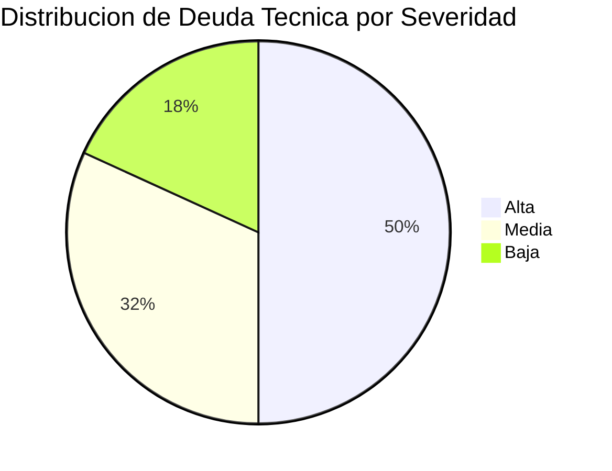
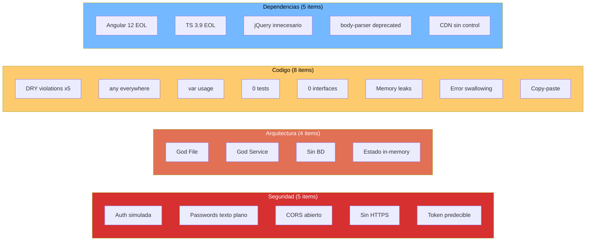

# QuoteFlow — Deuda Técnica: Resumen

## Distribución por Severidad

| Severidad | Cantidad | % Total |
|---|---|---|
| 🔴 Alta | 11 | 50% |
| 🟡 Media | 7 | 32% |
| 🟢 Baja | 4 | 18% |
| **Total** | **22** | 100% |

## Top 5 Issues Críticos

| # | Issue | Impacto | Esfuerzo Remediación |
|---|---|---|---|
| 1 | **Sin persistencia (datos in-memory)** — `app.ts`:32-156 | Reinicio = pérdida total | 1-2 semanas (agregar BD + ORM) |
| 2 | **Auth simulada (fake tokens)** — `app.ts`:165 | No se puede exponer a internet | 1 semana (JWT + middleware) |
| 3 | **God File 700 LOC** — `app.ts` | Imposible testear/escalar/mantener | 2-3 semanas (separar en módulos) |
| 4 | **Angular 12 EOL** — `package.json` | Sin patches de seguridad | 2-3 semanas (upgrade a 16+) |
| 5 | **0% test coverage** — (global) | Ningún cambio es seguro | 1-2 semanas (tests de caracterización) |

## Impacto en Mantenibilidad

| Aspecto | Score | Justificación |
|---|---|---|
| **Facilidad de cambio** | 1/5 | Cambiar formato moneda → editar 5 archivos. Sin tests para validar. |
| **Facilidad de comprensión** | 3/5 | El código tiene nombres en español y es simple, pero God objects ocultan flujo |
| **Facilidad de testing** | 0/5 | 0 tests, 0 interfaces, 0 mocks posibles sin rewrite |
| **Facilidad de deployment** | 0/5 | No es deployable — datos se pierden, sin BD, sin auth |
| **Facilidad de onboarding** | 3/5 | Proyecto pequeño (1,578 LOC efectivas), pero sin documentación inline |

**Score de Mantenibilidad Global: 1.4/5**

## Diagrama de Deuda por Categoría

## Hallazgos Clave

- **50% de la deuda es Alta** — más de la mitad de los problemas bloquean la producción
- **Mantenibilidad 1.4/5** — el sistema es frágil y resistente al cambio
- **Cluster de deuda en seguridad** — 5 items interconectados que requieren remediación conjunta
- **Sin BD = sin producción** — la deuda más fundamental (arquitectónica) bloquea todo lo demás

## Referencias

- [Deuda Técnica — Detalle](../analysis/tech-debt.md)
- [Componentes Obsoletos](outdated-components.md)
- [Carga de Mantenimiento](maintenance-burden.md)
- [Plan de Remediación](remediation-plan.md)
