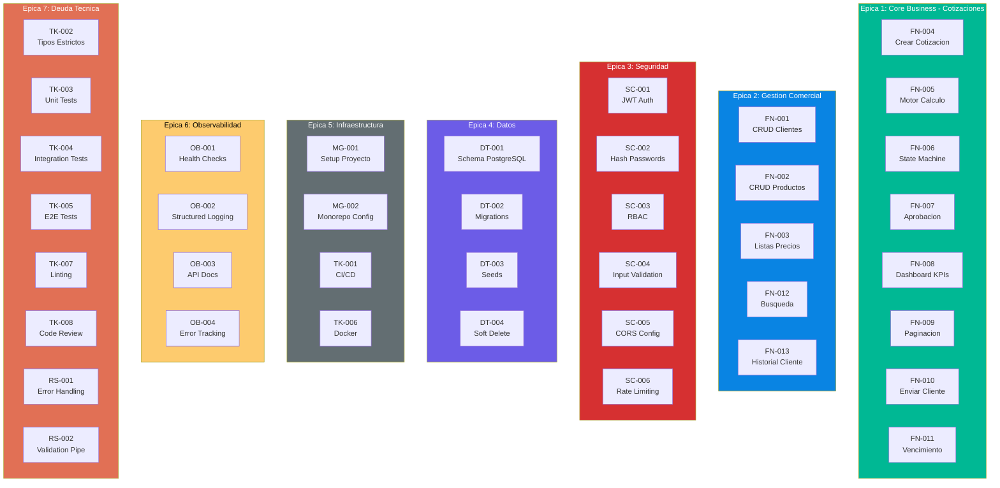

# QuoteFlow — Story Map Diagram

## Mapa Visual de Historias de Usuario

## Priorización por Ola

| Ola | Épicas cubiertas | HUs | Duración |
|---|---|---|---|
| Ola 0 — Foundation | 3, 4, 5 | MG-001, DT-001, SC-001, SC-002, TK-001 | 8 días |
| Ola 1 — Core Business | 1, 2 | FN-001 a FN-005, FN-012, FN-013 | 12 días |
| Ola 2 — Flujos | 1, 3 | FN-006 a FN-011, SC-003, SC-004, FN-009 | 8 días |
| Ola 3 — Calidad | 5, 6, 7 | TK-005, TK-006, OB-001 a OB-004, RS-001, RS-002 | 8 días |

## Referencias

- [Backlog](backlog.md)
- [Migration Component Order](../migration/component-order.md)
