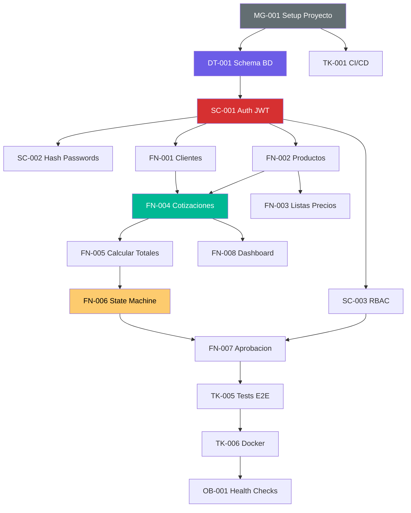

# QuoteFlow — Backlog de Historias de Usuario para Modernización

## Resumen

| Indicador | Valor |
|---|---|
| **Total HUs** | 42 |
| **Variante de Modernización (R)** | Rebuild (7R) |
| **Estrategia** | Reescritura completa con stack moderno (NestJS + Angular 17 + PostgreSQL) |
| **Talla QAM** | S (Small) |
| **Duración estimada** | 7-8 semanas |
| **Equipo** | 1 Tech Lead + 2 Devs + 1 QA |

### Distribución por Tipo

| Tipo | Cantidad | Porcentaje |
|---|---|---|
| FN (Funcional) | 16 | 38% |
| TK (Técnica) | 8 | 19% |
| SC (Seguridad) | 6 | 14% |
| DT (Datos) | 4 | 10% |
| OB (Observabilidad) | 4 | 10% |
| IN (Integración) | 0 | 0% |
| RS (Resiliencia) | 2 | 5% |
| MG (Migración) | 2 | 5% |

### Distribución por Épica

| # | Épica | HUs | Prioridad |
|---|---|---|---|
| 1 | Core Business — Cotizaciones | 8 | P0 |
| 2 | Gestión Comercial — Clientes y Catálogo | 5 | P0 |
| 3 | Seguridad e Identidad | 6 | P0 |
| 4 | Datos y Persistencia | 4 | P0 |
| 5 | Infraestructura y DevOps | 4 | P1 |
| 6 | Observabilidad y Operaciones | 4 | P1 |
| 7 | Deuda Técnica y Calidad | 11 | P1-P2 |

## User Story Map

```mermaid
flowchart LR
    subgraph OLA0["Ola 0: Foundation (8 dias)"]
        direction TB
        MG001["MG-001<br/>Setup proyecto"]
        DT001["DT-001<br/>Schema BD"]
        SC001["SC-001<br/>Auth JWT"]
        TK001["TK-001<br/>CI/CD base"]
    end

    subgraph OLA1["Ola 1: Core Business (12 dias)"]
        direction TB
        FN001["FN-001<br/>CRUD Clientes"]
        FN002["FN-002<br/>CRUD Productos"]
        FN003["FN-003<br/>Listas Precios"]
        FN004["FN-004<br/>Crear Cotizacion"]
        FN005["FN-005<br/>Calcular Totales"]
    end

    subgraph OLA2["Ola 2: Flujos (8 dias)"]
        direction TB
        FN006["FN-006<br/>Estado Machine"]
        FN007["FN-007<br/>Aprobacion"]
        FN008["FN-008<br/>Dashboard"]
        SC003["SC-003<br/>RBAC"]
    end

    subgraph OLA3["Ola 3: Calidad (8 dias)"]
        direction TB
        TK005["TK-005<br/>Tests E2E"]
        OB001["OB-001<br/>Health checks"]
        TK006["TK-006<br/>Docker"]
        OB003["OB-003<br/>API Docs"]
    end

    OLA0 --> OLA1 --> OLA2 --> OLA3

    style OLA0 fill:#636e72,color:#fff
    style OLA1 fill:#00b894,color:#fff
    style OLA2 fill:#fdcb6e,color:#000
    style OLA3 fill:#6c5ce7,color:#fff
```

## Dependencias entre HUs

## Estimación de Esfuerzo por Épica

| Épica | Story Points | Duración | Complejidad |
|---|---|---|---|
| 1 — Core Business | 34 | 12 días | Media-Alta |
| 2 — Gestión Comercial | 18 | 6 días | Media |
| 3 — Seguridad | 21 | 5 días | Media |
| 4 — Datos y Persistencia | 13 | 4 días | Media |
| 5 — Infraestructura | 10 | 3 días | Baja |
| 6 — Observabilidad | 10 | 3 días | Baja |
| 7 — Deuda Técnica | 21 | 5 días | Media |
| **Total** | **127 SP** | **~38 días** | **Media** |

[ESTIMADO: Story points basados en ~1,578 LOC de requisitos funcionales a reimplementar. Equipo de 3-4 personas en 7-8 semanas.]

## Criterios de Done Globales

Aplican a TODAS las HUs del backlog:

1. ✅ Código implementado siguiendo Clean Architecture (Controller → Service → Repository)
2. ✅ Tests unitarios con cobertura ≥80% del servicio
3. ✅ Tests de integración del endpoint (Supertest/Jest)
4. ✅ Validación de input con class-validator (NestJS) o similar
5. ✅ Documentación Swagger/OpenAPI del endpoint (si aplica)
6. ✅ Sin `any` — todos los tipos explícitos (TypeScript strict)
7. ✅ Manejo de errores con excepciones tipadas (HttpException)
8. ✅ Pull Request aprobado con code review
9. ✅ Pipeline CI verde (lint + build + test)
10. ✅ Sin secrets hardcodeados — variables de entorno

## Backlog Resumido (ordenado por prioridad)

| # | ID | Título | Tipo | Épica | Ola | Complejidad |
|---|---|---|---|---|---|---|
| 1 | MG-001 | Setup proyecto NestJS + Angular 17 | MG | 5 | 0 | S |
| 2 | DT-001 | Diseño e implementación schema PostgreSQL | DT | 4 | 0 | M |
| 3 | SC-001 | Autenticación JWT real | SC | 3 | 0 | M |
| 4 | SC-002 | Hashing de passwords con bcrypt | SC | 3 | 0 | S |
| 5 | TK-001 | Pipeline CI/CD básico | TK | 5 | 0 | S |
| 6 | FN-001 | CRUD de Clientes | FN | 2 | 1 | M |
| 7 | FN-002 | CRUD de Productos | FN | 2 | 1 | M |
| 8 | FN-003 | Gestión de Listas de Precios | FN | 2 | 1 | S |
| 9 | FN-004 | Creación de Cotizaciones | FN | 1 | 1 | L |
| 10 | FN-005 | Motor de Cálculo de Totales | FN | 1 | 1 | M |
| 11 | FN-006 | Máquina de Estados de Cotización | FN | 1 | 2 | M |
| 12 | SC-003 | Sistema de Roles y Permisos (RBAC) | SC | 3 | 2 | M |
| 13 | FN-007 | Flujo de Aprobación | FN | 1 | 2 | M |
| 14 | FN-008 | Dashboard con KPIs | FN | 1 | 2 | M |
| 15 | SC-004 | Validación de input en backend | SC | 3 | 2 | S |
| 16 | FN-009 | Paginación de listados | FN | 1 | 2 | S |
| 17 | TK-005 | Tests E2E y de integración | TK | 7 | 3 | M |
| 18 | OB-001 | Health checks y readiness probes | OB | 6 | 3 | S |
| 19 | OB-002 | Logging estructurado | OB | 6 | 3 | S |
| 20 | TK-006 | Containerización con Docker | TK | 5 | 3 | S |
| 21 | OB-003 | Documentación API OpenAPI/Swagger | OB | 6 | 3 | S |

*(Las HUs completas con criterios de aceptación están en los archivos de épicas)*

## Referencias

- [Migration Component Order](../migration/component-order.md)
- [Test Specifications](../migration/test-specifications.md)
- [Modernization Assessment](../analysis/modernization-assessment.md)
- [Business Logic](../behavior/business-logic.md)
- [Workflows](../behavior/workflows.md)
- [Production Readiness](../analysis/production-readiness.md)
- [Security Patterns](../analysis/security-patterns.md)
