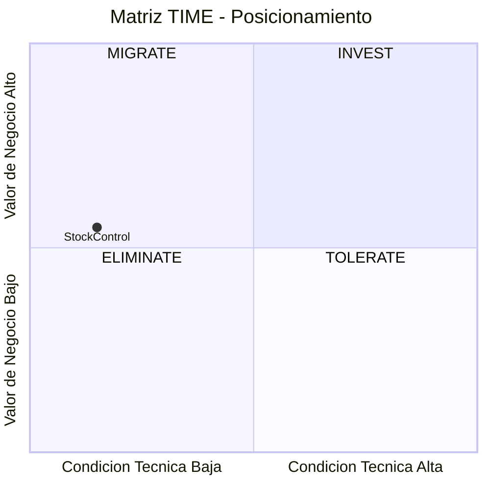

# Resumen Ejecutivo Técnico — Aplicación de Inventarios y Bodegas

---

## Ficha de la Aplicación

| Campo | Valor |
|---|---|
| Aplicación | StockControl — Aplicación de Inventarios y Bodegas |
| Cliente | SoftwareOne |
| Sector / Dominio | Logística / Gestión de inventarios y bodegas |
| Stack principal | Python 3.x + Flask 2.2.5 + SQLite (embebida) |
| LOC | 939 en 2 archivos |
| Nivel de input | Enriquecido (Score 8/10) |

---

## Diagnóstico de Salud

| Indicador | Estado | Detalle |
|---|---|---|
| Deuda Técnica | 🔴 | Score deuda: 85 — Complexity: 1.5 |
| Seguridad | 🔴 | 7 de 10 categorías OWASP vulnerables, 0 mecanismos implementados correctamente |
| Dependencias | 🟡 | 1 SPOF (God Module), 0 componentes sin fuente |
| Obsolescencia | 🟡 | Flask 2.2.5 desactualizado (2023), runtime Python vigente |
| Testing | 🔴 | Cobertura: 0%, CI/CD: No |
| Documentación | 🟡 | Score dimensión 8: 2.75/5 — código auto-documentado con antipatrones intencionales |

---

## Veredicto de Elegibilidad

| Campo | Valor |
|---|---|
| Score Final | **39.4 / 100** |
| Banda | **No Elegible** |
| Condiciones mandatorias cumplidas | 4 de 9 |
| Condiciones no verificables | 4 (supuestos pendientes) |
| Veredicto | No Elegible para QAM — requiere remediación previa o Rebuild con advisory |

### Condiciones pendientes de validación

| # | Condición | Estado | Acción requerida para validar |
|---|---|---|---|
| 3 | SME técnico disponible | ⚠️ Supuesto | Confirmar disponibilidad de desarrollador que conoce el sistema |
| 4 | Sponsor activo | ⚠️ Supuesto | Validar que existe budget y autoridad de decisión |
| 7 | Presupuesto mínimo | ⚠️ Supuesto | Confirmar que el cliente tiene budget para talla S mínimo |
| 9 | Timeline compatible | ⚠️ Supuesto | Confirmar ventana de 8+ semanas disponible |

> **Nota:** Si estas condiciones se validan, la aplicación podría calificar bajo modelo Advisory con Rebuild.

---

## Hallazgos Críticos

| ID | Tipo | Descripción |
|---|---|---|
| A-01 | seguridad | SQL Injection directa en 7+ puntos — explotable sin autenticación |
| A-02 | seguridad | MD5 para hashing de passwords — criptográficamente roto, sin salt |
| A-05 | complejidad | God Module de 939 LOC — todo el sistema en 1 archivo sin separación |
| A-07 | infraestructura | Sin CI/CD, sin Docker, sin tests, sin logging — deployment manual |
| A-10 | complejidad | Conexión SQLite global no thread-safe — race conditions bajo carga |

---

## Estrategia Recomendada

**Rebuild Modular** — La combinación de vulnerabilidades críticas de seguridad (7/10 OWASP), arquitectura monolítica en un solo archivo, ausencia total de testing y framework desactualizado hace que un refactoring sea más costoso que reescribir los 939 LOC con arquitectura limpia. El tamaño extremadamente pequeño (939 LOC) permite un Rebuild rápido y seguro.

### Matriz TIME — Posicionamiento de la Aplicación

### Justificación de la R seleccionada

| Criterio | Valor | Implicación |
|---|---|---|
| Cuadrante TIME | Migrate (condición técnica baja, valor negocio medio) | Rebuild o Rearchitect aplican |
| Runtime principal | Python 3.x vigente, Flask desactualizado | Rebuild sobre Flask moderno o FastAPI viable |
| Arquitectura | God Module — monolito de archivo único | Reescritura obligatoria (no hay qué refactorizar) |
| Target stack definido | No definido | Propuesta: Python 3.12 + FastAPI + PostgreSQL |
| Score deuda | 85 (Muy Alta) | Complexity 1.5 — esfuerzo significativo de remediación si se refactoriza |

---

## Dimensionamiento

| Concepto | Valor |
|---|---|
| Total WU | 2,800 |
| Créditos | 560 |
| Talla del proyecto | S |
| Duración estimada | 8–10 semanas |
| Valor contrato | USD 5,600 |

---

## Riesgos Top-3

| # | Riesgo | Impacto | Mitigación |
|---|---|---|---|
| 1 | Ausencia de SME técnico que valide reglas de negocio | Alto | Workshop de discovery funcional antes de iniciar |
| 2 | Vulnerabilidades explotadas antes del Rebuild (si está en red) | Alto | Aislar inmediatamente de cualquier red — ejecutar solo en localhost |
| 3 | Pérdida de paridad funcional por reglas no documentadas | Medio | Tests de caracterización contra sistema actual antes del Rebuild |

---

## Próximos Pasos

1. Validar con el cliente la disponibilidad de SME y sponsor — semana 1
2. Aislar el sistema de cualquier red pública (vulnerabilidades críticas) — inmediato
3. Workshop de alineación estratégica: confirmar target stack y drivers de negocio — semana 1-2
4. Definir stack objetivo (FastAPI + PostgreSQL recomendado) — semana 2
5. Iniciar Advisory + Rebuild en talla S — semana 3

---

## Diagrama Resumen

Este diagrama resume el flujo completo del QuickScan: desde la evaluación cuantitativa hasta la oferta comercial en una sola línea visual.

---

Análisis elaborado por SoftwareOne · 2026-07-22
