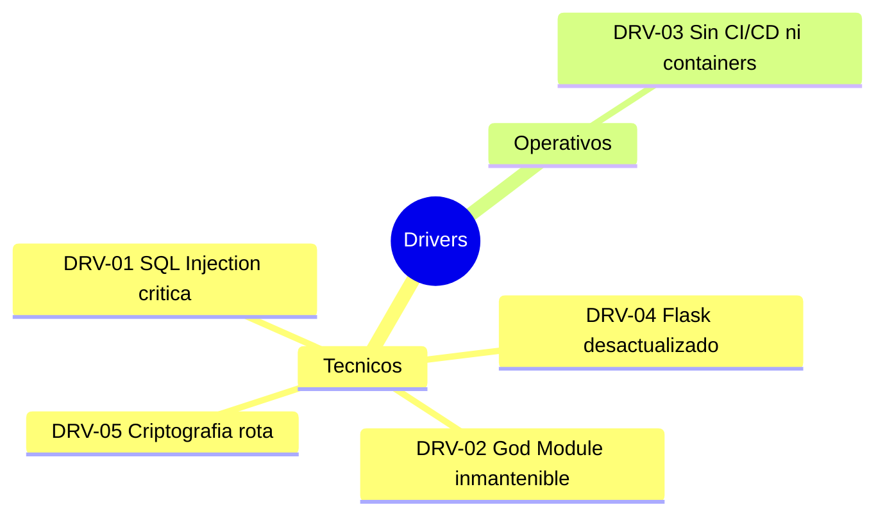

# Alcance — Aplicación de Inventarios y Bodegas

---

> **Aplicación:** StockControl — Aplicación de Inventarios y Bodegas  
> **Cliente:** SoftwareOne  
> **Fecha:** 2026-07-22

---

## 1. Resumen ejecutivo

### 1.1 Problema que se busca resolver

La aplicación de gestión de inventarios y bodegas presenta vulnerabilidades de seguridad críticas (SQL Injection, MD5, debug mode expuesto), una arquitectura monolítica en un solo archivo (God Module), y ausencia total de prácticas DevOps. En su estado actual es inoperable en producción de forma segura. Se requiere una modernización completa para convertirla en un sistema confiable, seguro y mantenible.

### 1.2 Motivadores (Drivers)

| ID | Driver | Tipo | Urgencia |
|---|---|---|---|
| DRV-01 | SQL Injection directa en 7+ endpoints permite compromiso total del sistema | Técnico | Alta |
| DRV-02 | God Module de 939 LOC imposibilita testing, mantenimiento y escalado | Técnico | Alta |
| DRV-03 | Ausencia total de CI/CD, monitoring y containerización impide operación cloud | Operativo | Media |
| DRV-04 | Flask 2.2.5 y Werkzeug 2.2.3 desactualizados sin parches de seguridad recientes | Técnico | Media |
| DRV-05 | MD5 para passwords y secret key hardcoded hacen que cualquier exposición de red sea catastrófica | Técnico | Alta |

### 1.3 Beneficio esperado

Obtener un sistema de inventarios seguro, modular, testeable y desplegable en cloud que permita operar con confianza en producción, escalar según demanda y mantener con bajo esfuerzo. Reducción de riesgo de seguridad de crítico a bajo.

---

## 2. Objetivos

### 2.1 Objetivo general

Modernizar StockControl eliminando las 7 vulnerabilidades OWASP, estableciendo arquitectura por capas y habilitando deployment cloud con CI/CD automatizado.

### 2.2 Objetivos específicos

1. Eliminar todas las vulnerabilidades de seguridad críticas (SQL Injection, MD5, debug mode, secret hardcoded)
2. Implementar arquitectura modular con separación de responsabilidades (routing, servicios, repositorios)
3. Establecer pipeline CI/CD con testing automatizado (cobertura >80%)
4. Containerizar la aplicación para deployment cloud-ready
5. Migrar de SQLite a un motor de BD apropiado para producción (PostgreSQL)

---

## 3. Alcance Funcional

### 3.1 Procesos de Negocio Incluidos

| # | Proceso | Criticidad |
|---|---|---|
| 1 | Gestión de movimientos de inventario (entradas, salidas, traslados, ajustes) | Alta |
| 2 | Gestión de catálogo de productos y categorías | Media |
| 3 | Gestión de bodegas/almacenes | Media |
| 4 | Dashboard con KPIs y alertas de stock | Media |
| 5 | Kardex (trazabilidad de existencias por producto y bodega) | Alta |
| 6 | Autenticación y gestión de usuarios con RBAC | Alta |

### 3.2 Funcionalidades Baseline (AS-IS)

| ID | Funcionalidad | Descripción | Criticidad |
|---|---|---|---|
| F001 | Login / Logout | Autenticación con username/password | Alta |
| F002 | Dashboard | Indicadores de stock, alertas, últimos movimientos | Media |
| F003 | CRUD Productos | Crear, editar, toggle activo/inactivo, filtrar | Media |
| F004 | CRUD Categorías | Crear, editar categorías de productos | Baja |
| F005 | CRUD Bodegas | Crear, editar, toggle bodegas activas | Media |
| F006 | Entrada de inventario | Registrar ingresos con costo y lote | Alta |
| F007 | Salida de inventario | Registrar salidas con validación de stock | Alta |
| F008 | Traslado entre bodegas | Mover stock entre ubicaciones | Alta |
| F009 | Ajuste de inventario | Ajustar stock al conteo físico | Alta |
| F010 | Kardex | Consulta cruzada Producto × Bodega con filtros | Media |
| F011 | Historial de movimientos | Listado con filtros por tipo, fecha, bodega | Media |

---

## 4. Integraciones Incluidas

| Sistema / Servicio | Tipo | Descripción | Criticidad |
|---|---|---|---|
| CDN Bootstrap (cdn.jsdelivr.net) | Entrada | Descarga de CSS/JS para UI | Baja |

[DECISIÓN AUTÓNOMA: El sistema no tiene integraciones significativas — es completamente autocontenido. La única dependencia externa es el CDN de Bootstrap para estilos.]

---

## 5. Restricciones Técnicas del Target

[PENDIENTE: Target stack no definido — se propondrá en la recomendación técnica]

### Restricciones recomendadas (propuesta SoftwareOne):

1. **Backend:** Python 3.12 + FastAPI
2. **Frontend:** Jinja2 templates + HTMX (mantener server-rendered) o Vue.js SPA
3. **Autenticación:** JWT + bcrypt con RBAC enforzado
4. **Infraestructura:** Docker + AWS ECS/Fargate o equivalente
5. **CI/CD:** GitHub Actions
6. **Base de datos:** PostgreSQL (migración desde SQLite)

---

## 6. Exclusiones

- Integraciones con ERP u otros sistemas (no existen en el AS-IS)
- Migración de datos históricos de gran volumen (SQLite con datos seed únicamente)
- Funcionalidades no presentes en el AS-IS (ej: facturación, compras, proveedores)

---

## 7. Supuestos

| ID | Supuesto | Impacto si no se cumple |
|---|---|---|
| S001 | Existe un SME que conoce las reglas de negocio de inventario | Requiere discovery funcional extenso (+2 semanas) |
| S002 | El target stack será Python moderno (se mantiene ecosistema) | Si se cambia a Java/.NET, sizing cambia completamente |
| S003 | No hay usuarios activos en producción actualmente | Si hay usuarios activos, se necesita plan de coexistencia |
| S004 | El cliente acepta migrar de SQLite a PostgreSQL | Si insiste en SQLite, limita escalabilidad severamente |

---

## 8. Dependencias

| ID | Dependencia | Responsable | Estado |
|---|---|---|---|
| D001 | Definición del target stack por parte del cliente | Cliente / Arquitecto SWO | Pendiente |
| D002 | Disponibilidad de ambiente cloud para deployment | Cliente / DevOps SWO | Pendiente |
| D003 | Validación de reglas de negocio con SME funcional | Cliente | Pendiente |

---

## Conclusiones

1. **Alcance compacto y bien definido:** Con solo 939 LOC y 11 funcionalidades, el sistema es pequeño pero funcionalmente completo para gestión básica de inventarios.
2. **Sin integraciones externas:** La ausencia de integraciones simplifica enormemente el Rebuild — no hay dependencias que preservar.
3. **Brechas de gobierno:** Faltan confirmaciones de sponsor, SME, budget y timeline. Estas deben cerrarse en la semana 1 del engagement.
4. **Target stack abierto:** La ausencia de restricciones permite proponer el stack óptimo (FastAPI + PostgreSQL), pero debe validarse con el cliente.

---

Generado por SoftwareOne X-Ray QuickScan · 2026-07-22
