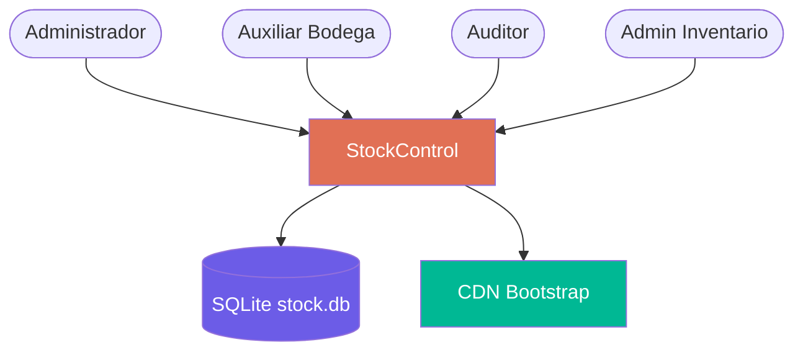
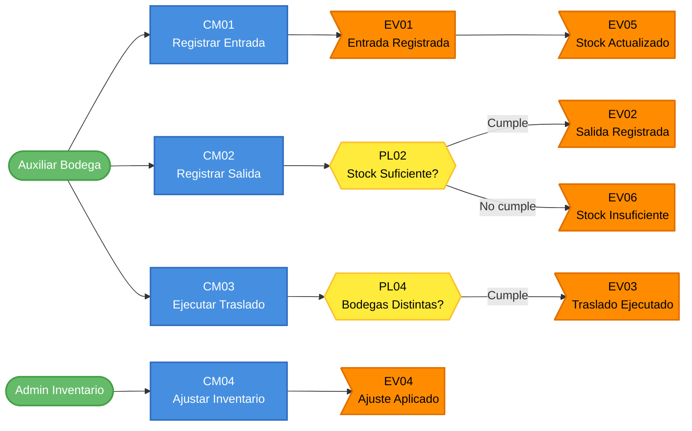

# Event Storming del AS-IS — StockControl (Gestión de Inventarios y Bodegas)

---

> **Aplicación:** StockControl — Aplicación de Inventarios y Bodegas  
> **Cliente:** SoftwareOne  
> **Tipo de análisis:** X-Ray QuickScan  
> **Fecha de análisis:** 2026-07-22

---

## Dominios Funcionales Identificados

| # | Dominio | Descripción | Eventos principales |
|---|---|---|---|
| 1 | Gestión de Inventario | Movimientos de stock (entradas, salidas, traslados, ajustes) | MovimientoRegistrado, StockActualizado, StockInsuficienteDetectado |
| 2 | Catálogo de Productos | Mantenimiento del maestro de productos y categorías | ProductoCreado, ProductoEditado, ProductoDesactivado |
| 3 | Gestión de Bodegas | Administración de almacenes/ubicaciones | BodegaCreada, BodegaEditada, BodegaDesactivada |
| 4 | Autenticación | Login/logout y gestión de sesiones | UsuarioAutenticado, AutenticacionFallida, SesionCerrada |
| 5 | Reportería/Kardex | Consultas de trazabilidad y dashboard de KPIs | KardexConsultado, DashboardGenerado |

---

## Dominio 1: Gestión de Inventario (Core)

### Eventos de Dominio

| ID | Evento | Descripción | Disparado por |
|----|--------|-------------|---------------|
| EV01 | EntradaRegistrada | Se ingresó stock a una bodega | CM01 |
| EV02 | SalidaRegistrada | Se descontó stock de una bodega | CM02 |
| EV03 | TrasladoEjecutado | Se movió stock entre dos bodegas | CM03 |
| EV04 | AjusteAplicado | Se ajustó stock al conteo físico (positivo o negativo) | CM04 |
| EV05 | StockActualizado | La existencia en una bodega cambió su valor | CM01/CM02/CM03/CM04 |
| EV06 | StockInsuficienteDetectado | No hay stock suficiente para la operación | CM02/CM03 |

### Comandos

| ID | Comando | Actor | Sistema externo |
|----|---------|-------|-----------------|
| CM01 | RegistrarEntrada | Auxiliar de Bodega | — |
| CM02 | RegistrarSalida | Auxiliar de Bodega | — |
| CM03 | EjecutarTraslado | Auxiliar de Bodega | — |
| CM04 | AjustarInventario | Admin de Inventario | — |

### Actores

| Actor | Rol | Acciones principales |
|-------|-----|----------------------|
| Auxiliar de Bodega | AUXILIAR | Registra entradas, salidas y traslados |
| Admin de Inventario | ADMIN_INV | Ejecuta ajustes de inventario |
| Administrador | ADMIN | Todas las operaciones + gestión de maestros |

### Sistemas Externos

| Sistema | Protocolo | Rol en el flujo |
|---------|-----------|-----------------|
| Ninguno | — | Sistema completamente autocontenido |

### Políticas y Reglas de Negocio

| ID | Política | Descripción |
|----|----------|-------------|
| PL01 | StockNuncaNegativo | El stock físico nunca puede ser menor que 0 (se aplica max(0, valor)) |
| PL02 | ValidarStockAntesSalida | Una salida requiere stock_actual >= cantidad_solicitada |
| PL03 | ValidarStockAntesTraslado | Un traslado requiere stock en bodega origen >= cantidad |
| PL04 | BodegasDistintasEnTraslado | Bodega origen y destino deben ser diferentes |
| PL05 | RegistrarTrazabilidad | Todo movimiento registra existencia_antes y existencia_despues |
| PL06 | CostoSobreescritoEnEntrada | El costo se actualiza en entrada (sin promedio ponderado) |

### Entidades

| ID | Entidad | Atributos clave |
|----|---------|-----------------|
| EN01 | Movimiento | id, tipo (ENTRADA/SALIDA/TRASLADO/AJUSTE_POS/AJUSTE_NEG), fecha, bodega, usuario, referencia |
| EN02 | DetalleMovimiento | id, movimiento_id, producto_id, cantidad, costo, existencia_antes, existencia_despues |
| EN03 | Existencia | id, producto_id, bodega_id, stock_fisico, stock_reservado, costo_promedio |

---

## Dominio 2: Catálogo de Productos (Supporting)

### Eventos de Dominio

| ID | Evento | Descripción | Disparado por |
|----|--------|-------------|---------------|
| EV07 | ProductoCreado | Se registró un nuevo producto en el catálogo | CM05 |
| EV08 | ProductoEditado | Se modificaron datos de un producto | CM06 |
| EV09 | ProductoDesactivado | Se cambió estado de activo a inactivo | CM07 |
| EV10 | ProductoActivado | Se reactivó un producto inactivo | CM07 |

### Comandos

| ID | Comando | Actor | Sistema externo |
|----|---------|-------|-----------------|
| CM05 | CrearProducto | Administrador | — |
| CM06 | EditarProducto | Administrador | — |
| CM07 | ToggleEstadoProducto | Administrador | — |

### Políticas y Reglas de Negocio

| ID | Política | Descripción |
|----|----------|-------------|
| PL07 | CodigoProductoUnico | No pueden existir dos productos con el mismo código |
| PL08 | CodigoInmutable | El código de producto no se puede modificar después de creado |
| PL09 | SoftDelete | Los productos se desactivan, nunca se eliminan físicamente |

### Entidades

| ID | Entidad | Atributos clave |
|----|---------|-----------------|
| EN04 | Producto | id, codigo (único), nombre, descripcion, categoria_id, stock_minimo, costo_promedio, estado |
| EN05 | Categoria | id, nombre, descripcion |

---

## Dominio 3: Gestión de Bodegas (Supporting)

### Eventos de Dominio

| ID | Evento | Descripción | Disparado por |
|----|--------|-------------|---------------|
| EV11 | BodegaCreada | Se registró una nueva bodega | CM08 |
| EV12 | BodegaEditada | Se modificaron datos de una bodega | CM09 |
| EV13 | BodegaDesactivada | Se cambió estado a inactiva | CM10 |

### Comandos

| ID | Comando | Actor | Sistema externo |
|----|---------|-------|-----------------|
| CM08 | CrearBodega | Administrador | — |
| CM09 | EditarBodega | Administrador | — |
| CM10 | ToggleEstadoBodega | Administrador | — |

### Entidades

| ID | Entidad | Atributos clave |
|----|---------|-----------------|
| EN06 | Bodega | id, nombre, ubicacion, responsable, capacidad, activa |

---

## Dominio 4: Autenticación (Generic)

### Eventos de Dominio

| ID | Evento | Descripción | Disparado por |
|----|--------|-------------|---------------|
| EV14 | UsuarioAutenticado | Login exitoso — sesión creada | CM11 |
| EV15 | AutenticacionFallida | Credenciales inválidas | CM11 |
| EV16 | SesionCerrada | Logout ejecutado | CM12 |

### Comandos

| ID | Comando | Actor | Sistema externo |
|----|---------|-------|-----------------|
| CM11 | IniciarSesion | Cualquier usuario | — |
| CM12 | CerrarSesion | Usuario autenticado | — |

### Políticas y Reglas de Negocio

| ID | Política | Descripción |
|----|----------|-------------|
| PL10 | PasswordMD5 | Passwords hasheados con MD5 sin salt (VULNERABLE — a remediar) |
| PL11 | SoloActivosPuedenLogin | Solo usuarios con activo=1 pueden autenticarse |

### Entidades

| ID | Entidad | Atributos clave |
|----|---------|-----------------|
| EN07 | Usuario | id, username, nombre, rol (ADMIN/AUXILIAR/AUDITOR/ADMIN_INV), activo, hash_password |

---

## Dominio 5: Reportería / Kardex (Generic)

### Eventos de Dominio

| ID | Evento | Descripción | Disparado por |
|----|--------|-------------|---------------|
| EV17 | DashboardGenerado | Se calcularon y mostraron los KPIs | CM13 |
| EV18 | KardexConsultado | Se generó la vista cruzada de existencias | CM14 |

### Comandos

| ID | Comando | Actor | Sistema externo |
|----|---------|-------|-----------------|
| CM13 | VerDashboard | Cualquier usuario autenticado | — |
| CM14 | ConsultarKardex | Cualquier usuario autenticado | — |

---

## Diagrama de Contexto General

---

## Flujo de Eventos (Event Flow)

---

## Conclusiones

1. **5 dominios funcionales identificados:** 1 Core (Gestión de Inventario), 2 Supporting (Productos, Bodegas) y 2 Generic (Auth, Reportería). El bounded context principal es claro y bien delimitado.

2. **Flujo lineal sin complejidad excesiva:** Los 18 eventos y 14 comandos representan un sistema de baja complejidad funcional. La lógica de negocio se concentra en 6 políticas, todas verificables y deterministas.

3. **Sin dependencias externas:** El sistema es 100% autocontenido. No hay eventos que crucen fronteras organizacionales ni integraciones que gestionar durante la modernización.

4. **Oportunidad de RBAC:** Los 4 roles (ADMIN, AUXILIAR, AUDITOR, ADMIN_INV) están definidos pero no enforzados. El Rebuild debe implementar autorización por comando según rol.

5. **Copy-paste entre movimientos:** Los comandos CM01-CM03 comparten ~80% de lógica. El Rebuild debe abstraer esto en un servicio de movimientos parametrizable por tipo.

---

Análisis elaborado por SoftwareOne · 2026-07-22
