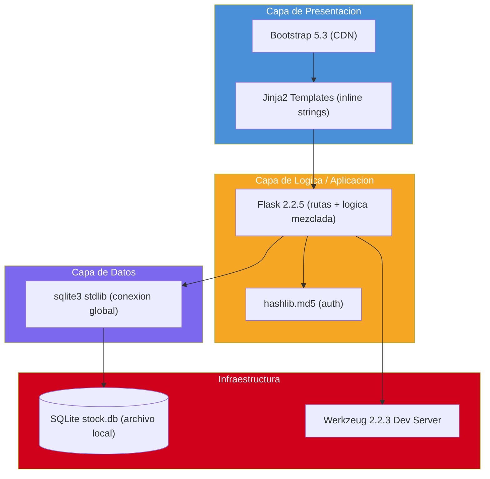

# Inventario Tecnológico

---

> **Aplicación:** StockControl — Aplicación de Inventarios y Bodegas  
> **Cliente:** SoftwareOne  
> **Tipo:** Python Flask Web Monolith (Single-file)  
> **LOC:** 939 | **Archivos fuente:** 2  
> **Fecha de análisis:** 2026-07-22

---

## 1. Runtime y Lenguaje

| Tecnología | Versión | Propósito | Estado | Alerta Vinculada |
|---|---|---|---|---|
| Python | 3.x (compatible via `from __future__`) | Runtime principal | ✅ Vigente | — |

---

## 2. Frameworks y Modelo de Aplicación

| Tecnología | Versión | Propósito | Estado | Alerta Vinculada |
|---|---|---|---|---|
| Flask | 2.2.5 | Framework web (routing, templates, sessions) | ⚠️ Legacy funcional | A-09 |
| Werkzeug | 2.2.3 | Servidor HTTP de desarrollo | ⚠️ Legacy funcional | A-04 |
| Jinja2 | Bundled con Flask | Motor de templates (usado via render_template_string) | ⚠️ Legacy funcional | — |

---

## 3. Bases de Datos

| Tecnología | Versión | Propósito | Estado | Alerta Vinculada |
|---|---|---|---|---|
| SQLite | Embebida (stdlib Python) | Almacenamiento principal — archivo local `stock.db` | ⚠️ Legacy funcional | A-10 |

---

## 4. Controles / Componentes UI (2)

| Tecnología | Versión | Propósito | Estado | Alerta Vinculada |
|---|---|---|---|---|
| Bootstrap | 5.3.0 (CDN) | Framework CSS para layout y componentes | ✅ Vigente | — |
| Bootstrap Icons | 1.11.0 (CDN) | Iconografía de la interfaz | ✅ Vigente | — |

---

## 5. Bibliotecas y Dependencias (2)

| Tecnología | Versión | Propósito | Estado | Alerta Vinculada |
|---|---|---|---|---|
| flask | 2.2.5 | Framework web | ⚠️ Legacy funcional — Flask 3.x disponible | A-09 |
| werkzeug | 2.2.3 | WSGI utilities (pinned explícitamente) | ⚠️ Legacy funcional — Werkzeug 3.x disponible | A-04 |

> **Nota:** Solo 2 dependencias declaradas en `requirements.txt`. No existe `requirements.lock` ni `Pipfile.lock`.

---

## 6. Herramientas de Build / CI

| Tecnología | Versión | Propósito | Estado | Alerta Vinculada |
|---|---|---|---|---|
| No se detectan herramientas de build automatizado ni CI/CD | — | — | 🚫 Ausente | A-07 |

---

## 7. Componentes Propietarios Sin Código Fuente (0)

No se detectaron componentes propietarios sin código fuente. Todas las dependencias son open source.

---

## 8. Diagrama de Stack Tecnológico

---

## 9. Conclusiones

1. **Stack minimalista:** Solo 2 dependencias externas (Flask + Werkzeug). La superficie de ataque por dependencias es pequeña pero ambas están desactualizadas.

2. **Sin herramientas de build:** Ausencia total de CI/CD, linting, formatting, testing frameworks. El "deploy" es ejecutar `python app.py` manualmente.

3. **Dependencias de stdlib riesgosas:** El uso de `hashlib.md5` (stdlib) para passwords y `sqlite3` con conexión global compartida son las decisiones técnicas más peligrosas.

4. **UI moderna vía CDN:** Bootstrap 5.3 es vigente y no requiere migración. Sin embargo, se carga desde CDN sin fallback local ni integrity hash (SRI).

5. **Ruta de actualización clara:** Flask 2.2→3.x y Werkzeug 2.2→3.x tienen guía de migración oficial. Alternativamente, migrar a FastAPI es viable por el tamaño pequeño.

---

Análisis elaborado por SoftwareOne · 2026-07-22
