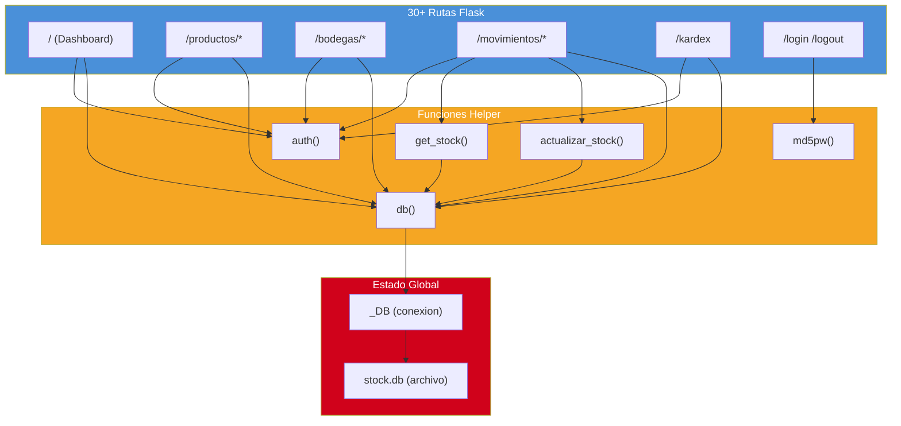
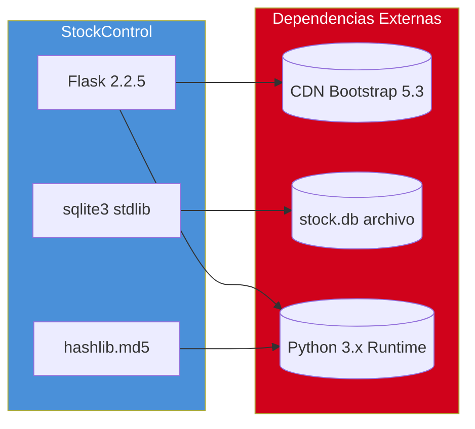
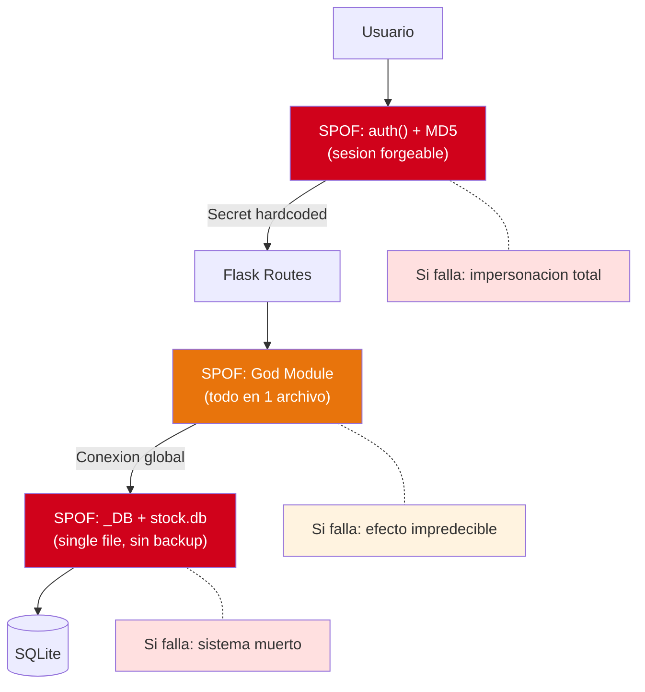

# Análisis de Dependencias

---

> **Aplicación:** StockControl — Aplicación de Inventarios y Bodegas  
> **Cliente:** SoftwareOne  
> **Tipo:** Python Flask Web Monolith (Single-file)  
> **LOC:** 939 | **Archivos fuente:** 2  
> **Fecha de análisis:** 2026-07-22

---

## 1. Análisis Fan-in / Fan-out de Componentes Clave

| Componente | Fan-in (quien lo usa) | Fan-out (que usa) | Clasificación |
|---|---|---|---|
| `app.py` (God Module) | 1 — el propio servidor Flask | 4 — sqlite3, hashlib, flask, functools | 🔴 God Module |
| `_DB` (conexión global SQLite) | 30+ rutas la consumen | 1 — sqlite3 stdlib | 🔴 SPOF CRÍTICO |
| `actualizar_stock()` | 4 rutas de movimientos | 2 — `_DB`, `get_stock()` | 🟡 Concentrador |
| `auth()` decorator | 25+ rutas protegidas | 1 — flask.session | 🟡 Concentrador |
| `db()` helper | Todas las rutas con SQL | 1 — `_DB` global | 🟡 Concentrador |

### Interpretación

- **`app.py` como God Module:** Con fan-in implícito de 100% (todo el sistema está en este archivo), cualquier cambio en una función tiene potencial de impactar cualquier otra. No hay encapsulación ni boundaries.
- **`_DB` como SPOF total:** La variable global de conexión SQLite es usada por TODAS las operaciones. Si se corrompe o se cierra, el sistema completo muere sin recovery posible.

---

## 2. Dependencias Externas — Radio de Impacto

| Dependencia Externa | Tipo | Radio de Impacto | Componentes Afectados | Criticidad |
|---|---|---|---|---|
| SQLite (stock.db) | BD embebida | 100% del sistema | Todas las rutas que ejecutan SQL | 🔴 Crítica |
| CDN Bootstrap (cdn.jsdelivr.net) | UI/CSS | 100% de presentación visual | Todas las páginas renderizadas | 🟡 Media |
| Python stdlib (hashlib, sqlite3, functools) | Runtime | 100% del sistema | Autenticación, datos, decoradores | 🔴 Crítica |

### Observaciones

- **SQLite como única persistencia:** Si el archivo `stock.db` se corrompe, se pierde toda la información sin posibilidad de recuperación (no hay backup automatizado).
- **CDN sin fallback:** Si cdn.jsdelivr.net no responde, toda la UI se muestra sin estilos — degradación visual total pero funcionalidad preservada.

---

## 3. Cadenas de Dependencia Transitiva

### Cadena Crítica 1: Request → Datos

```
HTTP Request → Flask Route → db() helper → _DB global → SQLite file (stock.db)
```

- **Riesgo:** Un solo punto de fallo en cada eslabón. Si `_DB` tiene un error de conexión bajo carga concurrente (check_same_thread=False), todas las requests fallan simultáneamente.
- **Mitigación posible:** Connection pooling + transacciones explícitas + BD server-grade.

### Cadena Crítica 2: Autenticación → Sesión

```
POST /login → md5pw(password) → SQL directo (vulnerable) → flask.session (secret hardcoded)
```

- **Riesgo:** Cadena doblemente vulnerable: SQL Injection permite bypass de auth, Y secret key predecible permite forjar sesiones directamente.
- **Mitigación posible:** Parametrizar queries + bcrypt + secret rotable desde env vars.

### Cadena Media 3: Movimiento → Stock

```
POST /movimientos/* → parsear form → actualizar_stock() → db().execute() → COMMIT
```

- **Riesgo:** Sin transacción atómica — si falla a mitad del loop de items, los primeros quedan actualizados pero los restantes no. Datos inconsistentes.
- **Impacto:** Acotado a la sesión del movimiento individual (no cascadea a otros usuarios).

---

## 4. Puntos Únicos de Fallo (SPOFs)

| ID | Componente | Tipo | Impacto si Falla | Dominios Afectados | Mitigación Existente |
|---|---|---|---|---|---|
| SPOF-01 | `_DB` (conexión global SQLite) | Infraestructura | Sistema completo inoperante | 100% — todos los dominios | ❌ Ninguna |
| SPOF-02 | `app.py` (God Module) | God Module | Un bug en cualquier función puede afectar todo | 100% — sin aislamiento | ❌ Ninguna |
| SPOF-03 | `stock.db` (archivo) | Datos | Pérdida total de datos | 100% — toda la persistencia | ❌ Ninguna (sin backup) |

### Análisis de Impacto SPOF-01

`_DB` (conexión global SQLite) encapsula:
- Toda la persistencia del sistema
- Acceso concurrente no thread-safe (`check_same_thread=False`)
- Sin connection pooling
- Sin retry logic

No existe:
- Connection pooling (1 conexión para N requests)
- Retry logic (si falla, muere)
- Circuit breaker (sin degradación)
- Fallback a modo degradado

### Análisis de Impacto SPOF-02

`app.py` (God Module) contiene:
- 939 LOC mezclando routing, lógica, datos y presentación
- 30+ funciones sin encapsulación
- Variables globales compartidas (`_DB`, `DEBUG`, `DATABASE`)
- 4 rutas de movimientos copy-paste (660 LOC duplicados)

Un error en una función de productos puede manifestarse como bug en movimientos por la ausencia de boundaries.

---

## 5. Diagrama de Dependencias Internas



---

## 6. Diagrama de Dependencias Externas



---

## 7. Diagrama de Mapa de SPOFs



---

## 8. Conclusiones

1. **Patrón estrella extremo:** Todas las rutas convergen en `_DB` — un solo punto de fallo al 100%. No existe forma de aislar ni degradar parcialmente.

2. **God Module amplifica riesgo:** La ausencia de módulos separados significa que un bug en `actualizar_stock()` no tiene boundary para evitar afectar `auth()` o el dashboard.

3. **Zero dependencias propietarias:** La buena noticia es que no hay vendor lock-in. Todo es open source y reemplazable: Flask→FastAPI, SQLite→PostgreSQL, MD5→bcrypt.

4. **Cadena de autenticación doblemente vulnerable:** SQL Injection en login + secret key predecible = doble vector de bypass completo.

5. **Modernización no requiere preservar integraciones:** Al no tener dependencias externas significativas, el Rebuild puede partir de cero sin adapters ni anti-corruption layers.

---

Análisis elaborado por SoftwareOne · 2026-07-22
