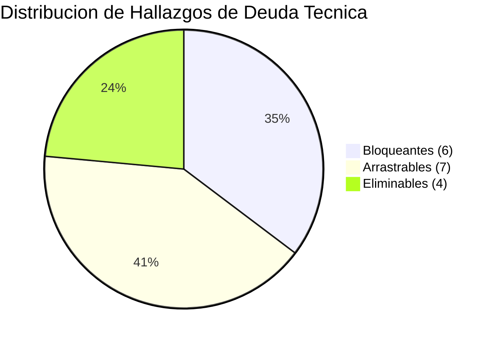
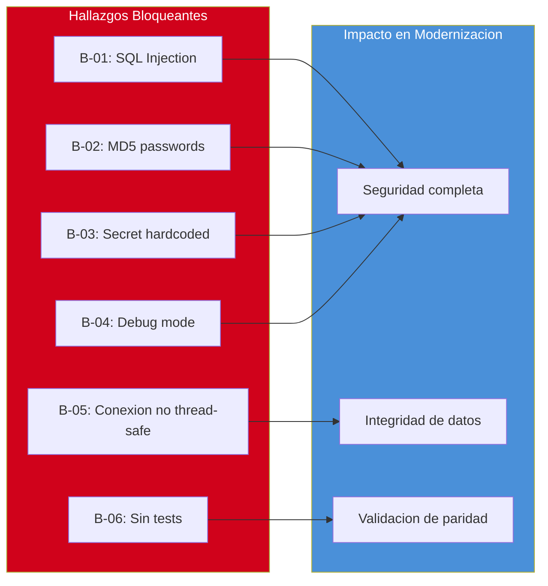

# Deuda Técnica Detallada

---

> **Aplicación:** StockControl — Aplicación de Inventarios y Bodegas  
> **Cliente:** SoftwareOne  
> **Tipo:** Python Flask Web Monolith (Single-file)  
> **LOC:** 939 | **Archivos fuente:** 2  
> **Fecha de análisis:** 2026-07-22

---

## 1. Clasificación de Hallazgos de Deuda Técnica

Se identificaron **17** hallazgos de deuda técnica, clasificados en tres categorías:

| Clasificación | Cantidad | Descripción |
|---|---|---|
| 🔴 **Bloqueante** | 6 | Impide la modernización si no se resuelve. Requiere acción inmediata. |
| 🟡 **Arrastrable** | 7 | Puede coexistir temporalmente durante la migración. |
| 🟢 **Eliminable** | 4 | Se elimina automáticamente al modernizar. |

---

## 2. Hallazgos Bloqueantes (6)

| # | Hallazgo | Impacto | Componente(s) | Alerta |
|---|---|---|---|---|
| B-01 | SQL Injection directa en 7+ rutas | Data breach completo, RCE potencial | `app.py:448,757,759,761,848,882` | A-01 |
| B-02 | MD5 sin salt para passwords | Credenciales expuestas ante cualquier dump de BD | `app.py:265` | A-02 |
| B-03 | Secret key hardcoded | Sesiones forjables por cualquier atacante con acceso al código | `app.py:44` | A-03 |
| B-04 | Debug mode permanente | RCE via Werkzeug debugger + info disclosure | `app.py:44-45` | A-04 |
| B-05 | Conexión global no thread-safe | Race conditions y corrupción de datos bajo carga | `app.py:49,70` | A-10 |
| B-06 | Sin tests automatizados | Imposible validar paridad funcional post-migración | Ausencia total | A-07 |

---

## 3. Hallazgos Arrastrables (7)

| # | Hallazgo | Impacto | Componente(s) | Alerta |
|---|---|---|---|---|
| A-01 | God Module (939 LOC en 1 archivo) | Imposible mantener, testear o escalar | `app.py` completo | A-05 |
| A-02 | 4 funciones copy-paste (~660 LOC duplicadas) | 4x costo de mantenimiento y bugs | `app.py:1228-1808` | A-06 |
| A-03 | Sin autorización por roles (RBAC decorativo) | Todos los usuarios tienen acceso total | `app.py:298-305` | — |
| A-04 | Sin paginación en queries | OOM con volumen alto de datos | `app.py:754,1870+` | — |
| A-05 | Error swallowing (`except: pass`) | Corrupción silenciosa de datos | `app.py:1252,1408,1560,1735` | — |
| A-06 | Sin transacciones atómicas en movimientos | Datos inconsistentes si falla mid-loop | `app.py:1228-1370` | — |
| A-07 | Costo sobreescrito sin promedio ponderado | Cálculo de valor de inventario incorrecto | `app.py:289-291` | — |

---

## 4. Hallazgos Eliminables (4)

| # | Hallazgo | Razón de Eliminación | Componente(s) |
|---|---|---|---|
| E-01 | HTML embebido en strings Python | Rebuild usa templates separados o SPA | `app.py:310-500` (templates inline) |
| E-02 | Flask 2.2.5 desactualizado | Rebuild usa Flask 3.x o FastAPI | `requirements.txt` |
| E-03 | Werkzeug 2.2.3 como servidor | Rebuild usa Gunicorn/Uvicorn + reverse proxy | `requirements.txt` |
| E-04 | SQLite como BD producción | Rebuild usa PostgreSQL | `app.py:41` |

---

## 5. Score de Deuda Técnica

### Cálculo

| Parámetro | Valor | Justificación |
|---|---|---|
| LOC afectado por deuda | 800 | ~85% del código tiene al menos un hallazgo (SQL injection + God Module afectan todo) |
| LOC total | 939 | Medición directa cloc |
| Ratio LOC | 85% | 800 / 939 × 100 |
| SPOFs con impacto 100% | 0 | Aunque _DB es SPOF, no se cuenta como componente separado en God Module |
| Ajuste SPOF | +0 | |
| **Score Deuda** | **85** | 85% ratio + 0 ajuste |

### Interpretación del Score

| Rango | Clasificación | Acción Recomendada |
|---|---|---|
| 0–30 | Deuda baja | Mantenimiento normal |
| 31–50 | Deuda moderada | Plan de remediación gradual |
| 51–70 | Deuda alta | Modernización prioritaria |
| **71–100** | **Deuda muy alta** | **Reescritura o reemplazo recomendado** |

> **Resultado: Score 85 → Deuda muy alta**  
> **Complexity Multiplier resultante: 1.5**

---

## 6. Distribución de Hallazgos

---

## 7. Carga de Mantenimiento (Maintenance Burden)

### Áreas de Mayor Costo Operativo

| Área | Costo Relativo | Causa Principal | Frecuencia de Incidentes |
|---|---|---|---|
| Seguridad | 🔴 Alto | 7 vulnerabilidades OWASP activas | Continuo (mientras esté expuesto) |
| Bugs en movimientos | 🔴 Alto | Copy-paste × 4 — un fix debe aplicarse 4 veces | Semanal [ESTIMADO] |
| Deployment | 🟡 Medio | Manual sin scripts — propenso a errores humanos | Cada deploy |
| Debugging | 🟡 Medio | Sin logging — solo print() y debug mode | Cada incidente |
| Testing regresión | 🔴 Alto | 0% cobertura — todo es validación manual | Cada cambio |

### Estimación de Esfuerzo de Mantenimiento

- **Tiempo dedicado a workarounds vs. desarrollo nuevo:** ~90% workarounds / 10% nuevas features [ESTIMADO: basado en la cantidad de deuda que bloquea cualquier mejora]
- **Velocidad de degradación:** Cada cambio en el God Module tiene probabilidad alta de introducir regresión por ausencia de tests
- **Riesgo de ruptura silenciosa:** `except: pass` en 4 puntos oculta errores que corrompen datos sin aviso

---

## 8. Mapa de Impacto por Tipo de Deuda

---

## 9. Conclusiones

1. **Score 85 — Deuda muy alta:** El 85% del código está afectado por al menos un hallazgo de deuda. La recomendación técnica es reescritura, no remediación.

2. **6 bloqueantes concentrados en seguridad:** Los hallazgos más graves son vulnerabilidades triviales de corregir individualmente (horas), pero su acumulación sistémica justifica un Rebuild.

3. **4 hallazgos se eliminan automáticamente:** HTML inline, Flask 2.x, Werkzeug dev server y SQLite desaparecen con el Rebuild — no requieren esfuerzo dedicado.

4. **Copy-paste como amplificador:** Los 660 LOC duplicados en movimientos significan que cualquier bug se manifiesta 4 veces y cualquier fix debe aplicarse 4 veces.

5. **Complexity Multiplier 1.5:** Este factor se aplica al dimensionamiento WU para reflejar el esfuerzo extra que genera la deuda acumulada.

---

Análisis elaborado por SoftwareOne · 2026-07-22
