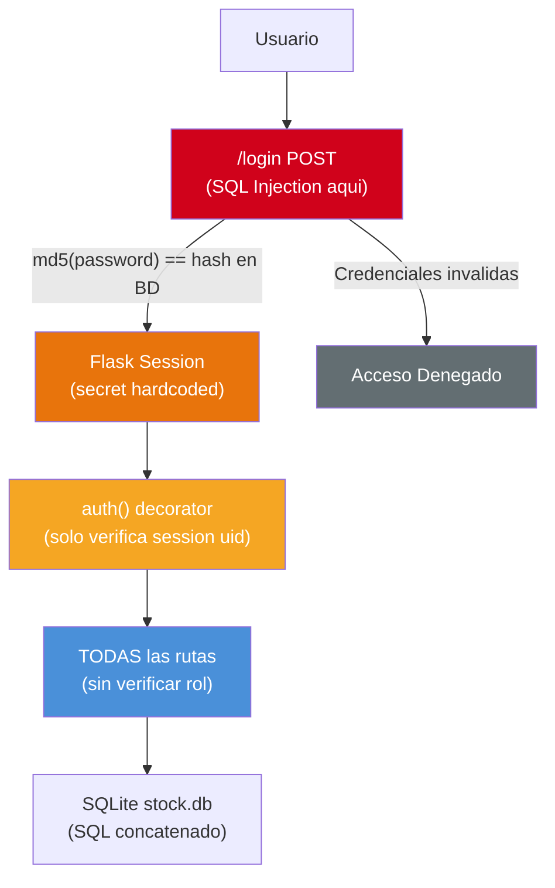

# Análisis de Seguridad

---

> **Aplicación:** StockControl — Aplicación de Inventarios y Bodegas  
> **Cliente:** SoftwareOne  
> **Tipo:** Python Flask Web Monolith (Single-file)  
> **LOC:** 939 | **Archivos fuente:** 2  
> **Fecha de análisis:** 2026-07-22

---

## 1. Postura de Seguridad General

| Área de Seguridad | Estado | Implementación | Observaciones |
|---|---|---|---|
| **Autenticación** | ❌ Débil | MD5 sin salt + secret hardcoded | Criptográficamente roto; sesiones forjables |
| **Autorización** | ❌ Ausente | Roles definidos pero sin enforcement | Decorator `auth()` solo verifica sesión, no roles |
| **Cifrado** | ❌ Ausente | Sin TLS, sin cifrado en reposo | Todo en texto plano; MD5 no es cifrado |
| **Auditoría** | ❌ Ausente | Solo `print()` básico | Sin registro de eventos de seguridad |
| **Validación de inputs** | ❌ Ausente | Input de usuario va directo a SQL y HTML | Sin sanitización, sin tipado, sin límites |

### Resumen de Postura

- **Fortalezas:** Ninguna identificada en el ámbito de seguridad.
- **Debilidades críticas:** SQL Injection (7+ puntos), MD5 passwords, secret hardcoded, debug mode, sin RBAC, sin CSRF, sin rate limiting.
- **Riesgo principal:** Un atacante puede obtener acceso completo al sistema y sus datos en segundos via SQL Injection en `/login`.

---

## 2. Vulnerabilidades Identificadas

| ID | Vulnerabilidad | CWE | Severidad | Ubicación | Descripción |
|---|---|---|---|---|---|
| V-01 | SQL Injection directa | CWE-89 | 🔴 High | `app.py:448,757,759,761,848,882` | Concatenación de strings en queries SQL |
| V-02 | Uso de MD5 para passwords | CWE-328 | 🔴 High | `app.py:265` | Hash criptográficamente roto sin salt |
| V-03 | Secret key hardcoded | CWE-798 | 🔴 High | `app.py:44` | `'stockcontrol_dev_KEY_123'` visible en código |
| V-04 | Debug mode en producción | CWE-489 | 🔴 High | `app.py:44-45` | Werkzeug debugger potencialmente accesible |
| V-05 | Sin autorización por roles | CWE-862 | 🟡 Medium | `app.py:298-305` | RBAC decorativo sin enforcement |
| V-06 | Sin CSRF protection | CWE-352 | 🟡 Medium | Todos los forms | Sin tokens anti-CSRF en ningún formulario |
| V-07 | Sin rate limiting | CWE-307 | 🟡 Medium | `/login` | Brute force sin restricción |
| V-08 | State change via GET | CWE-352 | 🟡 Medium | `app.py:1032,1190` | Toggle productos/bodegas con GET request |

### Detalle de Impacto por Vulnerabilidad

#### V-01: SQL Injection (CWE-89)

- **Vector de ataque:** Input en campo username del login: `' OR '1'='1' --`
- **Impacto:** Lectura/modificación/eliminación de todos los datos, bypass de autenticación
- **Probabilidad:** Alta — no requiere herramientas especializadas
- **Remediación:** Usar parametrized queries (`?` placeholders en sqlite3)

#### V-02: MD5 para Passwords (CWE-328)

- **Vector de ataque:** Obtener `stock.db` (via SQL Injection o acceso al servidor) → rainbow tables
- **Impacto:** Todas las contraseñas recuperables en segundos
- **Probabilidad:** Alta — si V-01 es explotada, V-02 es instantánea
- **Remediación:** Migrar a bcrypt/argon2 con salt único por usuario

#### V-03: Secret Key Hardcoded (CWE-798)

- **Vector de ataque:** Leer código fuente (público o via info disclosure) → forjar cookies Flask
- **Impacto:** Impersonación de cualquier usuario sin credenciales
- **Probabilidad:** Media — requiere acceso al código fuente
- **Remediación:** Mover a variable de entorno con rotación periódica

---

## 3. Mapeo OWASP Top 10 (2021)

| OWASP ID | Categoría | Vulnerabilidad Local | Severidad |
|---|---|---|---|
| A01:2021 | Broken Access Control | V-05, V-08 — Sin RBAC, state change via GET | 🔴 High |
| A02:2021 | Cryptographic Failures | V-02, V-03 — MD5, secret hardcoded | 🔴 High |
| A03:2021 | Injection | V-01 — SQL Injection en 7+ puntos | 🔴 High |
| A04:2021 | Insecure Design | Sin validación de negocio, sin rate limiting | 🟡 Medium |
| A05:2021 | Security Misconfiguration | V-04 — Debug mode permanente | 🔴 High |
| A06:2021 | Vulnerable and Outdated Components | Flask 2.2.5, Werkzeug 2.2.3 desactualizados | 🟡 Medium |
| A07:2021 | Identification and Authentication Failures | V-02, V-07 — MD5 + sin rate limit | 🔴 High |
| A08:2021 | Software and Data Integrity Failures | CDN sin integrity hash (SRI) | 🟢 Low |
| A09:2021 | Security Logging and Monitoring Failures | Sin logging de seguridad | 🟡 Medium |
| A10:2021 | Server-Side Request Forgery | No aplica — sin llamadas a URLs externas | — |

**Resumen:** 5 categorías en estado 🔴 High, 3 en 🟡 Medium, 1 en 🟢 Low, 1 No aplica.

---

## 4. Limitaciones del Análisis Estático

| Aspecto | Limitación | Impacto en Evaluación |
|---|---|---|
| Runtime behavior | Sin ejecución — no se puede confirmar explotabilidad real de V-04 (debugger) | V-04 marcada como High por potencial, no por explotación confirmada |
| Entorno de red | Sin info de firewall, WAF, segmentación de red | Si hay WAF, V-01 podría estar parcialmente mitigada |
| Datos sensibles | Sin acceso al contenido de stock.db | No se puede evaluar PII o datos financieros reales |
| Configuración servidor | Sin access a config de producción | Debug mode podría estar desactivado via env var (no detectado) |

---

## 5. Flujo de Autenticación y Autorización

### Observaciones del Flujo

1. **Gatekeeper vulnerable:** El login es el punto de entrada más crítico Y el más vulnerable (SQL Injection directa).
2. **Autorización inexistente:** `auth()` solo verifica existencia de sesión — un AUDITOR puede ejecutar movimientos de inventario.
3. **Segregación nula:** Todos los usuarios usan la misma conexión global a la misma BD con los mismos permisos.

---

## 6. Recomendaciones Prioritarias

| Prioridad | Acción | Vulnerabilidad | Esfuerzo |
|---|---|---|---|
| 🔴 1 | Parametrizar todas las queries SQL (usar `?` placeholders) | V-01 | Bajo (2 horas) |
| 🔴 2 | Externalizar secret key a variable de entorno | V-03 | Bajo (15 minutos) |
| 🔴 3 | Desactivar debug mode (env-based toggle) | V-04 | Bajo (15 minutos) |
| 🟡 4 | Migrar MD5 a bcrypt con salt (+ migración de hashes existentes) | V-02 | Medio (4 horas) |
| 🟡 5 | Implementar RBAC en decorator auth() por rol y ruta | V-05 | Medio (1 día) |

---

## 7. Conclusiones

1. **Postura de seguridad crítica:** 7 de 10 categorías OWASP vulnerables. El sistema NO debe exponerse a ninguna red sin remediación previa.

2. **Quick wins de alto impacto:** Las 3 remediaciones más urgentes (parametrizar SQL, externalizar secret, desactivar debug) se implementan en <3 horas y eliminan el 60% del riesgo.

3. **MD5 como herencia peligrosa:** Aunque el fix es técnicamente simple (migrar a bcrypt), requiere plan de migración de hashes existentes.

4. **RBAC como deuda funcional:** Los 4 roles están definidos pero sin lógica de enforcement. Cualquier Rebuild debe implementar RBAC desde el diseño.

5. **Ausencia total de auditoría:** Sin logging de seguridad, un ataque exitoso no dejaría rastro. El Rebuild debe incluir audit trail como requisito no negociable.

---

Análisis elaborado por SoftwareOne · 2026-07-22
