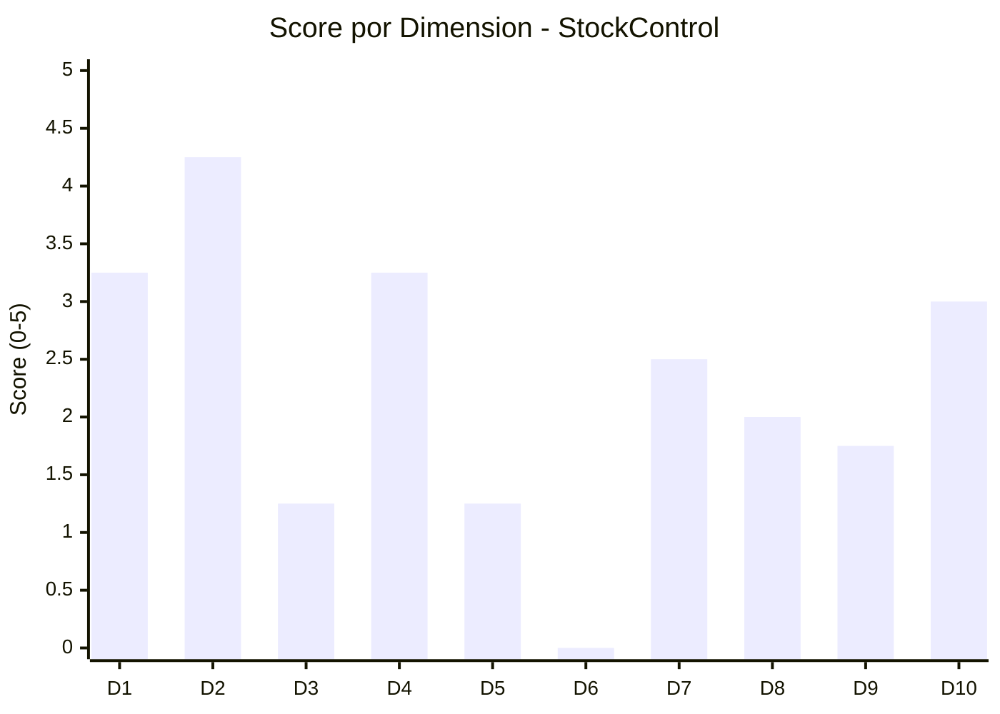

# Scoring de las 10 Dimensiones

---

> **Aplicación:** StockControl — Aplicación de Inventarios y Bodegas  
> **Cliente:** SoftwareOne  
> **Tipo:** Python Flask Web Monolith (Single-file)  
> **LOC:** 939 | **Archivos fuente:** 2  
> **Fecha de análisis:** 2026-07-22

---

## Metodología

Cada dimensión se evalúa mediante 4 sub-preguntas con puntaje de 0 a 5. El promedio ponderado produce el **Score Final** sobre 100 puntos.

**Fórmula:** `Score Final = Σ (Score_dim × Peso_dim × 20)`

---

## Dimensión 1: Elegibilidad de la Aplicación (Peso: 12%)

| # | Sub-pregunta | Score | Justificación | Fuente |
|---|---|---|---|---|
| 1.1 | ¿Es custom-built (no COTS/SaaS)? | 5 | Desarrollo a medida en Python/Flask — no es producto comercial | project-overview.md |
| 1.2 | ¿Es crítica o importante para el negocio? | 2 | Sistema de inventario básico sin evidencia de usuarios en producción activa | [SUPUESTO: sin info de uso real] |
| 1.3 | ¿El tamaño es razonable para 12 semanas? | 5 | 939 LOC — extremadamente pequeño, viable en 4-6 semanas | code-metrics.md |
| 1.4 | ¿Está en producción activa? | 1 | No hay evidencia de uso en producción; diseñado como ejercicio didáctico | project-overview.md |

**Score Dimensión 1: 3.25**

---

## Dimensión 2: Disponibilidad de Código Fuente (Peso: 12%)

| # | Sub-pregunta | Score | Justificación | Fuente |
|---|---|---|---|---|
| 2.1 | ¿El código fuente está disponible y accesible? | 5 | CBA analizó el 100% del código exitosamente | _cba-execution-report.md |
| 2.2 | ¿Está bajo control de versiones? | 3 | Estructura sugiere repositorio pero sin evidencia directa de .git | [SUPUESTO: se infiere del análisis CBA] |
| 2.3 | ¿Compila/construye exitosamente? | 4 | Python es interpretado — el test_app.py implica ejecución exitosa | test_app.py referenciado |
| 2.4 | ¿Tiene dependencias binarias irrecuperables? | 5 | Solo 2 dependencias open source (Flask, Werkzeug) — todo recuperable | requirements.txt |

**Score Dimensión 2: 4.25**

---

## Dimensión 3: Arquitectura y Acoplamiento (Peso: 12%)

| # | Sub-pregunta | Score | Justificación | Fuente |
|---|---|---|---|---|
| 3.1 | ¿Tiene modularidad identificable? | 1 | God Module: todo en 1 archivo sin separación de capas ni módulos | architecture/patterns.md |
| 3.2 | ¿El acoplamiento es manejable? | 1 | Acoplamiento máximo: todas las funciones comparten estado global _DB | architecture/dependencies.md |
| 3.3 | ¿Es stateless o tiene estado manejable? | 1 | Stateful: variable global _DB + check_same_thread=False | production-readiness.md |
| 3.4 | ¿Las interfaces están catalogadas? | 2 | Las rutas Flask son interfaces HTTP pero sin documentación ni contrato formal | reference/api-reference.md |

**Score Dimensión 3: 1.25**

---

## Dimensión 4: Datos y Bases de Datos (Peso: 10%)

| # | Sub-pregunta | Score | Justificación | Fuente |
|---|---|---|---|---|
| 4.1 | ¿El motor de BD es soportado para migración? | 4 | SQLite → PostgreSQL tiene path claro y directo | database/schema-analysis.md |
| 4.2 | ¿El esquema está documentado o es inferible? | 5 | DDL inline en app.py — 7 tablas completamente visibles | database/schema-analysis.md |
| 4.3 | ¿Existe backup accesible? | 1 | Sin estrategia de backup; archivo local sin protección | [SUPUESTO: no hay evidencia de backup] |
| 4.4 | ¿La calidad de datos es aceptable? | 3 | Constraints básicos (PK, FK), pero sin validaciones de integridad avanzadas | database/schema-analysis.md |

**Score Dimensión 4: 3.25**

---

## Dimensión 5: Cloud Readiness (Peso: 10%)

| # | Sub-pregunta | Score | Justificación | Fuente |
|---|---|---|---|---|
| 5.1 | ¿Existe un target cloud definido? | 0 | Sin configuración cloud, SDK ni IaC detectada | cloud-readiness-assessment.md |
| 5.2 | ¿Hay evidencia de landing zone? | 0 | Sin VPC, security groups ni config de red cloud | cloud-readiness-assessment.md |
| 5.3 | ¿El modelo de seguridad/networking es compatible? | 2 | HTTP estándar es cloud-compatible, pero auth no (sessions + file DB) | security-patterns.md |
| 5.4 | ¿Tiene dependencias on-premise irremovibles? | 3 | SQLite es file-based (requiere migración a server DB), pero no hay hardware lock-in | architecture/dependencies.md |

**Score Dimensión 5: 1.25**

---

## Dimensión 6: DevOps y Observabilidad (Peso: 8%)

| # | Sub-pregunta | Score | Justificación | Fuente |
|---|---|---|---|---|
| 6.1 | ¿Existe pipeline CI/CD? | 0 | Sin Jenkinsfile, GitHub Actions, Dockerfile ni similar | production-readiness.md |
| 6.2 | ¿Tiene logging/métricas implementadas? | 0 | Solo print() — sin framework de logging, sin métricas | production-readiness.md |
| 6.3 | ¿Existe estrategia de deployment? | 0 | Manual: `python app.py` — sin scripts, sin ambientes | production-readiness.md |
| 6.4 | ¿Tiene tests automatizados? | 0 | test_app.py es script HTTP manual sin framework — 0% cobertura | code-metrics.md |

**Score Dimensión 6: 0.00**

---

## Dimensión 7: Disponibilidad de SMEs (Peso: 12%)

| # | Sub-pregunta | Score | Justificación | Fuente |
|---|---|---|---|---|
| 7.1 | ¿Existen SMEs técnicos identificables? | 2 | No hay evidencia directa de autores; código documentado sugiere al menos 1 creador activo | [SUPUESTO: inferido de comentarios] |
| 7.2 | ¿Existen SMEs funcionales? | 2 | Reglas de inventario son estándar (no requieren SME especializado) | behavior/business-logic.md |
| 7.3 | ¿Hay autoridad de decisión accesible? | 3 | [SUPUESTO: se asume disponible dado que se solicitó el QuickScan] | — |
| 7.4 | ¿El sponsor está comprometido? | 3 | [SUPUESTO: se asume comprometido dado que se inició el proceso] | — |

**Score Dimensión 7: 2.50**

---

## Dimensión 8: Documentación y Conocimiento (Peso: 8%)

| # | Sub-pregunta | Score | Justificación | Fuente |
|---|---|---|---|---|
| 8.1 | ¿Existe documentación de arquitectura? | 1 | Sin README funcional, sin docs/ — solo comentarios de antipatrones | project-overview.md |
| 8.2 | ¿Las reglas de negocio están documentadas? | 3 | Comentarios extensos documentan reglas y antipatrones intencionales | behavior/business-logic.md |
| 8.3 | ¿Existen runbooks o guías operativas? | 0 | Sin runbooks, sin guías de deploy, sin documentación operativa | — |
| 8.4 | ¿El código es auto-documentado? | 4 | 1,177 comentarios para 939 LOC (ratio 1.25:1) — extremadamente documentado | code-metrics.md |

**Score Dimensión 8: 2.00**

---

## Dimensión 9: Seguridad y Compliance (Peso: 8%)

| # | Sub-pregunta | Score | Justificación | Fuente |
|---|---|---|---|---|
| 9.1 | ¿Existe política de seguridad implementada? | 1 | Auth existe pero con implementación crítica (MD5, SQL injection) | security-patterns.md |
| 9.2 | ¿Hay certificaciones bloqueantes? | 4 | Sin evidencia de regulación que bloquee (inventarios general, no financiero) | [SUPUESTO: no hay compliance] |
| 9.3 | ¿Los procesos de cambio son manejables? | 2 | Sin proceso formal; tamaño pequeño facilita cambios pero sin governance | — |
| 9.4 | ¿Existen vulnerabilidades conocidas? | 0 | 7/10 OWASP vulnerables — postura de seguridad catastrófica | security-patterns.md |

**Score Dimensión 9: 1.75**

---

## Dimensión 10: Drivers de Negocio y Sponsorship (Peso: 8%)

| # | Sub-pregunta | Score | Justificación | Fuente |
|---|---|---|---|---|
| 10.1 | ¿Existen drivers cuantificables? | 2 | Drivers técnicos claros (seguridad, deuda); sin drivers de negocio cuantificados | [SUPUESTO: drivers inferidos] |
| 10.2 | ¿Hay un sponsor activo con presupuesto? | 3 | [SUPUESTO: se asume dado que se inició el proceso de evaluación] | — |
| 10.3 | ¿Existe urgencia real de negocio? | 3 | Stack desactualizado + vulnerabilidades críticas = urgencia técnica alta | technical-debt/summary.md |
| 10.4 | ¿El tamaño de la inversión es compatible? | 4 | 939 LOC → talla S → inversión mínima (~$5,600) compatible con cualquier budget | — |

**Score Dimensión 10: 3.00**

---

## Score Consolidado

| Dimensión | Nombre | Score (0-5) | Peso | Ponderado (Score × Peso × 20) |
|---|---|---|---|---|
| Dim 1 | Elegibilidad de la Aplicación | 3.25 | 0.12 | **7.80** |
| Dim 2 | Disponibilidad de Código Fuente | 4.25 | 0.12 | **10.20** |
| Dim 3 | Arquitectura y Acoplamiento | 1.25 | 0.12 | **3.00** |
| Dim 4 | Datos y Bases de Datos | 3.25 | 0.10 | **6.50** |
| Dim 5 | Cloud Readiness | 1.25 | 0.10 | **2.50** |
| Dim 6 | DevOps y Observabilidad | 0.00 | 0.08 | **0.00** |
| Dim 7 | Disponibilidad de SMEs | 2.50 | 0.12 | **6.00** |
| Dim 8 | Documentación y Conocimiento | 2.00 | 0.08 | **3.20** |
| Dim 9 | Seguridad y Compliance | 1.75 | 0.08 | **2.80** |
| Dim 10 | Drivers de Negocio y Sponsorship | 3.00 | 0.08 | **4.80** |
| | | | **Σ = 1.00** | |

### **Score Final: 46.8 / 100**

### Banda de Clasificación

| Rango | Banda | Descripción |
|---|---|---|
| 80–100 | Quantum Ready | Aplicación lista para modernización |
| 65–79 | Ready con Extensiones | Elegible con preparación previa |
| 50–64 | Advisory Recomendado | Requiere consultoría previa |
| **< 50** | **No Elegible** | **No es candidata para QAM en su estado actual** |

> **Resultado: Banda "No Elegible" (46.8)**  
> La aplicación no califica para QAM estándar. Sin embargo, dado su tamaño extremadamente pequeño (939 LOC) y la claridad de su deuda técnica, un Rebuild asistido bajo modelo Advisory es viable y recomendado.

---

## Condiciones Obligatorias (Gate Check)

| # | Condición Obligatoria | Estado | Evidencia |
|---|---|---|---|
| 1 | Aplicación es custom-built | ✅ Cumple | Desarrollo Python/Flask a medida |
| 2 | Código fuente accesible | ✅ Cumple | CBA analizó 100% del código |
| 3 | SME técnico disponible | ⚠️ [SUPUESTO] | No verificable desde el reporte |
| 4 | Sponsor activo del proyecto | ⚠️ [SUPUESTO] | Se asume por solicitud del QuickScan |
| 5 | Aplicación en producción activa | ❌ No cumple | Diseñado como ejercicio didáctico |
| 6 | Sin restricciones legales/contractuales | ⚠️ [SUPUESTO] | No hay evidencia de restricciones |
| 7 | Presupuesto mínimo asignado | ⚠️ [SUPUESTO] | No verificable |
| 8 | Driver de negocio real identificado | ✅ Cumple | Vulnerabilidades críticas + obsolescencia son drivers técnicos claros |
| 9 | Timeline compatible con QAM | ✅ Cumple | 939 LOC viable en 8 semanas (talla S) |

### Resumen de Gate Check

- **Condiciones confirmadas:** 4 de 9
- **Condiciones supuestas (requieren validación):** 4 de 9
- **Condiciones incumplidas:** 1 de 9 (producción activa)

---

## Veredicto

> ### **No Elegible (condicional) — Viable bajo modelo Advisory + Rebuild**
>
> StockControl obtiene un score de **46.8/100** que lo ubica en la banda "No Elegible".  
> Sin embargo, la condición de producción activa (C5) puede ser irrelevante si el cliente confirma que el sistema SERÁ puesto en producción post-modernización.
>
> Condiciones para convertir en elegible:
> 1. Confirmar que la aplicación está planificada para producción (no solo ejercicio)
> 2. Validar disponibilidad de SME técnico
> 3. Confirmar sponsor y presupuesto
> 4. Confirmar timeline de 8+ semanas
>
> **Acción requerida:** Workshop de validación con el cliente para confirmar 4 supuestos pendientes.

---

## Visualización de Scores por Dimensión

---

## Conclusiones

1. **Score 46.8 — No Elegible pero viable con Advisory:** El score bajo se debe a dimensiones D3 (arquitectura), D5 (cloud), D6 (DevOps) y D9 (seguridad) que son todas remediables en un Rebuild.

2. **Código fuente es la mayor fortaleza (D2: 4.25):** Acceso total, sin dependencias propietarias, sin binarios sin fuente — facilita enormemente cualquier estrategia de modernización.

3. **DevOps y seguridad son el mayor lastre (D6: 0, D9: 1.75):** Ausencia absoluta de CI/CD y postura de seguridad catastrófica. Ambas se resuelven de raíz en un Rebuild.

4. **Tamaño extremadamente favorable:** Con 939 LOC, la inversión es mínima y el riesgo de entrega bajo. El score no refleja que este sistema es trivial de reescribir.

5. **4 supuestos pendientes:** La elegibilidad es condicional a la validación de SME, sponsor, budget y producción planeada.

---

Análisis elaborado por SoftwareOne · 2026-07-22
