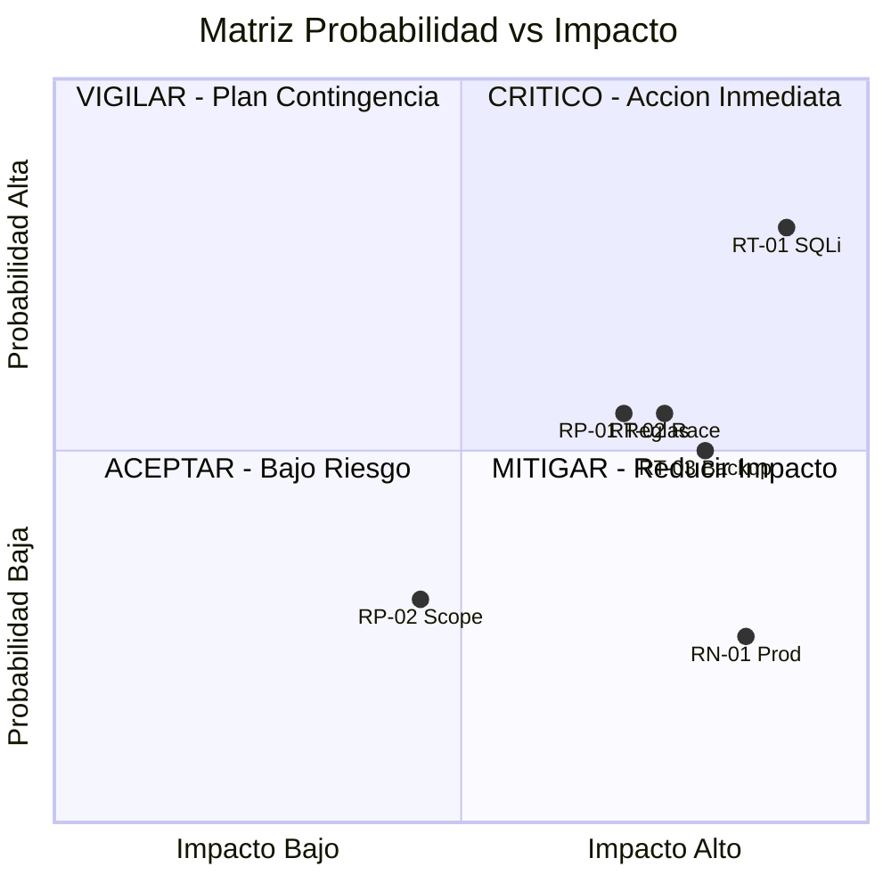

# Gap & Risk Register

---

> **Score Final:** 46.8 / 100 — No Elegible  
> **Banda:** No Elegible (<50)  
> **Complexity:** 1.5 (Deuda muy alta — score 85)

---

## 1. Registro de Brechas (Gaps de Elegibilidad)

| # | Dimensión | Score Actual | Score Target | Gap | Acciones para Cerrar | Responsable | Timing |
|---|---|---|---|---|---|---|---|
| G-01 | D6: DevOps y Observabilidad | 0.00 | 3.0 | 3.0 | Establecer CI/CD + Docker + logging | SoftwareOne DevOps | Durante modernización |
| G-02 | D3: Arquitectura y Acoplamiento | 1.25 | 3.0 | 1.75 | Rebuild modular por capas | SoftwareOne Dev | Durante modernización |
| G-03 | D5: Cloud Readiness | 1.25 | 3.0 | 1.75 | Containerizar + migrar SQLite→PostgreSQL | SoftwareOne Cloud | Durante modernización |
| G-04 | D9: Seguridad y Compliance | 1.75 | 3.0 | 1.25 | Remediar 7 categorías OWASP | SoftwareOne Security | Pre/durante modernización |

### Detalle de Acciones por Gap

#### G-01: DevOps y Observabilidad (Score 0.00 → Target 3.0)

**Situación actual:** Zero infraestructura DevOps. Sin CI/CD, sin Docker, sin tests, sin logging, sin monitoring. Deployment manual (`python app.py`).

**Acciones requeridas:**
1. Crear Dockerfile multi-stage con health checks
2. Configurar pipeline CI/CD (GitHub Actions: lint → test → build → deploy)
3. Implementar logging estructurado (JSON, correlation ID)
4. Agregar suite de tests automatizados (pytest, >80% cobertura)
5. Configurar monitoring básico (health endpoint + métricas RED)

**Prerrequisito para modernización:** No — se implementa COMO PARTE del Rebuild.

#### G-02: Arquitectura y Acoplamiento (Score 1.25 → Target 3.0)

**Situación actual:** God Module de 939 LOC en un solo archivo. Todas las capas mezcladas. Variable global compartida. Sin boundaries.

**Acciones requeridas:**
1. Separar en módulos: routes, services, repositories, models
2. Implementar dependency injection (eliminar variables globales)
3. Crear interfaces/contratos entre capas
4. Implementar patrón Repository para acceso a datos

**Prerrequisito para modernización:** No — el Rebuild lo resuelve de raíz.

#### G-03: Cloud Readiness (Score 1.25 → Target 3.0)

**Situación actual:** Aplicación atada a filesystem local (SQLite), sin containerización, sin configuración externalizada, sin health checks.

**Acciones requeridas:**
1. Migrar SQLite → PostgreSQL (BD server-grade)
2. Externalizar toda configuración a variables de entorno
3. Containerizar la aplicación (Docker)
4. Implementar health checks (/health, /ready)

**Prerrequisito para modernización:** No — forma parte natural del Rebuild.

#### G-04: Seguridad y Compliance (Score 1.75 → Target 3.0)

**Situación actual:** 7 de 10 categorías OWASP vulnerables. SQL Injection, MD5, secret hardcoded, debug mode, sin RBAC, sin CSRF.

**Acciones requeridas:**
1. Implementar queries parametrizadas (eliminar SQL injection)
2. Migrar a bcrypt/argon2 para passwords
3. Externalizar secretos a env vars con rotación
4. Implementar RBAC real por rol y endpoint
5. Agregar CSRF protection y rate limiting

**Prerrequisito para modernización:** Parcial — las 3 remediaciones urgentes (SQL, secret, debug) deben hacerse ANTES si el sistema está expuesto actualmente.

---

## 2. Registro de Riesgos

### 2.1 Riesgos Técnicos del AS-IS

| ID | Riesgo | Probabilidad | Impacto | Prioridad | Mitigación |
|---|---|---|---|---|---|
| RT-01 | SQL Injection explotada antes del Rebuild | Alta | Alto | 🔴 Crítico | Aislar de red inmediatamente; remediar en <1 día si está expuesto |
| RT-02 | Corrupción de stock.db por race conditions | Media | Alto | 🟠 Alto | No exponer a tráfico concurrente; backup manual antes de cada sesión |
| RT-03 | Pérdida de datos por ausencia de backup | Media | Alto | 🟠 Alto | Copiar stock.db a almacenamiento externo diariamente |

### 2.2 Riesgos del Proyecto de Modernización

| ID | Riesgo | Probabilidad | Impacto | Prioridad | Mitigación |
|---|---|---|---|---|---|
| RP-01 | Reglas de negocio no documentadas perdidas en el Rebuild | Media | Alto | 🟠 Alto | Tests de caracterización contra AS-IS antes de iniciar |
| RP-02 | Scope creep al descubrir funcionalidad fantasma (columnas sin lógica) | Baja | Medio | 🟡 Medio | Definir explícitamente: solo funcionalidad evidenciada en código |
| RP-03 | Sin SME disponible para validar paridad funcional | Media | Medio | 🟡 Medio | Documentar reglas del código; validar con usuario final en UAT |

### 2.3 Riesgos de Negocio

| ID | Riesgo | Probabilidad | Impacto | Prioridad | Mitigación |
|---|---|---|---|---|---|
| RN-01 | Sistema nunca llega a producción (era solo ejercicio) | Baja | Alto | 🟡 Medio | Confirmar con sponsor el objetivo real del Rebuild |
| RN-02 | Usuarios rechazan nueva UI post-Rebuild | Baja | Bajo | 🟢 Bajo | Mantener UX similar (Bootstrap) con mejoras incrementales |

---

## 3. Matriz de Prioridad

La concentración de riesgos en el cuadrante CRÍTICO (RT-01) confirma que la primera acción debe ser aislar el sistema de red. Los demás riesgos se distribuyen entre MITIGAR y VIGILAR.

---

## 4. Resumen Ejecutivo de Riesgos

| Categoría | Total | Críticos | Altos | Medios | Bajos |
|---|---|---|---|---|---|
| Técnicos AS-IS | 3 | 1 | 2 | 0 | 0 |
| Proyecto Modernización | 3 | 0 | 1 | 2 | 0 |
| Negocio | 2 | 0 | 0 | 1 | 1 |
| **TOTAL** | **8** | **1** | **3** | **3** | **1** |

### Top 3 Riesgos que Requieren Acción Inmediata

1. **RT-01: SQL Injection explotable** — Si el sistema está expuesto a cualquier red, un atacante puede comprometer todos los datos en segundos. Acción: aislar de red HOY.

2. **RP-01: Pérdida de reglas de negocio** — Sin SME ni documentación formal, las reglas viven solo en el código. Acción: extraer tests de caracterización del AS-IS antes de cualquier Rebuild.

3. **RT-02 + RT-03: Corrupción y pérdida de datos** — Conexión no thread-safe + sin backup = pérdida de datos inminente bajo carga. Acción: backup inmediato + limitar a 1 usuario concurrente.

---

## 5. Conclusiones

1. **1 riesgo CRÍTICO requiere acción en las próximas 24 horas:** Si StockControl está expuesto a red, aislar inmediatamente. La SQL Injection en `/login` es trivialmente explotable.

2. **Los 4 gaps se resuelven dentro del Rebuild:** No requieren trabajo pre-modernización separado — son inherentes al scope del proyecto.

3. **Riesgo de conocimiento es el mayor reto organizacional:** Sin SME confirmado, la validación de paridad funcional depende de la calidad de los tests de caracterización contra el AS-IS.

4. **Riesgo bajo de scope creep:** El sistema es tan pequeño (939 LOC, 11 funcionalidades) que el riesgo de descubrir complejidad oculta es mínimo.

5. **Confirmar objetivo de producción:** El riesgo RN-01 (sistema es solo ejercicio) debe descartarse en la primera reunión con el sponsor.

---

Análisis elaborado por SoftwareOne · 2026-07-22
