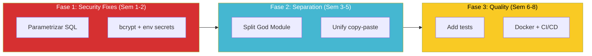
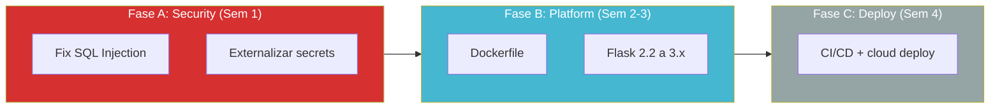
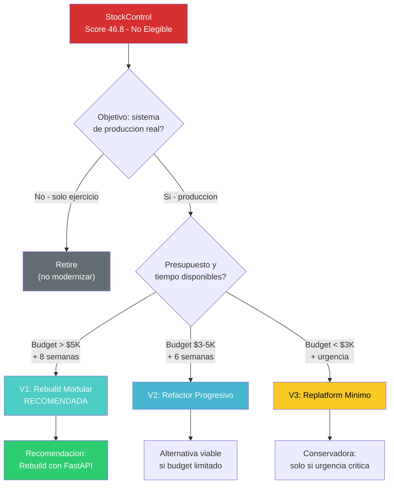

# Variantes de Modernización 7R

---

> **Score Final:** 46.8 / 100 — No Elegible  
> **Complexity:** 1.5 (Deuda muy alta)  
> **Score Deuda:** 85  
> **Stack actual:** Python 3.x + Flask 2.2.5 + SQLite  
> **Stack objetivo (definido por cliente):** No definido — propuesta SoftwareOne

---

## Contexto para la Selección de Variantes

### Factores determinantes

1. **Tamaño trivial (939 LOC):** El costo de Rebuild es menor que el costo de Refactor (no hay qué preservar de valor arquitectónico)
2. **Deuda score 85 (muy alta):** 85% del código está afectado — refactorizar es más costoso que reescribir
3. **Sin integraciones externas:** No hay anti-corruption layers, adapters ni contratos que preservar
4. **Stack Python vigente:** El runtime principal está vigente — se puede mantener el ecosistema
5. **7/10 OWASP vulnerables:** La seguridad debe implementarse from scratch — no hay base rescatable

### Variantes descartadas y razón

| Variante | Razón de descarte |
|---|---|
| **Retire** | El sistema tiene funcionalidad de valor (gestión de inventario) — no se descarta la funcionalidad |
| **Retain** | Score de deuda 85 + vulnerabilidades críticas hacen insostenible mantener el AS-IS |
| **Rehost** | No hay infraestructura que mover — es un script Python con SQLite local |
| **Rearchitect** | Con 939 LOC no tiene sentido descomponer en microservicios — un monolito limpio es suficiente |

### Variantes seleccionadas

Dado el tamaño pequeño y la deuda extrema, las variantes viables son **Rebuild** (reescribir desde cero con arquitectura limpia) y **Refactor** (reparar el código existente progresivamente). Se incluye **Replatform** como opción conservadora intermedia.

---

## Variante 1: Rebuild Modular (RECOMENDADA)

### Descripción

Reescritura completa de los 939 LOC usando Python 3.12 + FastAPI + PostgreSQL + arquitectura por capas. Se preserva la funcionalidad exacta del AS-IS (11 funcionalidades) con seguridad, testing y DevOps implementados from scratch.

### Estrategia de Ejecución

```mermaid
flowchart LR
    subgraph Fase1["Fase 1: Foundation (Sem 1-2)"]
        F1A["Arquitectura + DB schema"]
        F1B["CI/CD + Docker + IaC"]
    end

    subgraph Fase2["Fase 2: Core (Sem 3-5)"]
        F2A["Auth + RBAC"]
        F2B["CRUD Productos/Bodegas"]
        F2C["Movimientos inventario"]
    end

    subgraph Fase3["Fase 3: Features (Sem 6-7)"]
        F3A["Dashboard + Kardex"]
        F3B["Reportes + Historiales"]
    end

    subgraph Fase4["Fase 4: Cutover (Sem 8)"]
        F4A["Migracion datos + UAT + Go-live"]
    end

    Fase1 --> Fase2
    Fase2 --> Fase3
    Fase3 --> Fase4

    style Fase1 fill:#4ecdc4,color:#fff
    style Fase2 fill:#45b7d1,color:#fff
    style Fase3 fill:#f9ca24,color:#000
    style Fase4 fill:#6c5ce7,color:#fff
```

### Orden de Migración

| Orden | Módulo/Dominio | Justificación | Dependencias |
|---|---|---|---|
| 1 | Auth + RBAC | Fundación de seguridad — todo depende de esto | Infraestructura base |
| 2 | Catálogo (Productos, Categorías, Bodegas) | Entidades maestras requeridas por movimientos | Auth |
| 3 | Movimientos de Inventario | Core del negocio — mayor complejidad lógica | Catálogo |
| 4 | Dashboard + Kardex | Consultas/reportes que consumen los datos anteriores | Todo lo anterior |

### Perfil

| Atributo | Valor |
|---|---|
| **Esfuerzo** | S (Small) |
| **WU estimados** | 2,800 |
| **Duración** | 8–10 semanas |
| **Equipo centauro** | 1 Tech Lead + 1 Developer + 1 DevOps (part-time) |
| **Talla** | S |
| **Complejidad** | Baja-Media |
| **Riesgo** | Bajo (funcionalidad simple, sin integraciones) |

### Ventajas

- Elimina 100% de la deuda técnica de raíz
- Arquitectura limpia diseñada para mantenibilidad y escalabilidad
- Seguridad by-design (OWASP compliance) desde día 1
- Testing automatizado incluido (>80% cobertura)
- Cloud-ready desde el inicio (Docker + CI/CD)

### Desventajas

- Requiere discovery funcional (extraer reglas del código existente)
- Riesgo de perder funcionalidad no documentada explícitamente
- Mayor inversión inicial que un quick fix de seguridad

### Riesgos específicos

| Riesgo | Probabilidad | Impacto | Mitigación |
|---|---|---|---|
| Reglas de negocio no capturadas en el Rebuild | Media | Medio | Tests de caracterización contra AS-IS |
| Funcionalidad fantasma (columnas sin lógica) genera ambigüedad | Baja | Bajo | Excluir explícitamente: solo lo evidenciado |
| Sin SME para validar UAT | Media | Medio | UAT con usuario final + golden master testing |

### Prerrequisitos

1. ☐ Confirmar target stack (FastAPI + PostgreSQL propuesto)
2. ☐ Validar disponibilidad de SME para UAT
3. ☐ Definir ambiente cloud target (AWS/Azure/GCP)
4. ☐ Confirmar sponsor y budget
5. ☐ Aislar sistema actual de red (remediación urgente)

---

## Variante 2: Refactor Progresivo

### Descripción

Reparar el código existente en fases: primero seguridad (quick fixes), luego separación de capas, luego testing, luego containerización. Se mantiene Flask + SQLite como base, actualizando a Flask 3.x.

### Estrategia de Ejecución

### Perfil

| Atributo | Valor |
|---|---|
| **Esfuerzo** | S (Small) |
| **WU estimados** | 2,200 |
| **Duración** | 6–8 semanas |
| **Equipo centauro** | 1 Tech Lead + 1 Developer |
| **Talla** | S |
| **Complejidad** | Media |
| **Riesgo** | Medio (refactoring sin tests = regresión potencial) |

### Ventajas

- Menor inversión inicial (2,200 vs 2,800 WU)
- Valor incremental inmediato (seguridad desde semana 1)
- Preserva todo el código funcional existente

### Desventajas

- No elimina toda la deuda (SQLite permanece, Flask 2→3 tiene breaking changes)
- Refactoring sin tests es arriesgado (0% cobertura actual)
- Resultado: código mejorado pero no cloud-native
- Mantiene la "piel" del sistema legacy

### Riesgos específicos

| Riesgo | Probabilidad | Impacto | Mitigación |
|---|---|---|---|
| Regresión durante split del God Module (sin tests) | Alta | Medio | Characterization tests ANTES del split |
| Flask 2→3 breaking changes | Media | Bajo | Migración asistida con guía oficial |
| SQLite permanece como limitante de escala | Alta | Bajo | Aceptar limitación o planear migración futura |

### Prerrequisitos

1. ☐ Crear tests de caracterización contra el AS-IS
2. ☐ Confirmar que Flask 3.x es compatible con la funcionalidad actual
3. ☐ Definir si SQLite se mantiene o se migra (impacta scope)

---

## Variante 3: Replatform Mínimo (Conservadora)

### Descripción

Containerizar el sistema AS-IS con correcciones de seguridad mínimas (parametrizar SQL, externalizar secrets), actualizar Flask a 3.x y desplegar en cloud con Docker. NO se refactoriza la arquitectura interna.

### Estrategia de Ejecución

### Perfil

| Atributo | Valor |
|---|---|
| **Esfuerzo** | S (Small) |
| **WU estimados** | 1,200 |
| **Duración** | 4–6 semanas |
| **Equipo centauro** | 1 Developer + 1 DevOps (part-time) |
| **Talla** | S |
| **Complejidad** | Baja |
| **Riesgo** | Bajo (cambios mínimos al código) |

### Ventajas

- Menor inversión de todas las opciones (1,200 WU)
- Resuelve las vulnerabilidades más urgentes rápidamente
- El sistema queda en cloud con CI/CD básico
- Bajo riesgo de regresión (cambios puntuales)

### Desventajas

- God Module permanece (no mejora mantenibilidad)
- SQLite en container (no escala, backups complejos)
- Deuda arquitectónica intacta — solo se parchea
- "Lift-and-shift de problemas al cloud"

### Riesgos específicos

| Riesgo | Probabilidad | Impacto | Mitigación |
|---|---|---|---|
| SQLite en container pierde datos al reiniciar | Alta | Alto | Volume mount o migrar a PostgreSQL |
| God Module sigue siendo inmantenible | Alta | Medio | Aceptar limitación temporal |

### Prerrequisitos

1. ☐ Definir storage persistente para SQLite en container (volume)
2. ☐ Confirmar que el scope NO incluye refactoring arquitectónico
3. ☐ Aceptar que la deuda técnica permanece (decisión consciente)

---

## Tabla Comparativa

| Atributo | V1: Rebuild Modular | V2: Refactor Progresivo | V3: Replatform Mínimo |
|---|---|---|---|
| **Total WU** | 2,800 | 2,200 | 1,200 |
| **Duración** | 8–10 sem | 6–8 sem | 4–6 sem |
| **Equipo** | 3 personas | 2 personas | 2 personas |
| **Talla** | S | S | S |
| **Riesgo** | Bajo | Medio | Bajo |
| **Valor incremental** | ❌ Solo al final (big-bang) | ✅ Desde semana 2 | ✅ Desde semana 1 |
| **Resuelve seguridad** | ✅ 100% (by-design) | ✅ 100% (fix + refactor) | ⚠️ Parcial (solo fixes urgentes) |
| **Resuelve deuda** | ✅ 100% (nueva base) | ⚠️ 70% (God Module split pero SQLite queda) | ❌ 20% (solo security patches) |
| **Cloud-native** | ✅ Sí | ⚠️ Parcial | ❌ No (solo containerizado) |
| **Mantenibilidad post** | Excelente | Buena | Mala (igual que hoy) |

---

## Árbol de Decisión

---

## Recomendación Técnica

### Variante Recomendada: V1 — Rebuild Modular

**Razones de la recomendación:**

1. **Con 939 LOC, reescribir es más barato que refactorizar:** Un developer senior puede reescribir 939 LOC en 2-3 semanas con arquitectura limpia. Refactorizar sin tests toma igual o más tiempo con mayor riesgo.
2. **Deuda score 85 = no hay base rescatable:** El 85% del código tiene problemas. Preservar el 15% bueno no justifica arrastrar el 85% malo.
3. **Security by-design > security patches:** Un Rebuild implementa seguridad desde el diseño. Un Refactor parchea sobre una base insegura.
4. **Cloud-native desde día 1:** Rebuild produce un artefacto Docker-ready con CI/CD. Refactor produce un script Python mejorado.
5. **Inversión mínima en términos absolutos:** 2,800 WU = 560 créditos = USD $5,600. Es la inversión más baja posible en el espectro QAM.

### Condiciones para cambiar a V2

Si se confirman TODAS las siguientes:
- El cliente quiere preservar el código Python existente por alguna razón
- El budget es estrictamente <$5,000
- Hay un developer interno que conoce el código y puede hacer el refactoring
- Se acepta que SQLite permanece como BD

### Condiciones para considerar V3

Si se confirma CUALQUIERA de las siguientes:
- Urgencia de producción en <4 semanas (no hay tiempo para Rebuild)
- Budget extremadamente limitado (<$2,000)
- El objetivo es solo "pasar a cloud" sin mejorar arquitectura

---

## Conclusiones

1. **Las 3 variantes son talla S:** Todas caben en el paquete más pequeño de QAM. La diferencia es el nivel de resolución de deuda (20% vs 70% vs 100%).

2. **Rebuild es la opción óptima:** Para 939 LOC, reescribir es más rápido, más seguro y produce mejor resultado que refactorizar un God Module sin tests.

3. **El score "No Elegible" no impide el proyecto:** El sistema es tan pequeño que la estrategia Advisory + Rebuild lo convierte en el proyecto más simple y de menor riesgo posible.

4. **Inversión de USD 5,600 para V1:** Esto posiciona el proyecto como una demostración de bajo riesgo del modelo centauro — ideal como proof of concept del servicio QAM.

5. **Decisión del cliente define la variante:** Si el objetivo es producción real → V1. Si es solo containerizar → V3. Si quiere preservar código → V2.

---

Análisis elaborado por SoftwareOne · 2026-07-22
