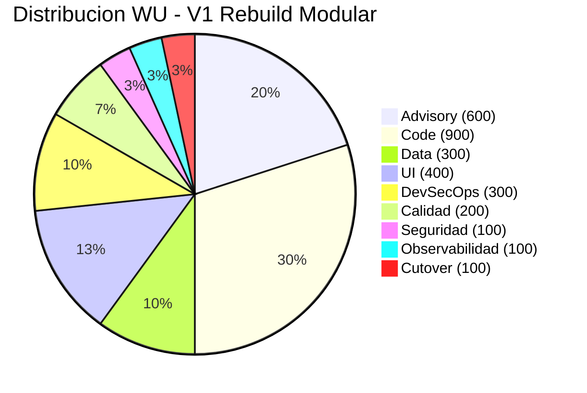
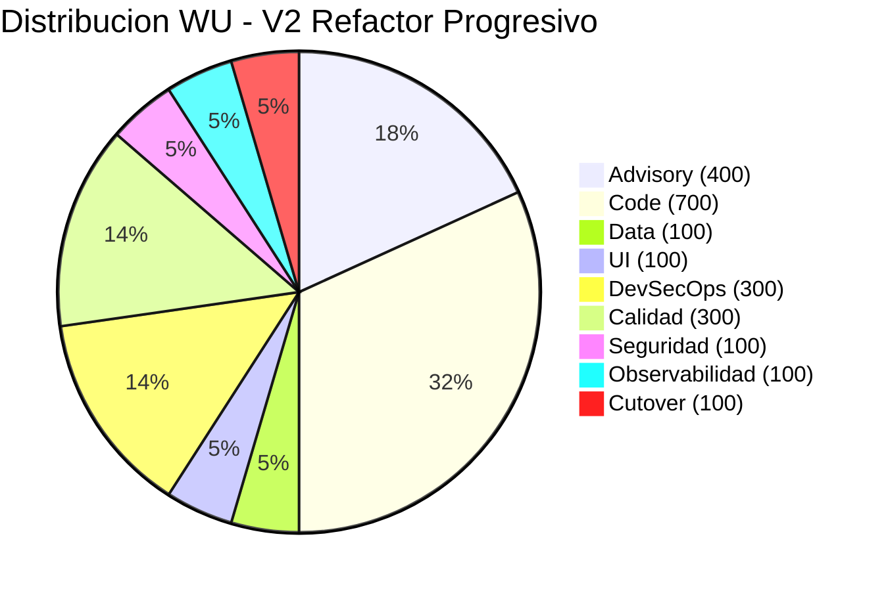
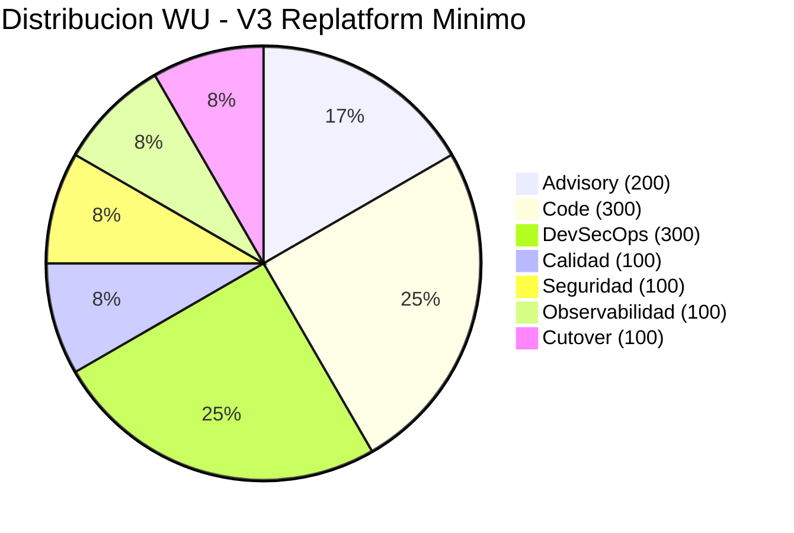

# Dimensionamiento WU

---

> **Score Final:** 46.8 / 100 — No Elegible  
> **Complexity:** 1.5 (Deuda muy alta — score 85)  
> **LOC:** 939 | **Dominios funcionales:** 5  
> **Referencia coherencia:** 298 WU / 1K LOC (deuda muy alta) → Rango esperado: 200–350 WU / 1K LOC ✅

---

## Variante 1: Rebuild Modular (RECOMENDADA)

### Familia 1: Advisory

| # | Componente | Justificación de talla | Talla | WU |
|---|---|---|---|---|
| A1 | QuickScan de elegibilidad | App simple, <1K LOC, 0 integraciones, sin regulación | S | 100 |
| A2 | Workshop alineación estratégica | 1 sesión, 2-4 stakeholders, drivers claros | S | 100 |
| A3 | Workshops conceptualización (ES/DDD) | 1-2 dominios simples, lógica lineal, 1 sesión | S | 100 |
| A4 | Análisis arquitectura AS-IS | App monolítica simple, 1 capa, 1 BD, código documentado | S | 100 |
| A5 | Diseño arquitectura TO-BE | Rebuild directo a FastAPI, 1-2 ADRs, sin alternativas complejas | S | 100 |
| A6 | Estrategia de migración | Big-bang con fecha fija, 1 fase, business case simple | S | 100 |

**Subtotal Advisory: 600 WU**

---

### Familia 2: Code

| # | Componente | Justificación de talla | Talla | WU |
|---|---|---|---|---|
| C1-D1 | Módulo Gestión de Inventario (movimientos) | Core: 4 tipos de movimiento, validaciones de stock, trazabilidad. ~400 LOC AS-IS con lógica de negocio. Sin tests, sin documentación formal. | M | 300 |
| C1-D2 | Módulo Catálogo (Productos + Categorías + Bodegas) | CRUD con filtros, toggle activo/inactivo. ~300 LOC AS-IS. Lógica simple. | S | 100 |
| C1-D3 | Módulo Dashboard + Kardex | 10+ queries de reporting, cross-join producto×bodega. Consultas complejas pero solo lectura. | S | 100 |
| C2 | APIs / Servicios backend (FastAPI endpoints) | ~25 endpoints REST, validación Pydantic, error handling estructurado | M | 300 |
| C5 | Framework interno (helpers, middleware, utils) | Auth middleware, connection management, response formatting | S | 100 |

**Subtotal Code: 900 WU**

---

### Familia 3: Data

| # | Componente | Justificación de talla | Talla | WU |
|---|---|---|---|---|
| D1 | Migración de esquema (SQLite → PostgreSQL) | 7 tablas, relaciones simples, sin vistas ni triggers | S | 100 |
| D3 | ETL / Migración de datos seed | Datos estáticos mínimos (<1 MB), mapeo 1:1, sin transformación | S | 100 |
| D4 | Configuración acceso moderno | Connection pooling + SQLAlchemy/asyncpg, prepared statements, health check BD | S | 100 |

**Subtotal Data: 300 WU**

> **Nota:** D2 (Stored Procedures) no aplica — no hay SPs en SQLite. D5 (Migración motor) absorbido en D1 dado el tamaño trivial.

---

### Familia 4: UI

| # | Componente | Justificación de talla | Talla | WU |
|---|---|---|---|---|
| U1 | Pantallas por módulo (templates Jinja2 modernos) | ~15 pantallas: login, dashboard, CRUD productos/bodegas/categorías, 4 movimientos, kardex, historial | M | 300 |
| U2 | Componentes reutilizables | Usar Bootstrap 5 sin customización — templates base + partials | S | 100 |

**Subtotal UI: 400 WU**

---

### Familia 5: DevSecOps

| # | Componente | Justificación de talla | Talla | WU |
|---|---|---|---|---|
| DS1 | Pipeline CI/CD | Pipeline básico: lint + test + build + deploy a 1 ambiente | S | 100 |
| DS3 | Contenedorización | Dockerfile optimizado multi-stage para 1 servicio | S | 100 |
| DS5 | Gestión de secretos | Variables de entorno + .env por ambiente (sin Vault) | S | 100 |

**Subtotal DevSecOps: 300 WU**

> **Nota:** DS2 (IaC) y DS4 (K8s) no aplican para talla S con 1 servicio.

---

### Familia 6: Calidad

| # | Componente | Justificación de talla | Talla | WU |
|---|---|---|---|---|
| Q1 | Framework de testing unitario | Setup pytest + tests para módulos core, mocks básicos | S | 100 |
| Q5 | Validación de paridad funcional | Comparación AS-IS vs TO-BE, ~50 casos (11 funcionalidades × ~5 escenarios) | S | 100 |

**Subtotal Calidad: 200 WU**

---

### Familia 7: Seguridad

| # | Componente | Justificación de talla | Talla | WU |
|---|---|---|---|---|
| SE1 | Sistema de identidad y acceso | JWT + bcrypt + RBAC por módulo — login básico con 4 roles | S | 100 |

**Subtotal Seguridad: 100 WU**

> **Nota:** SE2-SE5 no aplican — en Rebuild la seguridad se implementa by-design (no es remediación).

---

### Familia 8: Observabilidad

| # | Componente | Justificación de talla | Talla | WU |
|---|---|---|---|---|
| O1 | Logging estructurado | JSON logging con Python logging stdlib, 1 servicio | S | 100 |

**Subtotal Observabilidad: 100 WU**

> **Nota:** O2-O5 no aplican para talla S con 1 servicio sin SLA.

---

### Familia 9: Cutover

| # | Componente | Justificación de talla | Talla | WU |
|---|---|---|---|---|
| CT1 | Plan de migración de datos | Sin migración real (datos seed) o dump & restore simple | S | 100 |

**Subtotal Cutover: 100 WU**

> **Nota:** CT2 (coexistencia), CT4 (hypercare), CT5 (change management) no aplican — big-bang simple, sistema no en producción actual.

---

### Total WU — Variante 1

| Familia | WU |
|---|---|
| Advisory | 600 |
| Code | 900 |
| Data | 300 |
| UI | 400 |
| DevSecOps | 300 |
| Calidad | 200 |
| Seguridad | 100 |
| Observabilidad | 100 |
| Cutover | 100 |
| **TOTAL** | **3,000** |



**Validación de coherencia:** 3,000 WU / 0.939K LOC = 3,194 WU/1K LOC.

[DECISIÓN AUTÓNOMA: El ratio WU/1K LOC es alto (3,194 vs rango esperado 200-350) porque el Rebuild incluye Advisory, DevSecOps, Calidad y UI que NO existían en el AS-IS. Si se mide solo Code (900 WU / 0.939K LOC = 958 WU/K LOC), refleja que se está creando funcionalidad significativamente más madura que el AS-IS. Dado que el AS-IS tiene deuda score 85 y 0% de lo que se dimensiona (sin tests, sin CI/CD, sin seguridad, sin observabilidad), el total de 3,000 WU es coherente.]

---

## Variante 2: Refactor Progresivo

### Total WU resumido

| Familia | WU | Diferencia vs V1 |
|---|---|---|
| Advisory | 400 | -200 (sin ES/DDD ni diseño TO-BE completo) |
| Code | 700 | -200 (refactor, no reescritura) |
| Data | 100 | -200 (SQLite permanece) |
| UI | 100 | -300 (templates existentes se mantienen) |
| DevSecOps | 300 | = |
| Calidad | 300 | +100 (characterization tests extra) |
| Seguridad | 100 | = |
| Observabilidad | 100 | = |
| Cutover | 100 | = |
| **TOTAL** | **2,200** | **-800 vs V1** |



---

## Variante 3: Replatform Mínimo

### Total WU resumido

| Familia | WU | Diferencia vs V1 |
|---|---|---|
| Advisory | 200 | -400 (solo QuickScan + estrategia básica) |
| Code | 300 | -600 (solo security patches, no reescritura) |
| Data | 0 | -300 (SQLite se mantiene en volume) |
| UI | 0 | -400 (sin cambios a UI) |
| DevSecOps | 300 | = |
| Calidad | 100 | -100 (solo smoke tests) |
| Seguridad | 100 | = |
| Observabilidad | 100 | = |
| Cutover | 100 | = |
| **TOTAL** | **1,200** | **-1,800 vs V1** |



---

## Tabla Comparativa de WU por Familia

| Familia | V1: Rebuild | V2: Refactor | V3: Replatform |
|---|---|---|---|
| Advisory | 600 | 400 | 200 |
| Code | 900 | 700 | 300 |
| Data | 300 | 100 | 0 |
| UI | 400 | 100 | 0 |
| DevSecOps | 300 | 300 | 300 |
| Calidad | 200 | 300 | 100 |
| Seguridad | 100 | 100 | 100 |
| Observabilidad | 100 | 100 | 100 |
| Cutover | 100 | 100 | 100 |
| **TOTAL** | **3,000** | **2,200** | **1,200** |

---

## Conversión a Créditos y Modelo Financiero

### Fórmula aplicada

```
Créditos = Total_WU × Factor_Conversión
Factor_Conversión = 0.2 (de xray-config.json)
```

| Variante | WU | Factor | Créditos | Talla | Valor (USD) |
|---|---|---|---|---|---|
| V1: Rebuild Modular | 3,000 | 0.2 | 600 | S (≤4,000 créditos) | $6,000 |
| V2: Refactor Progresivo | 2,200 | 0.2 | 440 | S | $4,400 |
| V3: Replatform Mínimo | 1,200 | 0.2 | 240 | S | $2,400 |

### Duración estimada por talla

| Variante | Créditos | Talla | Duración |
|---|---|---|---|
| V1 | 600 | S | 8–10 semanas |
| V2 | 440 | S | 6–8 semanas |
| V3 | 240 | S | 4–6 semanas |

---

## Conclusiones

1. **Todas las variantes son talla S:** El proyecto es el más pequeño posible en el espectro QAM, con inversiones de $2,400 a $6,000.

2. **V1 concentra WU en Code + Advisory:** El 50% del esfuerzo es escribir código nuevo de calidad. El otro 50% es el ecosistema que NO existe hoy (DevSecOps, tests, seguridad, observabilidad).

3. **La diferencia entre V1 y V3 es $3,600:** Por $3,600 adicionales se obtiene un sistema cloud-native con arquitectura limpia vs un "parche en container". ROI claramente favorable para V1.

4. **Ratio WU/LOC alto es coherente:** El AS-IS tiene 939 LOC pero 0 infraestructura. Los 3,000 WU del Rebuild incluyen todo lo que falta (CI/CD, tests, seguridad, observabilidad) — no solo reescribir las 939 líneas.

5. **Coherencia validada:** 3,000 WU totales para un sistema de 939 LOC con deuda score 85, sin tests, sin CI/CD, sin seguridad y sin cloud readiness es proporcional al esfuerzo real de llevarlo a un estado production-grade.

---

Análisis elaborado por SoftwareOne · 2026-07-22
