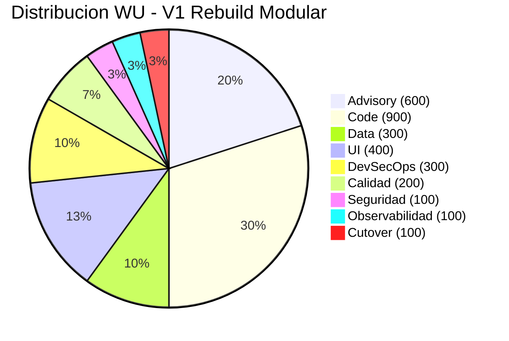
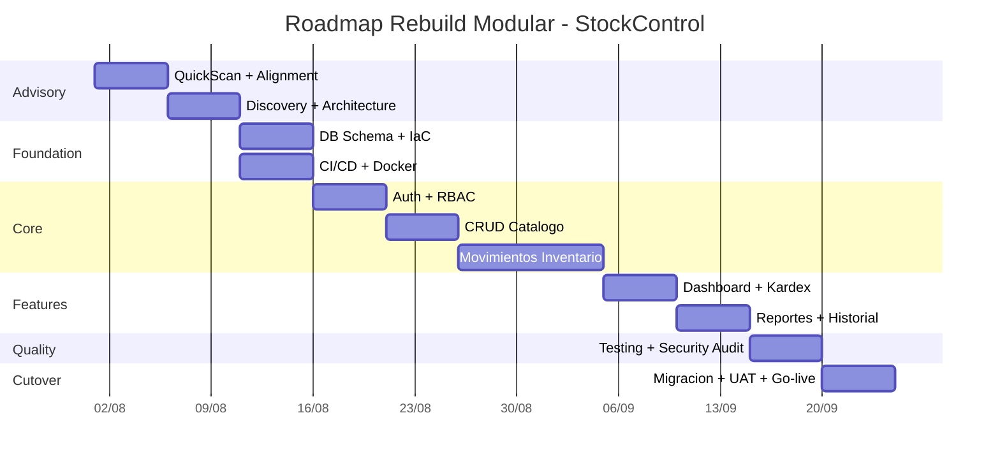

# Recomendación Técnica

---

> **Score Final:** 46.8 / 100 — No Elegible  
> **Variante Recomendada:** V1 — Rebuild Modular  
> **Total WU Recomendado:** 3,000 WU  
> **Duración estimada:** 8–10 semanas  
> **Equipo centauro:** 3 personas (1 Tech Lead + 1 Developer + 1 DevOps part-time)

---

## 1. Variante Recomendada

### V1: Rebuild Modular

**Justificación técnica:**

| Criterio | V1 (Recomendada) | V2 (Alternativa) | V3 (Conservadora) |
|---|---|---|---|
| Total WU | 3,000 | 2,200 (-27%) | 1,200 (-60%) |
| Riesgo de entrega | Bajo (green-field) | Medio (refactor sin tests) | Bajo (cambios mínimos) |
| Primera entrega de valor | Semana 8 (completa) | Semana 2 (security fixes) | Semana 1 (containerizado) |
| Cobertura funcional | 100% (reescritura total) | 100% (preserva todo) | 100% (sin cambios funcionales) |
| Resuelve deuda técnica | ✅ 100% | ⚠️ 70% | ❌ 20% |
| Resuelve seguridad | ✅ By-design | ✅ Patches + RBAC | ⚠️ Solo patches urgentes |

**Por qué V1 y no V2:**

- Con 939 LOC y deuda score 85, refactorizar código que es 85% problemático es más trabajo que reescribir 939 líneas limpias
- V2 requiere characterization tests previos (sin los cuales el refactoring es ciego) — esto agrega 300 WU pero el resultado sigue siendo código legacy mejorado
- V1 produce artefacto cloud-native; V2 produce script Python mejorado en container
- La diferencia de inversión es solo $1,600 (600 vs 440 créditos) para un resultado cualitativamente superior

**Por qué V1 y no V3:**

- V3 es "lift-and-shift de problemas" — el God Module permanece
- V3 deja SQLite en container (pérdida de datos al reiniciar sin volume mount)
- V3 no resuelve la mantenibilidad — cualquier cambio futuro sigue siendo arriesgado
- La diferencia es $3,600, pero V3 genera deuda nueva (complejidad operativa) sin resolver la existente

---

## 2. Comparativa de WU

---

## 3. Roadmap de Ejecución

---

## 4. Prerrequisitos del Cliente

| # | Prerrequisito | Responsable | Plazo | Bloqueante |
|---|---|---|---|---|
| 1 | Confirmar objetivo de producción (no solo ejercicio) | Sponsor | Antes de kickoff | ✅ Sí |
| 2 | Definir o aceptar target stack (FastAPI + PostgreSQL propuesto) | Cliente + Arquitecto SWO | Semana 1 | ✅ Sí |
| 3 | Disponibilidad de SME para UAT (mínimo 4h/semana) | Cliente | Semana 6 | ⚠️ Parcial |
| 4 | Definir ambiente cloud (AWS/Azure/GCP) | Cliente + DevOps SWO | Semana 2 | ✅ Sí |
| 5 | Confirmar presupuesto (USD ~6,000) | Sponsor | Antes de SOW | ✅ Sí |

---

## 5. Equipo Centauro Propuesto

| Rol | Dedicación | Responsabilidad |
|---|---|---|
| Tech Lead (Senior) | 50% durante 10 semanas | Arquitectura, code reviews, decisiones técnicas |
| Developer (Mid-Senior) | 100% durante 8 semanas | Implementación de código, tests, data migration |
| DevOps (Senior) | 25% durante 6 semanas | CI/CD, Docker, IaC, deployment |

**Total:** 3 personas, ~1.75 FTE equivalente promedio.

---

## 6. Stack Objetivo Propuesto

| Capa | Tecnología | Justificación |
|---|---|---|
| Backend | Python 3.12 + FastAPI | Async-ready, Pydantic validation, OpenAPI auto, ecosistema familiar |
| BD | PostgreSQL 16 | Server-grade, cloud-managed disponible, migraciones alembic |
| ORM | SQLAlchemy 2.x + Alembic | Tipado fuerte, migraciones versionadas, connection pool |
| Auth | JWT + bcrypt + python-jose | Stateless, RBAC enforzable, secret rotation via env |
| Frontend | Jinja2 + HTMX | Server-rendered (mantiene paradigma AS-IS), interactividad sin SPA |
| CI/CD | GitHub Actions | Estándar industry, gratuito para repos públicos |
| Container | Docker + docker-compose | Portabilidad, reproducibilidad, cloud-agnostic |
| Monitoring | Structlog + Prometheus metrics | Logging estructurado JSON + métricas RED básicas |

---

## 7. Modelo Financiero Resumen

| Concepto | Valor |
|---|---|
| WU Totales | 3,000 |
| Factor conversión | 0.2 |
| Créditos | 600 |
| Valor por crédito | USD 10 |
| **Valor contrato** | **USD 6,000** |
| Talla proyecto | S (≤4,000 créditos) |
| Duración | 8–10 semanas |

---

## 8. Próximos Pasos Inmediatos

| # | Acción | Responsable | Plazo |
|---|---|---|---|
| 1 | **URGENTE:** Aislar sistema de cualquier red (SQL Injection activa) | Cliente | Hoy |
| 2 | Workshop de validación: confirmar producción, sponsor, SME | SoftwareOne + Cliente | Semana 1 |
| 3 | Aceptar o proponer target stack alternativo | Cliente | Semana 1 |
| 4 | Firmar SOW con scope V1 (Rebuild Modular, talla S, 600 créditos) | Comercial SWO | Semana 2 |
| 5 | Kickoff del proyecto con equipo centauro asignado | SoftwareOne | Semana 3 |

---

## 9. Conclusiones

1. **Rebuild Modular es la recomendación unánime:** Para 939 LOC con deuda score 85, reescribir es objetivamente más eficiente que remediar.

2. **Inversión mínima posible (USD 6,000):** Este es el proyecto más pequeño, más barato y de menor riesgo que QAM puede ofrecer. Ideal como proof of concept del modelo centauro.

3. **Resultado: sistema production-grade en 10 semanas:** De un script Python vulnerable a una aplicación cloud-native con seguridad, tests y CI/CD completos.

4. **Acción urgente independiente del proyecto:** Si el sistema está expuesto a red HOY, debe aislarse inmediatamente. Las vulnerabilidades son trivialmente explotables.

5. **Elegibilidad condicional:** El score de 46.8 no impide el proyecto — confirmar 4 supuestos con el cliente convierte esto en un engagement viable bajo modelo Advisory + Rebuild.

---

Análisis elaborado por SoftwareOne · 2026-07-22
