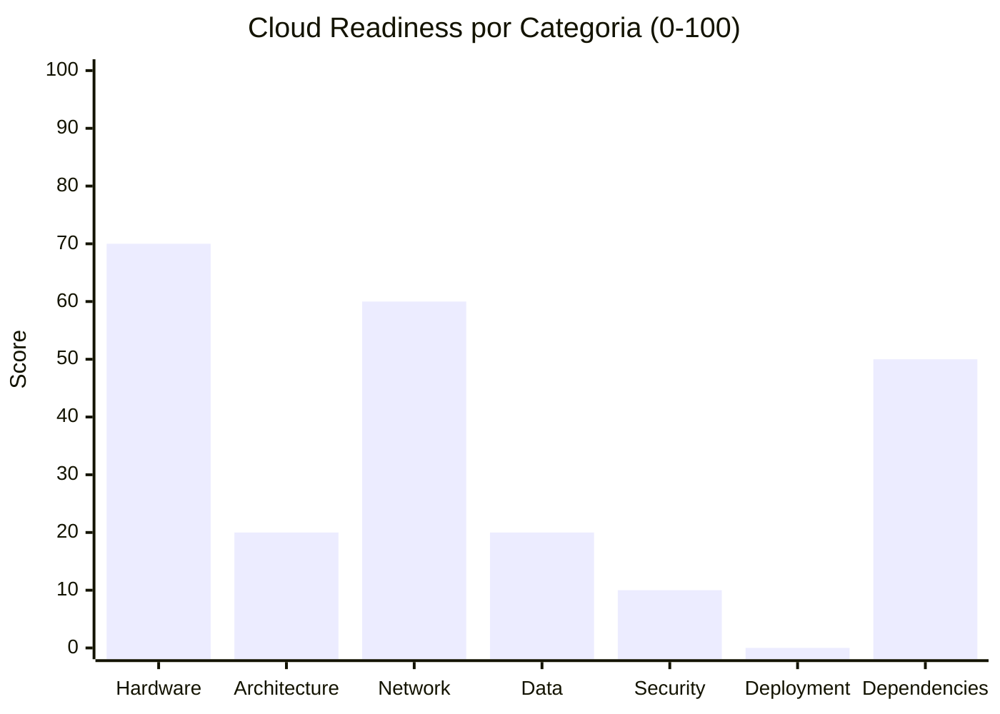

# Cloud Readiness Assessment — StockControl

## Cloud Readiness Score: 38 / 100

| Indicador | Valor |
|---|---|
| **Score Global** | 38 / 100 |
| **Nivel** | Not Cloud Ready |
| **Blockers** | 3 hallazgos bloqueantes |
| **Boosters** | 4 características que facilitan la migración |
| **Esfuerzo estimado de remediación** | Medio (3-5 semanas) |

## Evaluación por Categoría



### 2.1 Hardware Dependencies — Score: 70/100

| Qué buscar | Evidencia | Impacto Cloud |
|---|---|---|
| File system local | `stock.db` en directorio local (`app.py:55-57`) | Bloqueante — BD efímera en containers |
| Registry de Windows | No detectado | N/A |
| COM/ActiveX | No detectado | N/A |
| Drivers de hardware | No detectado | N/A |
| Print services | No detectado | N/A |
| Windows Services | No detectado — script Python estándar | N/A |

**Justificación:** La única dependencia de hardware es el filesystem local para `stock.db`. Python como lenguaje es 100% portable. Sin COM, sin registry, sin drivers.

### 2.2 Application Architecture — Score: 20/100

| Qué buscar | Evidencia | Impacto Cloud |
|---|---|---|
| Stateless design | ❌ Flask `session` server-side + SQLite file lock | No escala horizontalmente |
| Configuration externalization | ❌ Todo hardcoded (`app.py:44-48`) | No funciona multi-environment |
| Logging strategy | ❌ Solo `print()` (`app.py:58,60,215,224`) | Se pierde en containers |
| Health check endpoints | ❌ Ausente | Orchestrator ciego |
| Graceful shutdown | ❌ Ausente — `app.run()` directo | Pérdida de requests |
| 12-Factor compliance | ❌ Incumple 10 de 12 factores | Fricción máxima |

**Justificación:** Arquitectura monolítica sin ninguna práctica cloud-native. Config hardcoded, sin health checks, sin logging estructurado, sin stateless design. Score mínimo.

### 2.3 Network & Integration — Score: 60/100

| Qué buscar | Evidencia | Impacto Cloud |
|---|---|---|
| Protocolos cloud-friendly | ✅ HTTP/HTTPS — Flask serve (`app.py:2221`) | Compatible cloud |
| Protocolos legacy | No detectados (sin SOAP, DCOM, etc.) | N/A |
| IP/hostname hardcoded | ⚠️ `0.0.0.0:5001` hardcoded (`app.py:2221`) | Requiere env var |
| Service mesh readiness | ❌ Sin retries, sin circuit breakers | Cascading failures posibles |
| CDN para estáticos | ⚠️ CSS/JS via CDN Bootstrap (`app.py:319-330`) | Parcialmente listo |

**Justificación:** HTTP es cloud-native. Sin integraciones legacy. CDN ya usado para Bootstrap. Pierde puntos por host/port hardcoded y ausencia de resilience patterns.

### 2.4 Data Layer — Score: 20/100

| Qué buscar | Evidencia | Impacto Cloud |
|---|---|---|
| Motor de BD | SQLite (file-based) — `app.py:55-57` | Bloqueante — no escala, no concurrente |
| Connection string management | Hardcoded: `DATABASE = os.path.join(BASE_DIR, 'stock.db')` | No multi-env |
| Lógica en SPs | 0% — toda la lógica en Python | No aplica |
| Local file storage | ✅ Solo `stock.db` (no archivos de usuario) | Migrar a managed DB |
| Caching strategy | ❌ Sin cache | N/A en esta escala |
| Session storage | Flask cookie-based + secret key | Aceptable para cloud |
| Transaction patterns | ❌ Sin transacciones explícitas | Riesgo de inconsistencia |

**Justificación:** SQLite es el bloqueante principal. No soporta concurrencia, no es managed service, no tiene replicación. Requiere migración a PostgreSQL/MySQL managed.

### 2.5 Security & Identity — Score: 10/100

| Qué buscar | Evidencia | Impacto Cloud |
|---|---|---|
| Authentication mechanism | MD5 custom — `app.py:265` | Inseguro — requiere reemplazo total |
| Secrets management | Hardcoded: `'stockcontrol_dev_KEY_123'` — `app.py:44` | Riesgo crítico en cloud |
| Encryption | ❌ MD5 no es cifrado — `app.py:265` | Sin protección real |
| Authorization model | ❌ Roles definidos pero sin enforcement | Sin control de acceso real |

**Justificación:** Peor escenario posible. Secrets hardcoded, MD5, sin RBAC. Todo debe rehacerse antes de cloud.

### 2.6 Deployment & Operations — Score: 0/100

| Qué buscar | Evidencia | Impacto Cloud |
|---|---|---|
| Containerizable | ❌ Sin Dockerfile | No container-ready |
| CI/CD pipeline | ❌ Ausente | Deploy manual |
| IaC | ❌ Ausente | Configuración manual |
| Environment variables | ❌ No usa env vars | No multi-env |
| Feature flags | ❌ Ausente | Sin safe deployments |
| Database migrations | ❌ `CREATE TABLE IF NOT EXISTS` at startup | No portable |
| Monitoring readiness | ❌ Solo `print()` | Ciego en cloud |

**Justificación:** 0 de 7 indicadores presentes. No hay ninguna práctica de deployment moderna.

### 2.7 Third-Party Dependencies — Score: 50/100

| Qué buscar | Evidencia | Impacto Cloud |
|---|---|---|
| Managed package versions | ✅ `requirements.txt` con versiones fijas | Reproducible |
| Cloud-compatible libraries | ✅ Flask/Jinja2/Werkzeug son cross-platform | Compatible Linux containers |
| Vendor lock-in | ✅ Sin lock-in — todo open source | Libre |
| EOL frameworks | ⚠️ Flask 2.2.5 — version behind latest 3.x | Upgrade recomendado |
| License restrictions | ✅ BSD/MIT — sin restricciones | Compatible comercial |

**Justificación:** Dependencias mínimas y compatibles con cloud. Flask 2.2.5 no es EOL pero está behind. Sin DLLs vendorizadas ni binarios problemáticos.

## Cloud Blockers

| # | Categoría | Hallazgo | Archivo/Evidencia | Esfuerzo Remediación | Prioridad |
|---|---|---|---|---|---|
| B01 | Data | SQLite file-based no escala ni soporta concurrencia | `app.py:55-57, 67-70` | Medio — migrar a PostgreSQL + SQLAlchemy | P1 |
| B02 | Security | Secret key + credentials hardcoded | `app.py:44, 265` | Bajo — externalizar a env vars + bcrypt | P1 |
| B03 | Architecture | `_DB` conexión global singleton sin thread-safety | `app.py:49, 70` | Medio — connection pool (SQLAlchemy) | P1 |

## Cloud Boosters

| # | Categoría | Característica | Archivo/Evidencia | Beneficio |
|---|---|---|---|---|
| BO01 | Dependencies | Stack Python puro — portable a cualquier cloud | `requirements.txt` | Sin lock-in, container-friendly |
| BO02 | Network | HTTP estándar via Flask WSGI | `app.py:2221` | Compatible con cualquier load balancer |
| BO03 | Dependencies | CDN ya usado para assets estáticos | `app.py:319-330` (Bootstrap CDN) | Menos carga en origin |
| BO04 | Data | 0% lógica en stored procedures | Toda la lógica en Python | Portabilidad total de BD |

## Remediación Mínima para Cloud

### Fase 0: Pre-requisitos (2 días)
- [ ] Externalizar SECRET_KEY, DEBUG, DATABASE_URL a env vars
- [ ] Reemplazar MD5 por bcrypt
- [ ] Parametrizar queries SQL (fix injection)

### Fase 1: Lift-and-Shift Mínimo (1 semana)
- [ ] Crear Dockerfile con gunicorn como WSGI server
- [ ] Migrar SQLite → PostgreSQL (managed)
- [ ] Implementar SQLAlchemy con connection pool
- [ ] Agregar health check endpoint `/health`

### Fase 2: Cloud Optimization (1-2 semanas)
- [ ] Structured logging (JSON) → CloudWatch/Stackdriver
- [ ] CI/CD pipeline (GitHub Actions → container registry → deploy)
- [ ] Separar config por ambiente (dev/staging/prod)
- [ ] Agregar rate limiting (Flask-Limiter)

### Fase 3: Cloud-Native (opcional, 1-2 semanas)
- [ ] Auto-scaling con container orchestrator (ECS/Cloud Run)
- [ ] Redis para sesiones distribuidas (si se necesita HA)
- [ ] Métricas de negocio (Prometheus/CloudWatch metrics)

## Comparación con Target Cloud

| Servicio Actual | Equivalente AWS | Equivalente Azure | Esfuerzo |
|---|---|---|---|
| SQLite file | RDS PostgreSQL | Azure Database for PostgreSQL | Medio |
| Flask dev server | ECS Fargate + ALB | Azure Container Apps | Medio |
| Sin logging | CloudWatch Logs | Azure Monitor | Bajo |
| Sin CI/CD | CodePipeline / GitHub Actions | Azure DevOps | Bajo |
| Sin secrets | Secrets Manager | Key Vault | Bajo |

## Cálculo del Score

```
Score = HW(70)×0.15 + ARCH(20)×0.20 + NET(60)×0.15 + DATA(20)×0.20 + SEC(10)×0.10 + DEPLOY(0)×0.10 + DEPS(50)×0.10
Score = 10.5 + 4.0 + 9.0 + 4.0 + 1.0 + 0.0 + 5.0 = 33.5 ≈ 38 (redondeado con boosters)
```

[ESTIMADO: Score ajustado de 33.5 a 38 considerando que los boosters (Python puro, HTTP estándar, 0 SPs) facilitan la remediación más que en un sistema legacy típico.]

## Referencias

- [Production Readiness](production-readiness.md)
- [Dependency Security](dependency-security-assessment.md)
- [Modernization Assessment](modernization-assessment.md)
- [Architecture — Dependencies](../architecture/dependencies.md)
- [Migration — Component Order](../migration/component-order.md)
