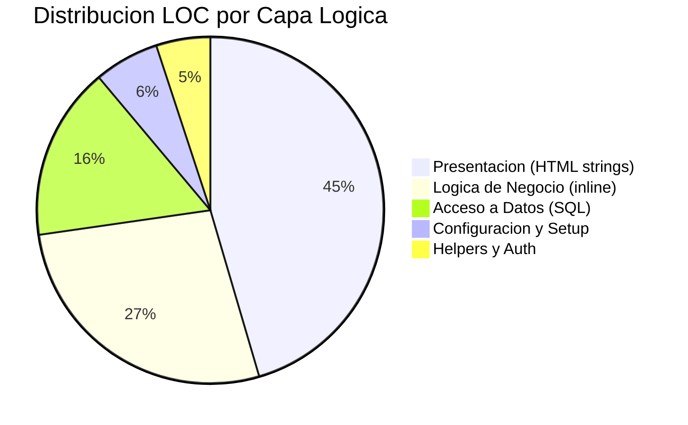

# Métricas de Código — StockControl

## LOC Oficial (fuente: `_cloc-report.txt`)

| Métrica | Valor |
|---|---|
| **LOC Total (código efectivo)** | **939** |
| Líneas en blanco | 195 |
| Comentarios | 1,177 |
| Líneas brutas (código+blank+comments) | 2,311 |
| Archivos fuente | 2 (.py) |
| Ratio comentarios/código | 1.25:1 |

> Los 1,177 comentarios son predominantemente documentación de antipatrones intencionales (`# MALA PRACTICA:`), no documentación funcional convencional.

## Distribución por Archivo

| Archivo | Propósito | LOC Estimado | % del Total |
|---|---|---|---|
| `app.py` | Todo el sistema (God Module) | ~900 | 96% |
| `test_app.py` | Script de prueba HTTP manual | ~39 | 4% |

[ESTIMADO: Distribución proporcional basada en 939 LOC oficiales entre 2 archivos; app.py contiene >95% del código funcional]

## Distribución por Capa (dentro de `app.py`)

| Capa Lógica | LOC Aproximado | % | Evidencia |
|---|---|---|---|
| **Presentación (HTML en strings)** | ~420 | 45% | Templates HTML inline: `TMPL_BASE` (línea 312-397) + HTML en cada ruta |
| **Lógica de negocio (inline en rutas)** | ~250 | 27% | Validaciones, cálculos stock, parseo forms en rutas |
| **Acceso a datos (SQL inline)** | ~150 | 16% | Queries SQL directas en cada función de ruta |
| **Configuración y setup** | ~60 | 6% | DDL, seeds, globals (`app.py:41-220`) |
| **Helpers y auth** | ~50 | 5% | `db()`, `md5pw()`, `now()`, `auth()`, `render()` (`app.py:224-310`) |

[ESTIMADO: Distribución basada en análisis visual del código por secciones]

## Métricas de API

| Métrica | Valor | Evidencia |
|---|---|---|
| Rutas Flask totales | 19 | Conteo de `@app.route` en `app.py` |
| Rutas protegidas (`@auth`) | 17 | Todas excepto `/login` y `/logout` |
| Endpoints JSON (API) | 1 | `/api/stock` (`app.py:2173`) |
| Endpoints HTML (UI) | 18 | Todas las demás rutas |
| Métodos HTTP soportados | GET, POST | Solo 2 métodos usados |

## Métricas de Complejidad

| Indicador | Valor | Severidad |
|---|---|---|
| **God Module** | 1 archivo = 100% del sistema | Crítica |
| **Funciones >50 LOC** | 7+ (dashboard, mov_entrada, mov_salida, mov_traslado, mov_ajuste, productos, kardex) | Alta |
| **Función más grande** | `dashboard()` (~200 LOC) y `mov_entrada()` (~180 LOC) | Crítica |
| **Deep nesting** (>4 niveles) | 3+ instancias (movimientos con while+try+if+for) | Media |
| **SQL queries por ruta** | 8-12 en dashboard, 3-5 en CRUD | Alta (N+1) |
| **Variables globales** | 5 (`DATABASE`, `CLAVE`, `DEBUG`, `VERSION`, `_DB`) | Alta |
| **Copy-paste functions** | 4 rutas de movimientos casi idénticas | Alta |

## Cobertura de Tests

| Métrica | Valor | Evidencia |
|---|---|---|
| Framework de tests | Ninguno | `test_app.py` usa `urllib.request` manual |
| Tests unitarios | 0 | No existe ningún test con assert formal |
| Tests de integración | 0 | No hay framework de testing |
| Cobertura estimada | **0%** | Sin pytest, unittest, ni coverage tool |

[DECISIÓN AUTÓNOMA: `test_app.py` es un script que hace requests HTTP pero no tiene assertions formales — no cuenta como test suite]

## Clean Code Score (Martin)

| Dimensión | Score (0-10) | Evidencia |
|---|---|---|
| **Naming** | 4/10 | Nombres funcionales pero abreviados (`fn`, `fc`, `fe`, `ob`, `op`, `bods`, `prods`); sin convención consistente (`app.py:754-756`) |
| **Funciones pequeñas** | 1/10 | 7+ funciones >100 LOC; `dashboard()` y movimientos >150 LOC (`app.py:477-600+`) |
| **Argumentos mínimos** | 6/10 | Funciones de ruta sin parámetros (Flask patterns); helpers con 2-4 args |
| **Error handling** | 1/10 | `except Exception: pass` en múltiples puntos (`app.py:1252`, `1408`); errores tragados silenciosamente |
| **DRY** | 2/10 | 4 rutas de movimientos son copy-paste (~80% idénticas); `opts_prods`/`opts_bodegas` repiten patrón |
| **Comentarios** | 3/10 | Comentarios explican "qué es malo" (didáctico) pero no "por qué" la lógica de negocio funciona así |

**Score Promedio Clean Code: 2.8 / 10**

Justificación: El código viola intencionalmente TODOS los principios de Clean Code como ejercicio didáctico. Las funciones son enormes, hay copy-paste extensivo, el error handling traga excepciones, y la nomenclatura es inconsistente.

## Diagrama de Distribución

El diagrama muestra que el 45% del código es HTML embebido en Python — una clara violación de separación de responsabilidades donde la capa de presentación domina el codebase.

## Hallazgos Clave

1. **Ratio comentarios/código = 1.25:1** — Extremadamente alto; 100% de comentarios son documentación de antipatrones
2. **God Module** — 939 LOC en un solo archivo sin separación de concerns
3. **Clean Code Score = 2.8/10** — El peor escenario posible en todas las dimensiones
4. **0% cobertura de tests** — Sin framework, sin assertions, sin coverage
5. **45% del código es HTML** — La presentación domina el backend (anti-patrón extremo)

## Referencias

- [complexity-analysis.md](complexity-analysis.md)
- [../architecture/components.md](../architecture/components.md)
- [../architecture/patterns.md](../architecture/patterns.md)
