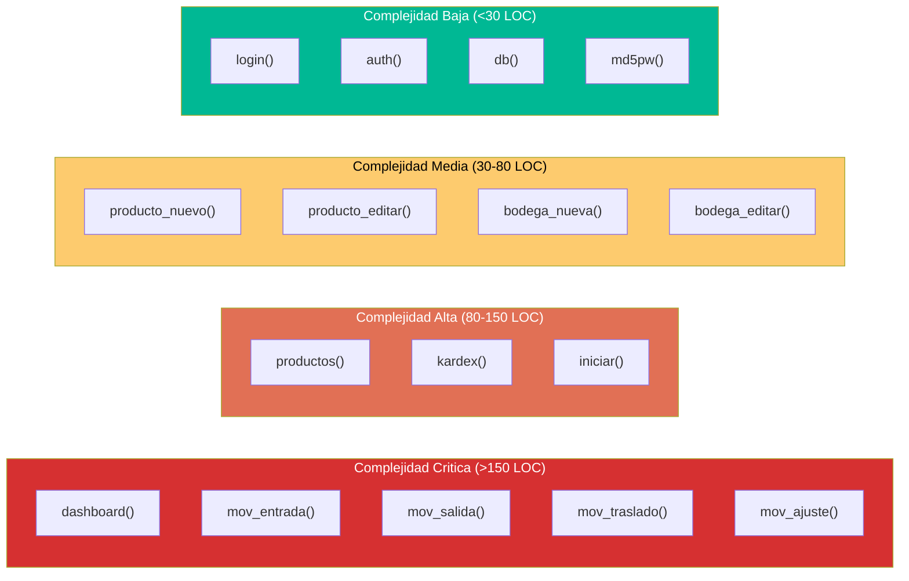

# Análisis de Complejidad — StockControl

## Evaluación General

| Métrica | Valor | Clasificación |
|---|---|---|
| **Complejidad estructural** | Crítica | God Module monolítico |
| **Complejidad cognitiva** | Alta | Funciones >150 LOC con lógica mezclada |
| **Complejidad de acoplamiento** | Crítica | Todo depende de todo (variable global `_DB`) |
| **LOC del módulo principal** | 939 (2,221 brutas) | Todo en `app.py` |

## God Classes / God Modules

| Componente | LOC | Responsabilidades | Severidad |
|---|---|---|---|
| `app.py` (God Module) | 939 LOC (100% del sistema) | Auth + BD + HTML + Negocio + Config + Routing + Seeds + API | **Crítica** |

Este es un caso extremo de God Module: un solo archivo contiene absolutamente toda la funcionalidad del sistema sin ninguna separación. Evidencia: `app.py:1-2221`.

## Funciones de Alta Complejidad

| Función | LOC Aprox. | Responsabilidades | Nesting Max | Evidencia |
|---|---|---|---|---|
| `dashboard()` | ~200 | 8 queries + cálculos + HTML + lógica de badges | 3 | `app.py:477-598` |
| `mov_entrada()` | ~180 | Form parsing + validación + insert + stock update + HTML + JS | 5 | `app.py:1224-1397` |
| `mov_salida()` | ~160 | Copia de mov_entrada con variaciones mínimas | 5 | `app.py:1400-1540` |
| `mov_traslado()` | ~170 | Copia con 2 bodegas + validación cruzada | 5 | `app.py:1545-1720` |
| `mov_ajuste()` | ~150 | Copia con lógica pos/neg | 5 | `app.py:1720-1870` |
| `productos()` | ~120 | SQL injection directa + filtros + HTML tabla | 3 | `app.py:714-840` |
| `kardex()` | ~120 | Queries complejas + HTML generado | 3 | `app.py:2050-2170` |
| `iniciar()` | ~100 | DDL + Seeds + Config + Print | 2 | `app.py:62-220` |

## Legacy Readiness por Componente (Feathers)

| Componente | Nivel | Justificación |
|---|---|---|
| `app.py` (completo) | **D — Monolithic** | God module, sin interfaces, sin DI, statics, singleton (`_DB` global), constructor doing work (`iniciar()` at import time) |
| Capa Auth | **D — Monolithic** | `auth()` decorator sin inyección, acoplado a `session` global |
| Capa Datos | **D — Monolithic** | `db()` retorna variable global; sin abstracción, sin repository pattern |
| Capa Negocio | **D — Monolithic** | Lógica inline en cada ruta; sin servicios separables |
| Capa Presentación | **D — Monolithic** | HTML hardcoded en strings; sin template files, sin components |

**Legacy Readiness Global: D (Monolithic)** — Requiere Sprout/Wrap → Strangler Fig → Rewrite parcial.

Evidencia de clasificación D:
- Sin interfaces: ninguna clase abstracta ni protocolo Python (`app.py` completo)
- Sin DI: `db()` accede a `_DB` global directamente (`app.py:227`)
- Singleton implícito: `_DB` creado una vez, nunca cerrado (`app.py:49, 70`)
- Constructor doing work: `iniciar()` ejecutado al import (`app.py:223-224`)

## Seams Detectados (Feathers)

| Seam Potencial | Tipo | Ubicación | Utilidad para Testing |
|---|---|---|---|
| `auth()` decorator | Object Seam | `app.py:298-305` | Se podría mockear para tests sin login |
| `db()` function | Preprocessing Seam | `app.py:227-230` | Podría redirigirse a BD de test |
| `get_stock()` | Link Seam | `app.py:240-245` | Helper puro, testeable independientemente |
| `actualizar_stock()` | Link Seam | `app.py:248-272` | Testeable si se inyecta BD |
| `render()` | Object Seam | `app.py:398-401` | Podría interceptarse para test de contenido |

**Pinch Points identificados**: `db()` y `auth()` — pocos tests en esos 2 puntos cubrirían >80% de la lógica.

## Module Depth (Ousterhout)

| Módulo | Interfaz | Implementación | Clasificación |
|---|---|---|---|
| `app.py` | Enorme (19 rutas, 5 helpers, 1 template) | Enorme (939 LOC) | **Shallow + Fat** — Lo peor: interfaz compleja E implementación compleja |
| `db()` | Simple (0 params) | Simple (3 LOC) | **Shallow** — Pass-through a global |
| `auth()` | Simple (decorator) | Simple (5 LOC) | **Shallow** — Solo verifica session |
| `render()` | Media (4 params) | Simple (4 LOC) | **Shallow** — Solo wrapper de render_template_string |
| `actualizar_stock()` | Media (4 params) | Media (20 LOC) | **Razonable** — Única función con profundidad real |

**Evaluación**: El sistema carece de módulos profundos (deep modules). Casi todo es pass-through o shallow. La complejidad está **dispersa** en las funciones de ruta, no encapsulada.

## Diagrama de Complejidad por Función

El diagrama muestra que 5 de las 19 funciones concentran la mayor complejidad del sistema. Las 4 funciones de movimientos son copias con variaciones mínimas — candidatas obvias a refactoring con Extract Method y Template Method.

## Dependency Blockers (Feathers)

| Blocker | Ubicación | Impacto | Técnica de Ruptura |
|---|---|---|---|
| `_DB` global (singleton) | `app.py:49` | Imposible testear sin BD real | Parameterize Constructor → inyectar conexión |
| `iniciar()` at import time | `app.py:223` | Import del módulo ejecuta toda la init | Extract and Override |
| `session` Flask global | `app.py:302` | Routes acopladas a estado de sesión | Wrap Method |
| `db()` retorna global | `app.py:227` | Toda función depende de un global | Introduce Static Setter (test seam) |

## Duplicación de Código

| Patrón Duplicado | Instancias | LOC Total Duplicado | Refactoring |
|---|---|---|---|
| Rutas de movimientos (entrada/salida/traslado/ajuste) | 4 | ~660 LOC | Extract Method + Template Method Pattern |
| `opts_prods()` / `opts_bodegas()` | 2 | ~16 LOC | Extract Method (genérico `opts_select()`) |
| Patrón form-parsing `while True` + `request.form.get(f'prod_{i}')` | 4 | ~60 LOC | Extract Method (`parse_item_list()`) |
| Patrón insert movimiento + detalle + commit | 4 | ~40 LOC | Extract Method (`registrar_movimiento()`) |

**Total código duplicado estimado: ~776 LOC de 939 = 83% del código tiene algún grado de duplicación**

[ESTIMADO: Basado en la estructura repetitiva de las 4 funciones de movimientos que son ~80% idénticas entre sí]

## Hallazgos Clave

1. **Legacy Readiness = D (Monolithic)** — El peor nivel; requiere estrategia de Strangler Fig
2. **5 funciones >150 LOC** — Todas en la categoría "God Function" de Feathers
3. **83% duplicación** — Las 4 rutas de movimientos son copy-paste
4. **0 módulos profundos** — Todo es shallow; la complejidad está dispersa, no encapsulada
5. **4 dependency blockers** — Impiden testing unitario sin refactoring previo

## Referencias

- [code-metrics.md](code-metrics.md)
- [tech-debt.md](tech-debt.md)
- [../architecture/patterns.md](../architecture/patterns.md)
