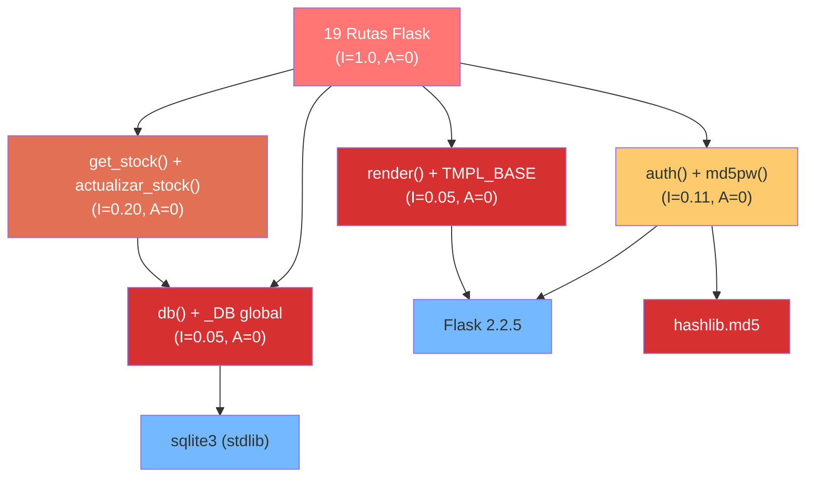

# Análisis de Dependencias — StockControl

## Resumen

| Métrica | Valor |
|---|---|
| Dependencias PyPI (directas) | 2 |
| Dependencias stdlib | 6 módulos |
| Dependencias CDN (frontend) | 3 recursos |
| Dependencias transitivas detectadas | 0 (sin lock file) |
| Riesgo global | **Medio-Alto** (no por cantidad sino por uso inseguro de hashlib) |

## Métricas de Component Principles (Clean Architecture)

### Instability (I) y Abstractness (A)

Dado que el sistema es un **monolito de 1 archivo**, las métricas de componente aplican a las zonas lógicas:

| Componente Lógico | Ca (incoming) | Ce (outgoing) | I = Ce/(Ca+Ce) | A (abstractness) | D = \|A+I-1\| |
|---|---|---|---|---|---|
| Zona Auth (`auth`, `md5pw`) | 17 (todas las rutas protegidas) | 2 (session, hashlib) | 0.11 | 0 (0 interfaces) | 0.89 — **Zona de Dolor** |
| Zona DB (`db()`, `_DB`) | 19 (todas las funciones) | 1 (sqlite3) | 0.05 | 0 | 0.95 — **Zona de Dolor** |
| Zona Render (`render`, `TMPL_BASE`) | 18 (todas las rutas con UI) | 1 (Flask) | 0.05 | 0 | 0.95 — **Zona de Dolor** |
| Zona Stock (`get_stock`, `actualizar_stock`) | 4 (movimientos) | 1 (db()) | 0.20 | 0 | 0.80 — **Zona de Dolor** |
| Rutas (19 funciones) | 0 (endpoints) | 5 (auth+db+render+stock+opts) | 1.0 | 0 | 0.0 — **Zona Inútil** |

### Interpretación

**TODOS los componentes están en la Zona de Dolor** (I≈0, A=0): son estables (muchas dependencias entrantes) pero completamente concretos (0 abstracciones). Esto significa:
- Imposible de cambiar sin romper todo el sistema
- Sin interfaces que permitan sustitución
- Acoplamiento máximo sin flexibilidad

Las rutas están en la **Zona Inútil** (I=1, A=0): completamente inestables y concretas — cada cambio las afecta pero no ofrecen abstracción.

## Violaciones a la Dependency Rule

| Violación | Evidencia | Impacto |
|---|---|---|
| Presentación → Datos (directo) | Cada ruta llama `db().execute()` directamente (`app.py:477+`) | Imposible testear UI sin BD |
| Presentación → Negocio (inline) | Lógica de validación de stock dentro de funciones HTML (`app.py:1418-1430`) | Sin separación posible |
| Negocio → Framework (acoplado) | Lógica usa `request.form`, `session`, `flash` directamente | Negocio no es portable |
| Datos → Infraestructura (hardcoded) | `sqlite3.connect(DATABASE, check_same_thread=False)` (`app.py:70`) | Sin abstracción de persistencia |

**Dependency Rule compliance: 0%** — Todas las capas dependen de todas las demás. No hay dirección de dependencia; es un grafo completamente conectado.

## Diagrama de Dependencias entre Zonas

El diagrama muestra un acoplamiento total: las rutas dependen de TODO, y las zonas de infraestructura (`db`, `auth`, `render`) no tienen abstracción. La Zona de Dolor (rojo) indica componentes que son dolorosamente difíciles de modificar.

## Framework Leakage

| Framework | Dónde se filtra | Impacto |
|---|---|---|
| Flask (`request`, `session`, `flash`, `redirect`) | DENTRO de la lógica de negocio de cada ruta | Imposible reusar la lógica sin Flask |
| SQLite (`db().execute()`, `Row`) | DENTRO de las funciones de presentación | BD no intercambiable |
| Jinja2 (`render_template_string`) | Helper `render()` acoplado al template inline | Sin sistema de templates real |

## Hallazgos Clave

1. **100% de componentes en Zona de Dolor** — Máxima estabilidad + 0 abstracción = sistema rígido
2. **Dependency Rule violada en 100% de los casos** — No hay dirección de dependencias
3. **Framework leakage total** — Flask, SQLite y Jinja2 invaden toda la lógica de negocio
4. **Acoplamiento circular** — Rutas↔Auth↔DB↔Rutas forman un grafo cíclico
5. **Sin lock file** — `requirements.txt` sin pinning de transitivas; builds no reproducibles

## Referencias

- [../architecture/dependencies.md](../architecture/dependencies.md)
- [dependency-security-assessment.md](dependency-security-assessment.md)
- [../architecture/patterns.md](../architecture/patterns.md)
