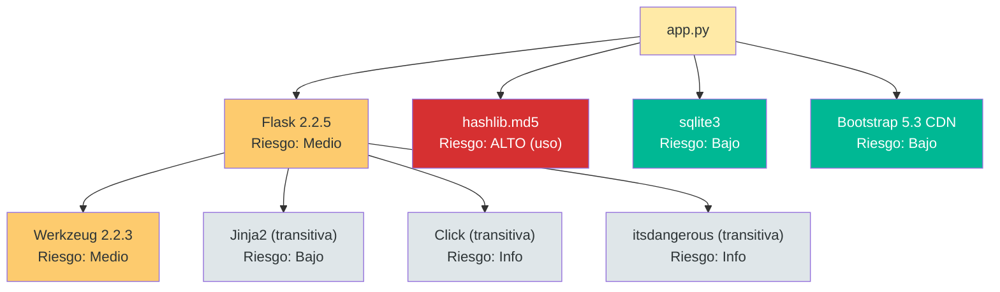

# Evaluación de Seguridad de Dependencias — StockControl

## Resumen Ejecutivo

| Métrica | Valor |
|---|---|
| Total dependencias directas (PyPI) | 2 |
| Total dependencias stdlib | 6 módulos |
| Dependencias CDN | 3 |
| Riesgo global | **Medio** |
| Dependencias con CVEs potenciales | 1 (Flask 2.2.5 — versión desactualizada) |
| Dependencias abandonadas | 0 |

## Inventario Completo de Dependencias

| Nombre | Versión Instalada | Tipo | Ecosistema | Riesgo | Estado |
|---|---|---|---|---|---|
| **Flask** | 2.2.5 | Directa | PyPI | Medio | Desactualizado (~2 major) |
| **Werkzeug** | 2.2.3 | Directa | PyPI | Medio | Desactualizado (~2 major) |
| hashlib (MD5) | stdlib | Implícita | Python stdlib | **Alto** (uso inseguro) | Activo (pero MD5 roto para crypto) |
| sqlite3 | stdlib | Implícita | Python stdlib | Bajo | Activo y mantenido |
| os | stdlib | Implícita | Python stdlib | Info | Activo |
| sys | stdlib | Implícita | Python stdlib | Info | Activo |
| datetime | stdlib | Implícita | Python stdlib | Info | Activo |
| json | stdlib | Implícita | Python stdlib | Info | Activo |
| Bootstrap CSS | 5.3.0 | CDN | jsdelivr | Bajo | Versión reciente |
| Bootstrap JS | 5.3.0 | CDN | jsdelivr | Bajo | Versión reciente |
| Bootstrap Icons | 1.11.0 | CDN | jsdelivr | Bajo | Versión reciente |

## Dependencias con Riesgo Elevado

### Flask 2.2.5 — Medio

- **Versión instalada:** 2.2.5 (evidencia: `requirements.txt:3`)
- **Estado:** Desactualizado — Flask 3.x es la versión actual
- **CVEs potenciales:** [PENDIENTE: verificar CVEs específicos para Flask 2.2.5 en NVD]
- **Cambios breaking:** Flask 3.0 requiere Werkzeug 3.x y dropea soporte para Python <3.8
- **Riesgo:** La versión 2.2.x está en mantenimiento limitado; parches de seguridad pueden no estar disponibles
- **Recomendación:** Actualizar a Flask 3.x como parte de la modernización

### hashlib MD5 — Alto (por uso, no por la librería)

- **Versión:** stdlib Python (siempre actualizado con el intérprete)
- **Problema:** No es un problema de la dependencia sino del **USO**: MD5 no debe usarse para hashing de passwords
- **Evidencia:** `app.py:265` — `hashlib.md5(p.encode()).hexdigest()`
- **Alternativa moderna:** `bcrypt` (pip) o `argon2-cffi` (pip)
- **Criticidad:** Alta — passwords recuperables con rainbow tables

## Análisis de Exposición

| Dependencia | Expuesta a Internet | Runtime | Surface Area | Riesgo Real |
|---|---|---|---|---|
| Flask 2.2.5 | Sí (app.run `0.0.0.0`) | Sí | 100% de la app | Medio — si hay CVE, todo está expuesto |
| Werkzeug 2.2.3 | Sí (HTTP server) | Sí | Request parsing + debug | Medio — debugger expuesto con DEBUG=True |
| hashlib MD5 | Indirecto (via login) | Sí | Solo `md5pw()` | Alto — password hashing roto |
| sqlite3 | Indirecto (via SQL) | Sí | 100% de datos | Bajo (la librería es segura; el problema es SQL injection en el código) |
| Bootstrap CDN | Sí (client-side) | Sí (browser) | UI completa | Bajo — sin SRI pero CDN es confiable |

## Cadena de Dependencias

El diagrama muestra un árbol de dependencias extremadamente simple. El riesgo no viene de la cantidad de dependencias sino del **uso inseguro** de hashlib MD5 y de las versiones desactualizadas de Flask/Werkzeug.

## Licencias

| Dependencia | Licencia | Riesgo Legal |
|---|---|---|
| Flask | BSD-3 | ✅ Ninguno — permisiva |
| Werkzeug | BSD-3 | ✅ Ninguno — permisiva |
| Bootstrap | MIT | ✅ Ninguno — permisiva |
| Python stdlib | PSF | ✅ Ninguno — permisiva |

Sin conflictos de licencias. Todas las dependencias usan licencias permisivas compatibles con uso comercial.

## Recomendaciones Priorizadas

| Prioridad | Acción | Esfuerzo | Impacto |
|---|---|---|---|
| **P1** | Reemplazar MD5 por bcrypt/argon2 | Bajo (horas) | Resuelve DT-03 (passwords seguros) |
| **P2** | Actualizar Flask 2.2.5 → 3.x | Medio (días) | Acceso a parches de seguridad + features modernos |
| **P3** | Agregar `requirements.lock` o migrar a Poetry | Bajo (minutos) | Builds reproducibles |
| **P4** | Agregar SRI a tags de CDN | Bajo (minutos) | Protección contra CDN comprometido |

## Impacto en Modernización

| Dependencia | Bloquea Migración | Equivalente Moderno | Esfuerzo |
|---|---|---|---|
| Flask 2.2.5 | No — upgrade directo | Flask 3.x o FastAPI | Bajo (Flask 3.x) / Medio (FastAPI) |
| Werkzeug 2.2.3 | No — se actualiza con Flask | Werkzeug 3.x | Automático con Flask 3.x |
| hashlib MD5 | No bloquea, pero DEBE cambiarse | bcrypt / argon2-cffi | Bajo |
| sqlite3 | **Sí** para producción multi-usuario | PostgreSQL / MySQL | Medio-Alto |

La única dependencia que realmente **bloquea** la modernización para producción es **SQLite** (no soporta escrituras concurrentes ni es adecuada para deploy cloud). Todas las demás son actualizables sin cambios arquitectónicos.

## Hallazgos Clave

1. **Árbol de dependencias mínimo** (2 packages) — Facilita enormemente la migración
2. **Riesgo principal: uso inseguro de hashlib** — No es un CVE de la librería sino del código
3. **Flask/Werkzeug desactualizados** — 2 major versions behind, sin parches recientes
4. **Sin lock file** — Builds no reproducibles (no se sabe qué transitivas se instalan)
5. **Sin dependencias abandonadas** — Flask y Werkzeug siguen activamente mantenidos

## Referencias

- [../architecture/dependencies.md](../architecture/dependencies.md)
- [security-patterns.md](security-patterns.md)
- [dependency-analysis.md](dependency-analysis.md)
