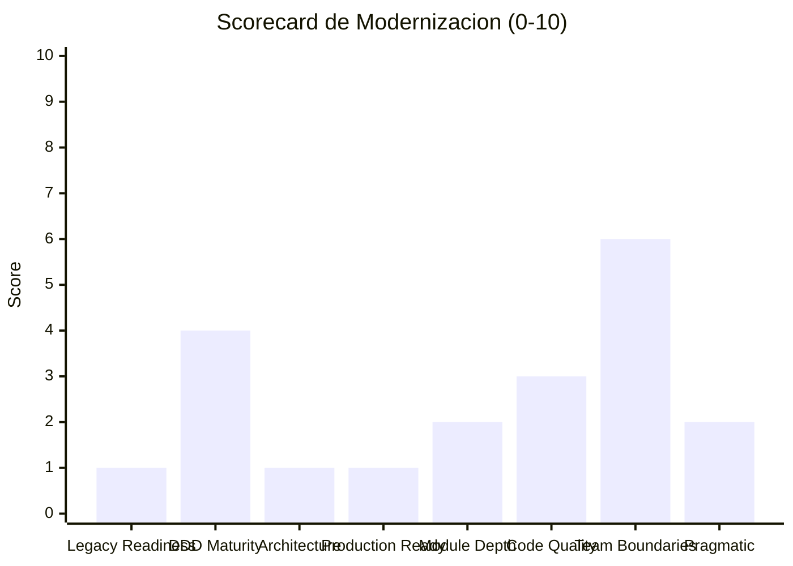

# Modernization Assessment — StockControl

## Scorecard de Modernización (8 Frameworks)

| Framework | Score | Justificación |
|---|---|---|
| Legacy Readiness (Feathers) | 1/10 | Nivel D — Monolithic: sin interfaces, sin DI, singleton global, constructor doing work |
| DDD Maturity (Evans) | 4/10 | 4 bounded contexts identificables pero sin separación; naming de dominio presente |
| Architecture Compliance (Martin) | 1/10 | Violación total de Dependency Rule: todo depende de todo; sin capas |
| Production Readiness (Nygard) | 1/10 | 0 de 8 stability patterns presentes; debug mode permanente |
| Module Depth (Ousterhout) | 2/10 | 1 módulo shallow (God Module con interfaz=todo); sin information hiding |
| Code Quality (Clean Code) | 3/10 | Score 2.8 — naming aceptable (dominio) pero funciones enormes, sin error handling |
| Team Boundaries (Skelton) | 6/10 | 4 bounded contexts claros → fracture planes naturales para split |
| Pragmatic (Hunt/Thomas) | 2/10 | DRY violado (4x copy-paste), orthogonality 1/5, múltiples broken windows |

**Score promedio: 2.5/10 — Requiere modernización significativa.**

## 1. Legacy Readiness (Michael Feathers) — Score: 1/10

### Nivel Global: D — Monolithic

| Componente | Nivel | Justificación |
|---|---|---|
| `app.py` (completo) | D | God module sin seams, sin DI, variable global `_DB`, `iniciar()` at import time |
| Auth layer | D | `auth()` acoplado a `session` global sin inyección posible |
| Data layer | D | `db()` retorna variable global; sin abstracción; SQL inline |
| Business logic | D | Inline en cada ruta; sin servicios, sin dominio |
| Presentation | D | HTML strings hardcoded; sin archivos template |

**Seams potenciales detectados:** 5 (ver `analysis/complexity-analysis.md`)
- `auth()` decorator — object seam
- `db()` function — preprocessing seam
- `get_stock()` — link seam
- `actualizar_stock()` — link seam
- `render()` — object seam

**Dependency Blockers:** 4 críticos
- `_DB` variable global mutable (`app.py:49`)
- `iniciar()` ejecutado at import time (`app.py:223`)
- `session` de Flask acoplado directamente
- `db()` retorna singleton sin inyección

**Evidencia:** `app.py:47-49, 62-222, 227-230, 298-305`

## 2. DDD Maturity (Eric Evans) — Score: 4/10

### Bounded Contexts Identificados

| BC | Entidades | Tablas | Rutas | Candidato a microservicio |
|---|---|---|---|---|
| **Catálogo** | Producto, Categoría | `productos`, `categorias` | 4 (/productos/*) | ✅ Sí |
| **Almacenamiento** | Bodega, Existencia | `bodegas`, `existencias` | 3 (/bodegas/*) | ✅ Sí |
| **Movimientos** | Movimiento, Detalle | `movimientos`, `detalle_movimientos` | 6 (/movimientos/*) | ✅ Sí |
| **Identidad** | Usuario, Sesión | `usuarios` | 2 (/login, /logout) | ✅ Sí |

### Ubiquitous Language

| Término en código | Dominio de negocio | Evaluación |
|---|---|---|
| `productos` | Productos de inventario | ✅ Correcto |
| `bodegas` | Almacenes/bodegas físicas | ✅ Correcto |
| `movimientos` | Movimientos de inventario | ✅ Correcto |
| `kardex` | Tarjeta Kardex de existencias | ✅ Correcto |
| `existencias` | Stock por producto/bodega | ✅ Correcto |
| `activo` (flag 0/1) | Estado de registro | ⚠️ Primitive obsession |
| `tipo` (string) | Tipo de movimiento | ⚠️ Debería ser Enum |

**Evaluación:** Naming de dominio CORRECTO (ubiquitous language presente), pero **modelo anémico**: las "entidades" son solo diccionarios de DB, sin comportamiento de negocio. Score 4/10 porque los nombres y contexts son buenos, pero no hay modelo rico.

### Anti-Corruption Layer

❌ No existe — el sistema es autocontenido sin integraciones externas que requieran ACL.

## 3. Architecture Compliance (Robert C. Martin) — Score: 1/10

### Dependency Rule

❌ **Violación total**: No existen capas. Todo depende de todo. El concepto de "inner vs outer" no aplica cuando hay 1 solo módulo.

### Component Metrics

| Componente | Ca (incoming) | Ce (outgoing) | I = Ce/(Ca+Ce) | A | D |
|---|---|---|---|---|---|
| Config (C01) | 15 (todo) | 0 | 0.0 | 0.0 | 1.0 (zona dolor) |
| Helpers (C03) | 12 | 3 | 0.2 | 0.0 | 0.8 (zona dolor) |
| Render (C05) | 7 | 2 | 0.22 | 0.0 | 0.78 |
| Rutas (C06-C13) | 0 | 5+ | 1.0 | 0.0 | 0.0 (zona inutil) |

**Hallazgo:** Config y Helpers están en la **zona de dolor** (estables pero concretos — difíciles de cambiar). Las Rutas están en la **zona inútil** (inestables pero sin abstracción).

**Evidencia:** Fan-in/fan-out calculado desde `architecture/components.md`

## 4. Production Readiness (Michael Nygard) — Score: 1/10

**0 de 8 stability patterns presentes.** Ver detalle completo en `analysis/production-readiness.md`.

Resumen: Sin circuit breakers, sin timeouts, sin retries, sin bulkheads, sin health checks, sin graceful degradation, sin graceful shutdown, sin steady state.

Anti-patterns presentes: Single Point of Failure, Unbounded Results, Cascading Failures, Shared Mutable State, Error Swallowing, Debug in Production, No Connection Pool.

## 5. Module Depth (John Ousterhout) — Score: 2/10

### Evaluación Deep vs Shallow

| Módulo | Interfaz | Implementación | Depth | Evaluación |
|---|---|---|---|---|
| `app.py` (God Module) | Toda la app HTTP (19 URLs) | 939 LOC | Aparentemente Deep | En realidad **Shallow**: cada ruta expone toda la complejidad interna sin encapsulamiento |
| `db()` | `db()` → connection | 4 LOC | Ultra-shallow | Pass-through a variable global |
| `auth()` | decorator | 8 LOC | Shallow | Solo verifica `session['uid']` |
| `actualizar_stock()` | 3 params | ~30 LOC | Acceptable | Único helper con depth real |

**Classitis:** ❌ No aplica — no hay clases. El problema es opuesto: **todo en funciones**.
**Pass-through methods:** `db()` es un pass-through puro a `_DB` global.
**Information Hiding:** ❌ Inexistente — SQL, HTML, y lógica mezclados sin encapsulamiento.

## 6. Code Quality / Clean Code (Robert C. Martin) — Score: 3/10

| Criterio | Score | Evidencia |
|---|---|---|
| Naming | 5/10 | Nombres de dominio buenos (`productos`, `kardex`) pero abbreviations (`u`, `p`, `b`, `r`) |
| Funciones pequeñas | 1/10 | Funciones de 150-580 LOC; dashboard 200 LOC |
| Argumentos mínimos | 4/10 | Helpers con 2-3 args; rutas usan `request` implícito |
| Error handling | 1/10 | `except Exception: pass` en 4+ puntos |
| DRY | 1/10 | 4 funciones de movimientos copy-pasted |
| Comments | 5/10 | Comentarios abundantes (didácticos) pero explican QUÉ, no POR QUÉ |

**Score promedio: 2.8/10**

**Top 3 violaciones:**
1. God functions (dashboard: 200 LOC, movimientos: 150-580 LOC) — `app.py:477-598, 1224-1870`
2. Copy-paste programming (4 movimientos 80% idénticos) — `app.py:1224-1870`
3. Error swallowing (`except Exception: pass`) — `app.py:1252, 1408, 1560, 1735`

## 7. Team Boundaries (Skelton & Pais) — Score: 6/10

### Fracture Planes Naturales

| Fracture Plane | Módulos | Cognitive Load | Team Type |
|---|---|---|---|
| **Catálogo** | Productos + Categorías | Bajo | Stream-aligned |
| **Almacenamiento** | Bodegas + Existencias | Bajo | Stream-aligned |
| **Movimientos** | 4 tipos + Historial + Kardex | Alto (core domain) | Stream-aligned |
| **Identidad** | Usuarios + Auth + Sesiones | Medio | Platform |

**Score 6/10 porque:** Los fracture planes son MUY claros (el modelo de datos ya los define naturalmente), pero actualmente NO hay separación implementada. La estructura de datos facilita enormemente la partición post-modernización.

### Equipo Recomendado para Modernización

| Rol | Dedicación | Justificación |
|---|---|---|
| 1 Python/Flask Senior | 100% | Refactoring de God Module + nuevos módulos |
| 1 DevOps (part-time) | 30% | Docker + CI/CD + monitoring |

**Total: 1.3 FTE por 5-6 semanas.**

## 8. Pragmatic Assessment (Hunt & Thomas) — Score: 2/10

| Criterio | Score | Evidencia |
|---|---|---|
| DRY (Knowledge) | 1/5 | 4 movimientos copy-paste; patrones HTML repetidos |
| Orthogonality | 1/5 | Cambiar auth afecta todas las rutas; cambiar BD afecta todo |
| Reversibility | 2/5 | SQLite fácil de reemplazar; Flask extensible; pero sin capas |
| Tracer Bullets | 3/5 | Funciona end-to-end (login→dashboard→movimiento→kardex) |
| Broken Windows | 1/5 | `except: pass`, debug=True, hardcoded secrets, MD5 |

**Broken Windows detectadas:**
- `except Exception: pass` × 4 (`app.py:1252, 1408, 1560, 1735`)
- `DEBUG = True` hardcoded (`app.py:44`)
- `CLAVE = 'stockcontrol_dev_KEY_123'` (`app.py:44`)
- `md5(pw)` para hashing (`app.py:265`)
- Comentarios de antipatrones intencionales (> 1,177 líneas de comentarios)

## Recomendación Final de Modernización

### Variante Recomendada: **Refactor (R5)**

**Justificación basada en evidencia:**
1. El sistema es PEQUEÑO (939 LOC) — no justifica Rebuild
2. Los bounded contexts son CLAROS — no requiere Rearchitect
3. El stack (Python/Flask) es MODERNO y tiene path de actualización
4. La lógica de negocio es CORRECTA — solo necesita reestructuración
5. Las dependencias son MÍNIMAS (2 paquetes) — sin bloqueantes de migración

**No recomendadas:**
- Rebuild (R7): Excesivo para 939 LOC; la lógica funciona bien
- Rearchitect (R6): No necesita microservicios para este tamaño
- Replatform (R4): No hay plataforma que cambiar; es Python puro
- Rehost (R3): No resuelve la deuda técnica

### Inversión Estimada

| Concepto | Valor |
|---|---|
| Duración | 5-6 semanas |
| Equipo | 1-2 personas |
| Créditos QAM | ~70 |
| Talla QAM | S (Small) |
| Complejidad | Media (deuda alta pero tamaño pequeño) |
| Riesgo | Bajo (characterization tests + sistema pequeño) |

## Referencias

- [Production Readiness](production-readiness.md)
- [Tech Debt](tech-debt.md)
- [Complexity Analysis](complexity-analysis.md)
- [Component Order](../migration/component-order.md)
- [Patterns](../architecture/patterns.md)
