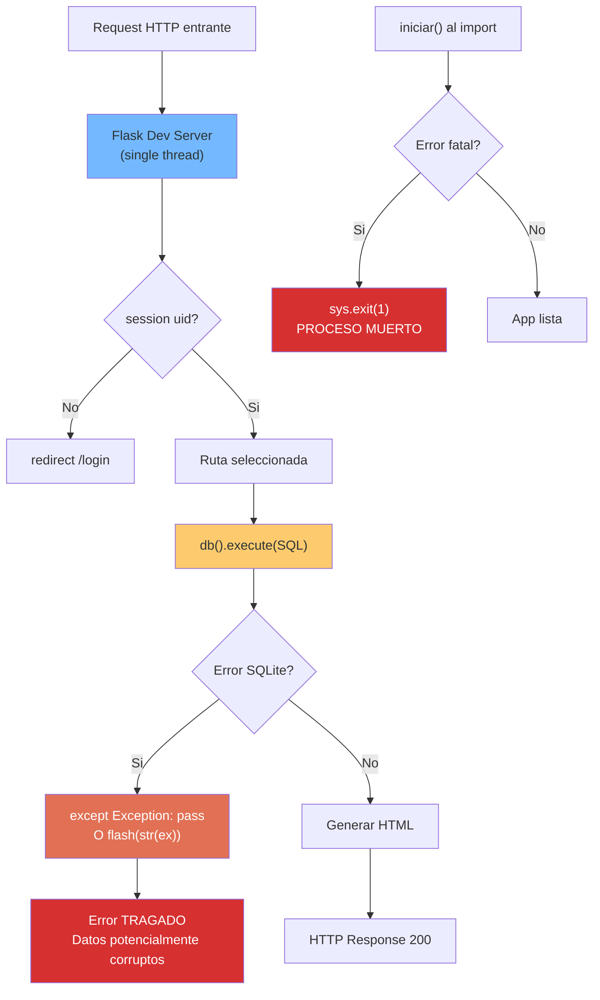

# Production Readiness — StockControl

## Score Global: 1 / 10

**Nivel: Dangerous** — Sin timeouts, sin error handling real, single point of failure en todo.

Justificación: El sistema no tiene NINGÚN stability pattern implementado. Cada uno de los 8 criterios de producción está completamente ausente. El modo debug permanentemente habilitado y la conexión global no thread-safe hacen que este sistema sea peligroso de operar en cualquier entorno que no sea desarrollo local.

## Stability Patterns

| Pattern | Presente | Evidencia |
|---|---|---|
| Circuit Breaker | ❌ Ausente | Sin librería de resiliencia (Polly, tenacity, etc.) — búsqueda en `app.py` completo: 0 resultados |
| Timeouts | ❌ Ausente | Ninguna operación tiene timeout configurado; SQLite es local pero sin statement timeout |
| Retry con backoff | ❌ Ausente | Sin retry policy en ninguna operación — `app.py` completo |
| Bulkheads | ❌ Ausente | Conexión global única (`_DB`) compartida por todos los requests — `app.py:49` |
| Health Checks | ❌ Ausente | Sin endpoint `/health`, `/ready` o equivalente |
| Graceful Degradation | ❌ Ausente | Sin fallback para CDN caído ni para errores de BD |
| Graceful Shutdown | ❌ Ausente | Sin manejo de SIGTERM; no hay drain de conexiones |
| Steady State | ❌ Ausente | Sin cleanup de sesiones, logs ni archivos temporales |

**0 de 8 patterns presentes.**

## Anti-Patterns de Producción Detectados

| Anti-Pattern | Evidencia | Impacto |
|---|---|---|
| **Single Point of Failure** | `_DB` = 1 conexión SQLite global (`app.py:49`) | Si la BD se corrompe, todo el sistema muere |
| **Unbounded Results** | `SELECT *` sin LIMIT en productos, movimientos, kardex (`app.py:754, 1870+`) | Con datos suficientes, OOM o timeout del browser |
| **Cascading Failures** | Un error en `iniciar()` mata todo el proceso (`sys.exit(1)` — `app.py:223`) | Sin recovery posible |
| **Shared Mutable State** | `_DB` global + `check_same_thread=False` (`app.py:70`) | Race conditions bajo carga concurrente |
| **Error Swallowing** | `except Exception: pass` en 4+ puntos (`app.py:1252, 1408, 1560, 1735`) | Errores silenciosos = datos corruptos sin aviso |
| **Debug in Production** | `DEBUG=True` hardcoded (`app.py:44`) | Stack traces expuestos + Werkzeug debugger |
| **No Connection Pool** | Conexión única sin pool ni reconexión (`app.py:70`) | Bajo carga concurrente = sqlite3.OperationalError |

## Observability Assessment

| Aspecto | Estado | Evidencia |
|---|---|---|
| **Logging** | ❌ Solo `print()` | `app.py:58, 60, 215, 217, 224` — Sin logging framework |
| **Structured Logging** | ❌ Ausente | Solo texto plano: `print("[OK] Base de datos lista:", DATABASE)` |
| **Métricas** | ❌ Ausente | Sin Prometheus, StatsD, ni métricas de negocio |
| **Distributed Tracing** | ❌ N/A | Sistema monolítico sin integraciones |
| **Error Tracking** | ❌ Ausente | Sin Sentry, Rollbar, ni error aggregation |
| **Alertas** | ❌ Ausente | Sin mecanismo de alertas automáticas |
| **Audit Trail** | ❌ Parcial | `movimientos` registra `usuario_id` y `fecha`, pero sin log de login/logout/errores |

## Deployment Readiness

| Aspecto | Estado | Evidencia |
|---|---|---|
| Zero-downtime deploy | ❌ Imposible | Single process, sin load balancer, BD local |
| Feature Flags | ❌ Ausente | Sin mecanismo de feature toggles |
| Rollback Strategy | ❌ Ausente | Sin versioning de deployments |
| Environment Separation | ❌ Ausente | Un solo `app.py` para todo; sin config per-env |
| Containerización | ❌ Ausente | Sin Dockerfile ni docker-compose |
| CI/CD Pipeline | ❌ Ausente | Sin Jenkinsfile, GitHub Actions, ni equivalente |
| IaC | ❌ Ausente | Sin Terraform, CloudFormation ni similar |

## Scalability Assessment (System Design — Xu)

| Aspecto | Estado | Evidencia |
|---|---|---|
| **Statelessness** | ❌ Stateful | `_DB` global = state en la instancia (`app.py:49`) |
| **Caching** | ❌ Ausente | Sin Redis, Memcached ni cache layer — cada request = queries a BD |
| **Message Queues** | ❌ Ausente | Sin RabbitMQ, Celery ni equivalente |
| **Database Patterns** | ❌ Monolítico | Single SQLite file sin read replicas |
| **Connection Pooling** | ❌ Ausente | 1 conexión global compartida |
| **Async/Non-blocking** | ❌ Ausente | Todo es síncrono (Flask dev server) |
| **Rate Limiting** | ❌ Ausente | Sin throttling en ningún endpoint |
| **CDN** | ⚠️ Parcial | CSS/JS de Bootstrap vía CDN (pero sin fallback local) |
| **Horizontal Scaling** | ❌ Imposible | SQLite + state global = máximo 1 instancia |
| **Batch Processing** | ❌ Ausente | Sin jobs en background ni particionamiento |

**Scalability Score: 1/10** — Hardcoded a single instance, shared mutable state. El sistema NO puede escalar horizontalmente sin rewrite completo de la capa de datos.

[NO VERIFICADO: performance en runtime — solo análisis estático. El impacto real de las queries sin paginación depende del volumen de datos.]

## Diagrama de Flujo de Errores

El diagrama muestra que los errores tienen dos destinos: ser tragados silenciosamente (corrupción potencial) o matar el proceso completo. No hay middle ground de graceful degradation.

## Hallazgos Clave

1. **Score 1/10** — El peor score posible; sistema clasificado como "Dangerous"
2. **0 de 8 stability patterns** — Sin ninguna protección contra fallos
3. **Imposible escalar** — SQLite + global state = máximo 1 instancia, 1 usuario concurrent
4. **Observabilidad nula** — Solo `print()` para debugging; cero métricas, cero alertas
5. **Anti-patterns activos**: error swallowing, unbounded queries, shared mutable state, debug in prod
6. **Sin infraestructura DevOps** — Sin Docker, CI/CD, IaC, monitoring, ni env separation

## Referencias

- [security-patterns.md](security-patterns.md)
- [tech-debt.md](tech-debt.md)
- [../architecture/system-overview.md](../architecture/system-overview.md)
