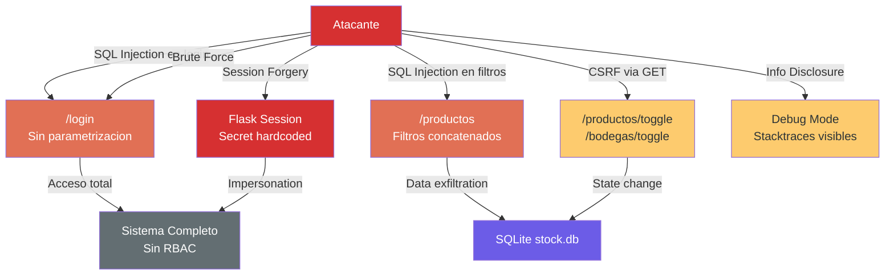

# Análisis de Seguridad — StockControl

## Resumen Ejecutivo

| Indicador | Valor |
|---|---|
| **Postura de seguridad** | Crítica — múltiples vulnerabilidades explotables |
| **Hallazgos Críticos** | 4 |
| **Hallazgos Altos** | 3 |
| **Hallazgos Medios** | 4 |
| **Hallazgos Bajos** | 2 |

El sistema presenta el peor escenario posible de seguridad: SQL Injection directa, MD5 para passwords, secret key hardcoded, debug habilitado en producción, y ausencia total de validación de input. Estas vulnerabilidades son **intencionales** (ejercicio didáctico) pero representan un riesgo absoluto si el sistema se expone a cualquier red.

## Mecanismos de Seguridad Existentes

| Mecanismo | Estado | Evidencia |
|---|---|---|
| Autenticación | ⚠️ Existe pero insegura | `auth()` decorator verifica `session['uid']` — `app.py:298-305` |
| Hashing de passwords | ❌ Criptográficamente roto | MD5 sin sal — `app.py:265` (`hashlib.md5`) |
| Gestión de sesiones | ⚠️ Flask session con secret débil | `app.secret_key = 'stockcontrol_dev_KEY_123'` — `app.py:48` |
| Autorización por roles | ❌ No implementada | Roles definidos pero sin verificación — decorator solo chequea sesión |
| Validación de input | ❌ Ausente | Entrada de usuario va directa a SQL y HTML |
| CSRF protection | ❌ Ausente | No hay token CSRF en ningún formulario |
| Rate limiting | ❌ Ausente | Sin limitación de intentos de login |
| Logging de seguridad | ❌ Ausente | Solo `print()` básico |

## Modelo STRIDE

| Categoría | Hallazgo | Evidencia | Severidad |
|---|---|---|---|
| **S**poofing | Secret key predecible permite forjar sesiones | `app.py:44` — `CLAVE = 'stockcontrol_dev_KEY_123'` | Crítica |
| **T**ampering | SQL Injection permite modificar cualquier dato | `app.py:448` — `"WHERE username='" + u + "'"` | Crítica |
| **R**epudiation | Sin logging de acciones de usuarios | Ausencia total de audit trail para operaciones | Alta |
| **I**nformation Disclosure | Debug mode expone tracebacks al usuario | `app.py:44-45` — `DEBUG=True`, `app.debug=True` | Alta |
| **D**enial of Service | Sin paginación — carga TODOS los registros | `app.py:754` — `SELECT *` sin LIMIT | Media |
| **E**levation of Privilege | Roles sin enforcement permiten acceso total | `auth()` no verifica rol — solo existencia de sesión | Alta |

## Vulnerabilidades Detectadas

### CRÍTICAS

#### 1. SQL Injection Directa (A03: Injection)

**Estado:** ❌ Vulnerable — **explotable directamente**

| Ruta | Código vulnerable | Línea |
|---|---|---|
| `/login` | `"WHERE username='" + u + "'"` | `app.py:448` |
| `/productos` (filtro nombre) | `" AND p.nombre LIKE '%" + fn + "%'"` | `app.py:757` |
| `/productos` (filtro categoría) | `" AND p.categoria_id=" + fc` | `app.py:759` |
| `/productos` (filtro estado) | `" AND p.estado=" + fe` | `app.py:761` |
| `/productos/nuevo` (duplicado check) | `"WHERE codigo='" + cod + "'"` | `app.py:848` |
| `/productos/editar/<pid>` | `"WHERE id=" + str(pid)` | `app.py:882` |
| Seed data (init) | Concatenación directa de hashes | `app.py:158-164` |

**Impacto:** Un atacante puede leer/modificar/borrar cualquier dato, ejecutar operaciones administrativas, y potencialmente ejecutar código en el servidor (dependiendo de extensiones SQLite).

#### 2. Broken Authentication — MD5 para Passwords (A02/A07)

**Estado:** ❌ Vulnerable

**Evidencia:** `app.py:265` — `hashlib.md5(p.encode()).hexdigest()`

- MD5 es criptográficamente roto desde ~2004
- Sin salt → vulnerable a rainbow tables
- Passwords predecibles en seed: `admin123`, `bodega123`, `audit123`, `inv2024`
- Cualquier dump de BD expone todas las credenciales instantáneamente

#### 3. Secret Key Hardcoded (A02: Cryptographic Failures)

**Estado:** ❌ Vulnerable

**Evidencia:** `app.py:44` — `CLAVE = 'stockcontrol_dev_KEY_123'`

- La clave secreta de Flask está visible en el código fuente
- Permite forjar cookies de sesión y suplantar cualquier usuario
- No hay rotación de secretos ni gestión de configuración segura

#### 4. Credentials Hardcoded en Código (A07)

**Estado:** ❌ Vulnerable

**Evidencia:** `app.py:158-164` — Usuarios seed con passwords visibles en texto plano antes del hash:
- `admin` / `admin123`
- `bodeguero1` / `bodega123`
- `auditor1` / `audit123`
- `inventario1` / `inv2024`

Además, el propio template de login muestra las credenciales: `app.py:484-487` — `<strong>Usuarios:</strong> admin / admin123`

### ALTAS

#### 5. Debug Mode en Producción (A05: Security Misconfiguration)

**Estado:** ❌ Vulnerable

**Evidencia:** `app.py:44-45` — `DEBUG = True` + `app.debug = True`

- Stacktraces expuestos al usuario con información interna
- Console de debug interactiva de Werkzeug potencialmente accesible
- Información sobre paths del servidor, versiones, dependencias

#### 6. Sin Autorización por Roles (A01: Broken Access Control)

**Estado:** ❌ Vulnerable

**Evidencia:** `app.py:298-305` — El decorator `auth()` solo verifica `if 'uid' not in session` — nunca verifica el rol.

- Un `AUDITOR` puede ejecutar movimientos (debería ser solo lectura)
- Un `AUXILIAR` puede crear/editar productos (debería limitarse)
- Sin RBAC real → todos los usuarios autenticados tienen acceso total

#### 7. State-Changing Operations via GET (A01)

**Estado:** ❌ Vulnerable

**Evidencia:** 
- `app.py:1032` — `@app.route('/productos/toggle/<int:pid>')` — Cambia estado con GET
- `app.py:1190` — `@app.route('/bodegas/toggle/<int:bid>')` — Cambia estado con GET

Permite CSRF trivial: un link en un email o imagen puede desactivar productos/bodegas.

### MEDIAS

#### 8. Sin CSRF Protection (A01)

**Estado:** ❌ Vulnerable

No hay tokens CSRF en ningún formulario. Todos los POST son vulnerables a Cross-Site Request Forgery.

#### 9. Sin Rate Limiting (A07)

**Estado:** ❌ Vulnerable

El endpoint `/login` acepta intentos ilimitados → brute force trivial.

#### 10. Error Disclosure (A05)

**Estado:** ⚠️ Parcialmente mitigado

**Evidencia:** `app.py:863` — `flash('Error tecnico: ' + str(ex), 'danger')`

Errores técnicos (stacktraces SQLite) se muestran al usuario en múltiples rutas.

#### 11. No Input Validation (A03)

**Estado:** ❌ Vulnerable

Ninguna validación de tipo, longitud, formato ni rango en inputs de usuario. Ejemplo: campo `costo_promedio` acepta cualquier string que `float()` pueda parsear — sin límites.

### BAJAS

#### 12. Sin Security Headers

**Estado:** ❌ Ausente

No hay headers de seguridad: X-Frame-Options, X-Content-Type-Options, Strict-Transport-Security, Content-Security-Policy.

#### 13. CDN sin Integrity Hash

**Estado:** ⚠️ Riesgo menor

`app.py:316-317` — Bootstrap cargado desde CDN sin atributo `integrity` (SRI). Si el CDN es comprometido, scripts maliciosos podrían inyectarse.

## Diagrama de Superficie de Ataque

El diagrama muestra que un atacante tiene múltiples vectores de entrada, todos sin mitigación. El vector más crítico es SQL Injection en `/login` que otorga acceso completo sin credenciales.

## Evaluación OWASP Top 10 (2021)

| Categoría | Estado | Severidad | Bloqueante para Modernización |
|---|---|---|---|
| A01: Broken Access Control | ❌ Vulnerable | Crítica | Sí — requiere implementar RBAC |
| A02: Cryptographic Failures | ❌ Vulnerable | Crítica | Sí — requiere reemplazo de MD5 |
| A03: Injection | ❌ Vulnerable | Crítica | Sí — requiere parametrización de queries |
| A04: Insecure Design | ❌ Vulnerable | Alta | Sí — requiere rediseño de auth |
| A05: Security Misconfiguration | ❌ Vulnerable | Alta | Sí — requiere config per-environment |
| A06: Vulnerable/Outdated Components | ⚠️ Parcial | Alta | No — actualización de Flask es directa |
| A07: Auth Failures | ❌ Vulnerable | Crítica | Sí — requiere hashing moderno + MFA |
| A08: Software/Data Integrity | ⚠️ Parcial | Media | No — SRI headers son quick fix |
| A09: Security Logging Failures | ❌ Vulnerable | Media | No — agregar logging es incremental |
| A10: SSRF | ✅ No aplica | — | No — no hay llamadas a URLs externas |

**Totales:** ✅: 1 | ⚠️: 2 | ❌: 7

## Hallazgos Clave

1. **7 de 10 categorías OWASP vulnerables** — postura de seguridad crítica
2. **SQL Injection directa en 7+ puntos** — vector de ataque más peligroso
3. **MD5 sin salt para passwords** — cualquier BD dump = credenciales expuestas
4. **Secret key en código fuente** — sesiones forjables
5. **Sin RBAC** — roles decorativos sin enforcement
6. **Debug habilitado** — información interna expuesta

## Referencias

- [dependency-security-assessment.md](dependency-security-assessment.md)
- [production-readiness.md](production-readiness.md)
- [../architecture/patterns.md](../architecture/patterns.md)
