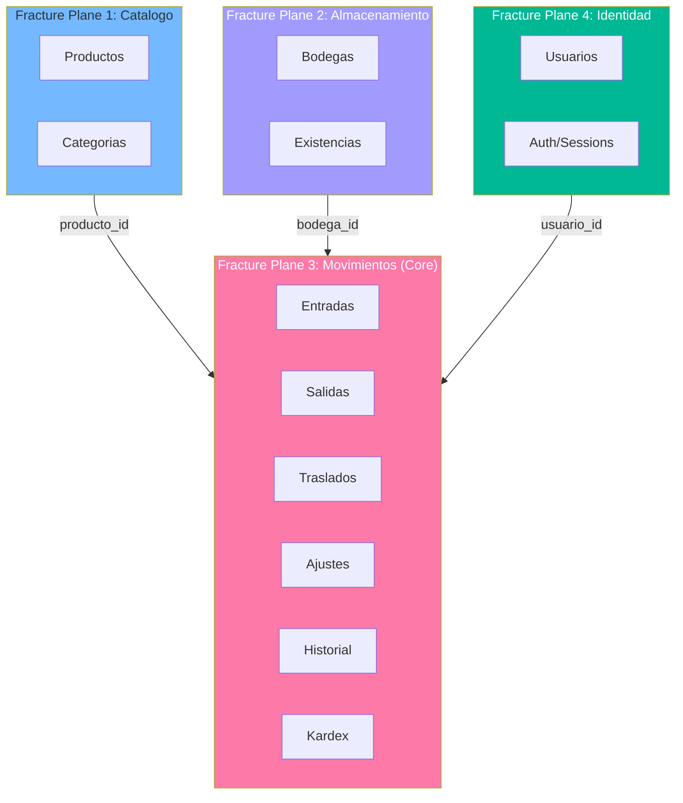
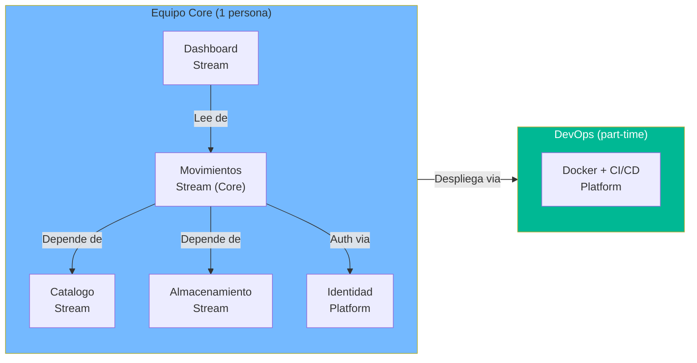

# Team Structure Assessment — StockControl

## Fracture Planes del Sistema

StockControl tiene **4 fracture planes naturales** derivados directamente del modelo de datos y los bounded contexts identificados. A pesar de ser un God Module, la separación lógica es evidente.

## Cognitive Load Map

| Módulo (post-modernización) | Responsabilidades | Cognitive Load | Justificación |
|---|---|---|---|
| **Catálogo** | CRUD productos, CRUD categorías, búsqueda | **Bajo** | Lógica CRUD simple, pocas reglas de negocio |
| **Almacenamiento** | CRUD bodegas, gestión de existencias, control stock | **Medio** | Cálculos de stock, stock mínimo, costos promedio |
| **Movimientos** | 4 tipos de movimiento, validación stock, atomicidad | **Alto** | Core domain: reglas de negocio complejas, consistencia transaccional |
| **Identidad** | Auth, sessions, RBAC, gestión usuarios | **Medio** | Seguridad es siempre complejo; RBAC requiere diseño cuidadoso |
| **Dashboard/Reporting** | KPIs, alertas, vistas cruzadas | **Bajo** | Solo queries de lectura, sin lógica de escritura |

## Team Types Propuestos

| Componente | Team Type | Razón |
|---|---|---|
| **Movimientos + Kardex** | Stream-aligned | Core domain que entrega valor directo al negocio |
| **Catálogo + Almacenamiento** | Stream-aligned | Funcionalidad que evoluciona con las necesidades del usuario |
| **Identidad + Auth** | Platform | Servicio compartido que otros componentes consumen |
| **Dashboard** | Stream-aligned | Evoluciona según necesidades de reporting |
| **Infra (Docker/CI/CD)** | Platform | Habilita a todos los demás equipos |

## Interaction Modes

| Equipo A | Equipo B | Modo | Razón |
|---|---|---|---|
| Movimientos | Catálogo | X-as-a-Service | Movimientos consulta productos via API/interface |
| Movimientos | Almacenamiento | Collaboration | Stock es responsabilidad compartida en los movimientos |
| Movimientos | Identidad | X-as-a-Service | Auth es un servicio consumido |
| Dashboard | Todos | X-as-a-Service | Dashboard solo lee datos de otros módulos |

## Equipo Recomendado para Modernización

### Para un proyecto de este tamaño (939 LOC → ~3-4K LOC post-refactoring)

| Rol | Personas | Dedicación | Responsabilidad |
|---|---|---|---|
| **Python/Flask Senior** | 1 | 100% | Refactoring estructural, nuevos módulos, tests |
| **DevOps Engineer** | 1 | 30% (part-time) | Docker, CI/CD, monitoring, infra |
| **Total** | 1.3 FTE | — | 5-6 semanas |

### Justificación del Tamaño

- El sistema es **muy pequeño** (939 LOC) — no requiere equipo grande
- **No hay UI separada** — todo es server-rendered (sin frontend developer)
- **No hay integraciones** — sin necesidad de especialista en APIs externas
- **BD simple** — SQLite/PostgreSQL sin DBA dedicado
- **1 persona senior** puede ejecutar Ola 0-3 completa si conoce Flask bien

### Para escalamiento futuro (post-modernización)

Si el sistema crece post-modernización, la estructura de equipo se expande naturalmente:

| Fase | Equipo | Trigger |
|---|---|---|
| Actual | 1 full-stack Python | Sistema < 5K LOC |
| Crecimiento | 2 devs + 1 QA | Sistema 5-20K LOC o múltiples integraciones |
| Madurez | 2 stream-aligned teams + 1 platform | Sistema > 20K LOC o múltiples bounded contexts activos |

## Diagrama de Team Boundaries

**Nota:** Para un sistema de 939 LOC, una sola persona cubre todos los bounded contexts. La separación en team types es para guiar la **estructura de código** (blueprints, servicios), no para asignar personas diferentes a cada componente.

## Cross-Team Dependencies

Con el equipo actual de 1.3 FTE, no hay "cross-team dependencies" en el sentido organizacional. Sin embargo, las dependencias entre módulos (que serían cross-team en un equipo más grande) son:

| Dependencia | Dirección | Impacto |
|---|---|---|
| Movimientos → Catálogo | Lectura (producto_id) | Bajo — solo consulta |
| Movimientos → Almacenamiento | Lectura/Escritura (stock) | **Alto** — core business |
| Movimientos → Identidad | Lectura (usuario_id) | Bajo — solo auditoría |
| Dashboard → Todos | Solo lectura | Bajo — agregaciones |

## Recomendaciones

1. **Separar el código por bounded context** aunque 1 persona lo mantenga todo — prepara para crecimiento futuro
2. **Definir interfaces entre módulos** (Python ABCs o Protocols) — permite testing independiente
3. **Cada bounded context en su propio Blueprint Flask** — aislamiento natural en Flask
4. **Shared kernel mínimo**: solo `models/base.py` y `config.py` — evitar coupling innecesario

## Referencias

- [Modernization Assessment](modernization-assessment.md)
- [Components](../architecture/components.md)
- [Patterns](../architecture/patterns.md)
- [Component Order](../migration/component-order.md)
