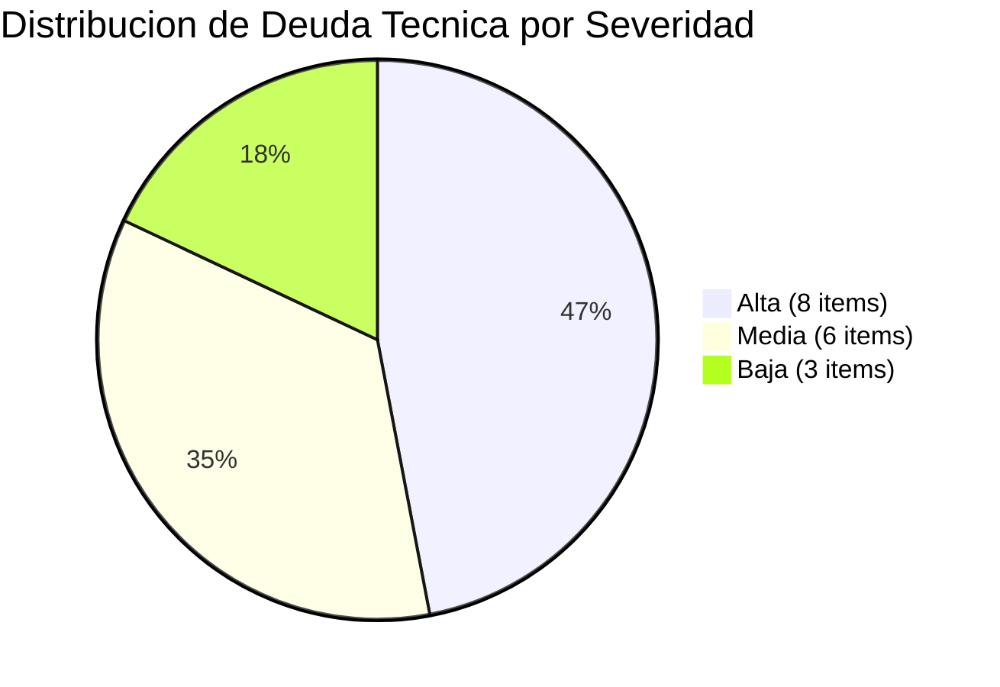
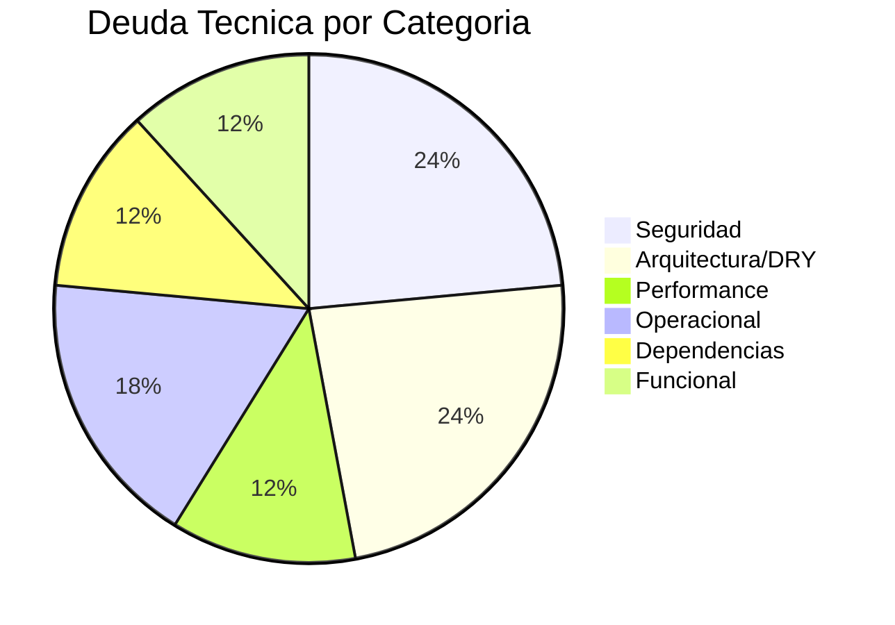

# Deuda Técnica y Legacy Assessment — StockControl

## Resumen de Deuda Técnica

| Severidad | Cantidad | % del Total |
|---|---|---|
| **Alta** | 8 | 47% |
| **Media** | 6 | 35% |
| **Baja** | 3 | 18% |
| **Total** | 17 | 100% |

## Inventario de Deuda Técnica

### Severidad ALTA

| ID | Hallazgo | Categoría | Evidencia | Impacto |
|---|---|---|---|---|
| DT-01 | God Module (todo en 1 archivo) | Arquitectura | `app.py` = 939 LOC, 19 rutas, 7 tablas | Imposible mantener, testear ni escalar |
| DT-02 | SQL Injection directa (7+ puntos) | Seguridad | `app.py:448,757,759,761,848,882` | Riesgo crítico de data breach |
| DT-03 | MD5 para password hashing | Seguridad | `app.py:265` — `hashlib.md5()` | Credenciales expuestas en cualquier dump |
| DT-04 | Secret key hardcoded | Seguridad | `app.py:44` — `CLAVE = 'stockcontrol_dev_KEY_123'` | Sesiones forjables |
| DT-05 | Conexión BD global no thread-safe | Concurrencia | `app.py:49,70` — `_DB` + `check_same_thread=False` | Race conditions bajo carga |
| DT-06 | Copy-paste de 4 rutas de movimientos | DRY | `app.py:1224-1870` — 4 funciones ~80% idénticas | 4x esfuerzo de mantenimiento |
| DT-07 | HTML embebido en Python (45% del código) | Separación | Todo el UI como f-strings en `app.py` | Imposible para diseñadores UX |
| DT-08 | Debug mode permanente + host 0.0.0.0 | Operacional | `app.py:44-45, 2221` | Información expuesta + acceso de red |

### Severidad MEDIA

| ID | Hallazgo | Categoría | Evidencia | Impacto |
|---|---|---|---|---|
| DT-09 | Flask 2.2.5 desactualizado | Dependencias | `requirements.txt:3` | Sin parches de seguridad recientes |
| DT-10 | Sin validación de input | Calidad | Múltiples rutas POST sin sanitización | Datos inconsistentes en BD |
| DT-11 | Error swallowing (`except: pass`) | Reliability | `app.py:1252,1408,1560,1735` | Errores silenciosos = corrupción |
| DT-12 | Queries N+1 en dashboard | Performance | `app.py:477-600` — 8 queries separadas | Degradación con volumen de datos |
| DT-13 | Sin paginación (carga todo) | Performance | `app.py:754` — `SELECT *` sin LIMIT | OOM con datos suficientes |
| DT-14 | Roles sin authorization enforcement | Funcional | `app.py:298-305` — `auth()` no verifica rol | Privilegios excesivos |

### Severidad BAJA

| ID | Hallazgo | Categoría | Evidencia | Impacto |
|---|---|---|---|---|
| DT-15 | Sin lock file (pip) | Build | Ausencia de `requirements.lock` | Builds no reproducibles |
| DT-16 | Bootstrap CDN sin SRI | Frontend | `app.py:316` — sin atributo `integrity` | Riesgo si CDN comprometido |
| DT-17 | Sin logging framework | Observabilidad | Solo `print()` — `app.py:58,60,215` | Sin trazabilidad operativa |

## Legacy Readiness Assessment (Feathers)

### Clasificación Global: **D — Monolithic**

| Criterio | Evaluación | Evidencia |
|---|---|---|
| **Seams** | 0 seams reales (5 potenciales identificados) | Sin interfaces, sin DI, sin abstracción |
| **God Methods** | 5+ funciones >150 LOC | `dashboard`, 4 movimientos |
| **Dependency Blockers** | 4 bloqueantes críticos | `_DB` global, `iniciar()` at import, `session`, `db()` |
| **Characterization Test Readiness** | Factible vía `test_app.py` HTTP | Se puede pinear con golden master de responses |
| **Testabilidad** | 0% actual; requiere dependency-breaking | Sin mocks posibles sin inyección |

### Acción de Modernización para Nivel D

```
1. Sprout Class → Extraer servicios (InventarioService, AuthService)
2. Wrap Method → Envolver db() con abstracción de Repository
3. Strangler Fig → Crear nuevo módulo por bounded context, redirigir rutas gradualmente
4. Characterization Tests → Pinear comportamiento actual antes de tocar código
```

## Refactoring Patterns (Fowler) — Remediación

### DT-01: God Module → Extract Class

**Smell:** God Class (939 LOC, 19 rutas, 7 tablas, 4 bounded contexts en 1 archivo)
**Refactoring recomendado:** Extract Class (múltiples)
**Mecánica:**
1. Crear `models/` con clases de dominio (Producto, Bodega, Movimiento, Usuario)
2. Crear `services/` con lógica de negocio (InventarioService, AuthService)
3. Crear `repositories/` con acceso a datos (ProductoRepository, etc.)
4. Crear `routes/` con blueprints Flask por dominio
5. Mover HTML a `templates/` con Jinja2 real
**Archivos afectados:** `app.py` (se divide en 15-20 archivos)
**Tests necesarios antes:** Characterization tests HTTP de todas las 19 rutas
**Riesgo:** Alto (afecta todo el sistema)

### DT-02: SQL Injection → Parameterize Queries

**Smell:** SQL concatenation (Injection vulnerability)
**Refactoring recomendado:** Replace concatenation with parameterized queries
**Mecánica:**
1. Buscar todos los `" + variable + "` en queries SQL
2. Reemplazar por `?` placeholder + tuple de parámetros
3. Verificar que no cambia el comportamiento con characterization tests
**Archivos afectados:** `app.py:448,757,759,761,848,882`
**Tests necesarios antes:** Test de login + test de filtros de productos
**Riesgo:** Bajo (cambio mecánico sin cambio de lógica)

### DT-06: Copy-Paste Movimientos → Extract Method + Template Method

**Smell:** Duplicate Code (4 funciones ~80% idénticas)
**Refactoring recomendado:** Extract Method + Template Method Pattern
**Mecánica:**
1. Extract Method: `parse_items_from_form()` — lógica de parseo repetida
2. Extract Method: `registrar_movimiento(tipo, items, bod_id, ...)` — insert + commit
3. Template Method: crear `MovimientoBase` con template de flujo común
4. Cada tipo (Entrada, Salida, Traslado, Ajuste) override solo las diferencias
**Archivos afectados:** `app.py:1224-1870` (660 LOC → ~200 LOC)
**Tests necesarios antes:** Tests de cada tipo de movimiento con datos válidos/inválidos
**Riesgo:** Medio (lógica de negocio crítica)

### DT-03: MD5 → Replace with bcrypt/argon2

**Smell:** Broken cryptographic algorithm
**Refactoring recomendado:** Replace Data Value with Object (Password hash strategy)
**Mecánica:**
1. Instalar `bcrypt` o `argon2-cffi`
2. Crear función `hash_password(plain)` → argon2/bcrypt hash
3. Crear función `verify_password(plain, hashed)` → bool
4. Migrar passwords existentes (re-hash en primer login exitoso)
**Archivos afectados:** `app.py:265` + login route + seed
**Tests necesarios antes:** Test de login/logout existente
**Riesgo:** Medio (requiere migración de datos existentes)

### DT-07: HTML en Python → Extract to Templates

**Smell:** Mixed responsibilities (Presentación + Lógica)
**Refactoring recomendado:** Extract Method (hacia archivos de template)
**Mecánica:**
1. Crear directorio `templates/`
2. Mover `TMPL_BASE` → `templates/base.html`
3. Extraer HTML de cada ruta → `templates/{ruta}.html`
4. Reemplazar `render_template_string` por `render_template`
**Archivos afectados:** `app.py` (elimina ~420 LOC de HTML inline)
**Tests necesarios antes:** Snapshot tests de HTML de cada ruta
**Riesgo:** Bajo-Medio (cambio mecánico pero muchos archivos)

## Diagrama de Distribución de Deuda





Los diagramas muestran que la deuda está concentrada en seguridad (4 items de alta severidad) y arquitectura (God Module + DRY violations). La remediación de seguridad es urgente; la de arquitectura es el enabler para todo lo demás.

## Broken Windows (Hunt & Thomas — Pragmatic Programmer)

| Ventana Rota | Evidencia | Impacto Cultural |
|---|---|---|
| Código comentado extensivo (`# MALA PRACTICA:`) | 1,177 líneas de comentarios | Normaliza la presencia de malas prácticas |
| `except Exception: pass` | 4+ instancias silenciando errores | Normaliza ignorar problemas |
| TODOs implícitos (columnas no usadas: `stock_reservado`, `lote`, `fecha_vencimiento`) | Schema DDL `app.py:126-128` | Funcionalidad abandonada a medias |
| Credenciales en código y en template de login | `app.py:44, 484-487` | Normaliza prácticas inseguras |

## Orthogonality Score (Hunt & Thomas): 1/5

| Aspecto | Score | Justificación |
|---|---|---|
| Cambiar BD | 1/5 | Requiere modificar TODAS las rutas (SQL inline en cada función) |
| Cambiar UI framework | 1/5 | HTML hardcoded en Python; cambiar Bootstrap = tocar todas las rutas |
| Cambiar auth | 1/5 | MD5 + session acoplados a login + decorator + seed |
| Agregar endpoint | 2/5 | Agregar ruta es factible pero requiere copy-paste del patrón |
| Cambiar regla de negocio | 1/5 | Lógica dispersa en rutas + SQL → sin punto único de cambio |

**Ortogonalidad: 1.2/5** — Cambiar cualquier aspecto del sistema requiere tocar múltiples puntos no relacionados.

## DRY Knowledge Violations

| Conocimiento Duplicado | Instancias | Impacto |
|---|---|---|
| Patrón de parseo de form items | 4 (movimientos) | Cambiar formato = modificar 4 funciones |
| Patrón de insert movimiento + detalle | 4 | Cambiar schema de movimientos = 4 puntos |
| Opciones HTML (`opts_prods`, `opts_bodegas`) | 2+4 usos | Cambiar formato de select = 6 puntos |
| Validación "campo obligatorio" | 5+ | Sin schema de validación centralizado |
| Patrón de toggle estado (GET) | 2 (productos, bodegas) | Cambiar a POST = 2 funciones + 2 templates |

## Reversibility Assessment

| Decisión | Reversible | Esfuerzo para revertir |
|---|---|---|
| SQLite como BD | Medio | Requiere cambiar todas las queries (SQL inline, no ORM) |
| Flask como framework | Medio | Routes son estándar; el acoplamiento está en templates |
| Monolito 1 archivo | Fácil | Extractar a módulos es refactoring directo |
| MD5 para passwords | Difícil | Requiere re-hashear o resetear todos los passwords |
| HTML en strings | Medio-Difícil | 420 LOC de HTML mezclado con lógica Python |

## Hallazgos Clave

1. **17 items de deuda técnica** — 8 de severidad Alta, dominados por seguridad y arquitectura
2. **Legacy Readiness = D** — El peor nivel; requiere Strangler Fig pattern para modernizar
3. **Orthogonality = 1.2/5** — Sistema completamente no-ortogonal; cada cambio es shotgun surgery
4. **4 broken windows activas** — Código que normaliza malas prácticas
5. **Remediación priorizada:** SQL Injection (quick win) → Extract Templates → Extract Services → Replace MD5

## Referencias

- [code-metrics.md](code-metrics.md)
- [complexity-analysis.md](complexity-analysis.md)
- [security-patterns.md](security-patterns.md)
- [production-readiness.md](production-readiness.md)
