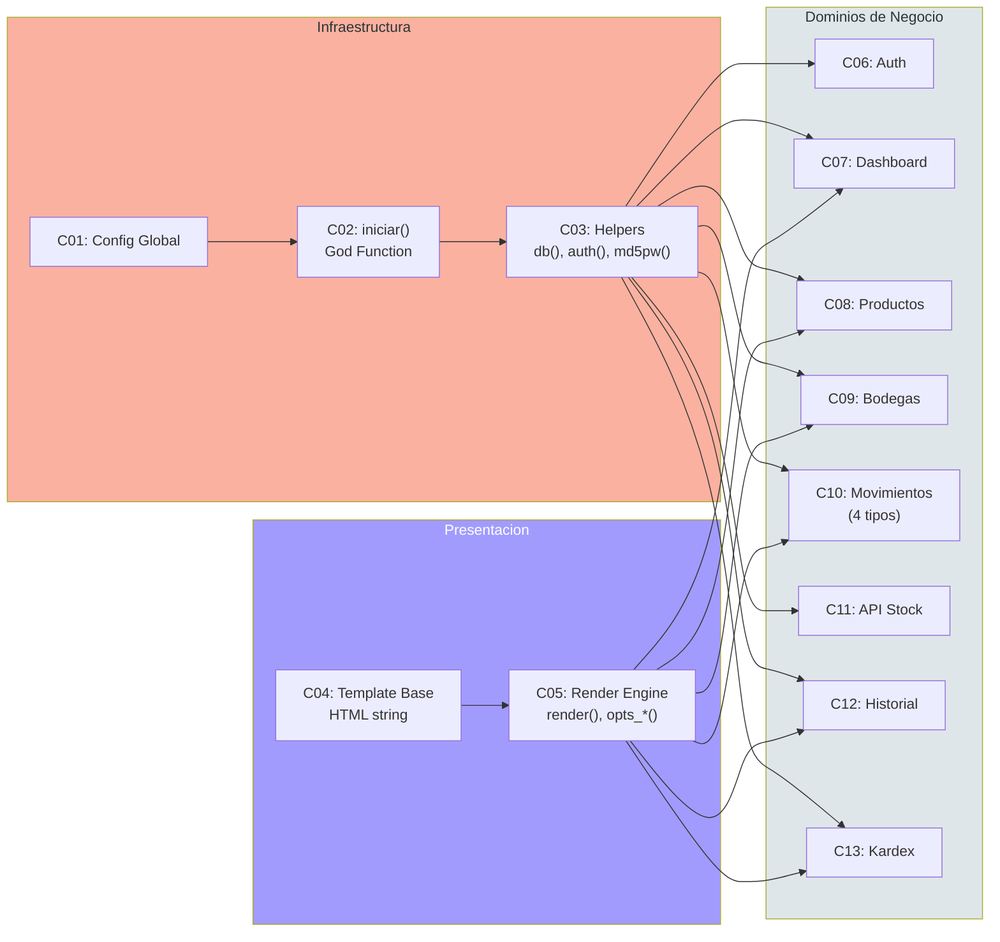

# Componentes del Sistema — StockControl

## Inventario de Componentes

Dado que el sistema es un **God Module** sin separación de archivos, los "componentes" son zonas lógicas dentro de `app.py`. No existen módulos, packages ni clases.

| # | Componente Lógico | Líneas | Responsabilidad | Acoplamiento |
|---|---|---|---|---|
| C01 | Configuración Global | `app.py:38-50` | Constantes, Flask app, secret key | Consumido por todo |
| C02 | God Function `iniciar()` | `app.py:62-222` | DDL + Seed + Conexión BD | Ejecutado al importar |
| C03 | Helpers de Infraestructura | `app.py:224-300` | `db()`, `md5pw()`, `now()`, `get_stock()`, `actualizar_stock()`, `auth()` | Consumido por todas las rutas |
| C04 | Template Base (HTML) | `app.py:311-398` | Layout HTML/CSS como string | Consumido por `render()` |
| C05 | Render Engine | `app.py:399-440` | `render()`, `opts_prods()`, `opts_bodegas()`, `get_prods_bodegas()` | Consumido por rutas con UI |
| C06 | Auth Module | `app.py:442-498` | Login/Logout | Depende de C03 |
| C07 | Dashboard | `app.py:500-706` | KPIs, alertas, últimos movimientos | Depende de C03, C04, C05 |
| C08 | Productos CRUD | `app.py:708-1040` | Crear, listar, editar, toggle estado | Depende de C03, C04, C05 |
| C09 | Bodegas CRUD | `app.py:1042-1226` | Crear, listar, editar, toggle estado | Depende de C03, C04, C05 |
| C10 | Movimientos (4 tipos) | `app.py:1228-1808` | Entrada, Salida, Traslado, Ajuste | Depende de C03, C05 |
| C11 | API Stock | `app.py:1810-1818` | Endpoint JSON `/api/stock` | Depende de C03 |
| C12 | Historial Movimientos | `app.py:1820-1950` | Listado con filtros + N+1 | Depende de C03, C04, C05 |
| C13 | Kardex/Existencias | `app.py:1952-2200` | Vista cruzada producto×bodega + detalle | Depende de C03, C04, C05 |
| C14 | Error Handlers | `app.py:2202-2214` | 404, 500 | Depende de C05 |
| C15 | Main (Entrypoint) | `app.py:2216-2221` | `app.run()` con config hardcoded | Depende de C01 |

## Mapa de Componentes

El diagrama muestra el alto acoplamiento: **todos** los componentes de negocio dependen de los mismos helpers de infraestructura (C03) y del engine de presentación (C05). No hay aislamiento.

## Métricas por Componente

| Componente | LOC aprox. | Fan-in | Fan-out | Complejidad |
|---|---|---|---|---|
| C02 `iniciar()` | 160 | 1 (main) | 3 (sqlite3, hashlib, seed) | **Alta** — God Function |
| C07 Dashboard | 205 | 1 (ruta) | 5 (8+ queries, HTML, C03, C04, C05) | **Alta** |
| C08 Productos | 330 | 4 rutas | 4 (C03, C04, C05, SQL) | **Media-Alta** |
| C10 Movimientos | 580 | 4 rutas | 5 (C03, C05, get_stock, actualizar_stock, SQL) | **Alta** — copy-paste ×4 |
| C13 Kardex | 250 | 2 rutas | 4 (C03, C04, C05, CROSS JOIN SQL) | **Media-Alta** |

## Cohesión y Acoplamiento

### Análisis de Cohesión

| Componente | Tipo de Cohesión | Evaluación |
|---|---|---|
| C03 Helpers | **Utilitaria** (funciones sin relación funcional juntas) | Baja — `md5pw()` no tiene nada que ver con `get_stock()` |
| C07 Dashboard | **Comunicativa** (acceden a los mismos datos) | Media |
| C10 Movimientos | **Temporal** (se ejecutan en el mismo momento) | Baja — 4 copias de la misma lógica |

### Análisis de Acoplamiento

- **Acoplamiento de contenido**: Todos los componentes acceden a la variable global `_DB` vía `db()` — acoplamiento máximo
- **Acoplamiento de control**: El decorator `auth()` controla el flujo de todos los componentes de negocio
- **Acoplamiento de datos comunes**: Todas las rutas comparten `session`, `request`, y `db()`

## Hallazgos Clave

1. **No hay componentes reales** — solo zonas lógicas dentro de un archivo monolítico
2. **Duplicación masiva** — Movimientos (C10) son 4 copy-pastes con variaciones mínimas (~580 LOC que podrían ser ~150)
3. **God Function** — `iniciar()` hace DDL + seed + config + conexión en 160 líneas
4. **Sin interfaces** — No hay abstracciones, contratos ni dependency injection
5. **Acoplamiento total** — Cambiar `db()` afecta los 15 componentes

## Referencias

- [system-overview.md](system-overview.md)
- [dependencies.md](dependencies.md)
- [patterns.md](patterns.md)
- [../reference/program-structure.md](../reference/program-structure.md)
