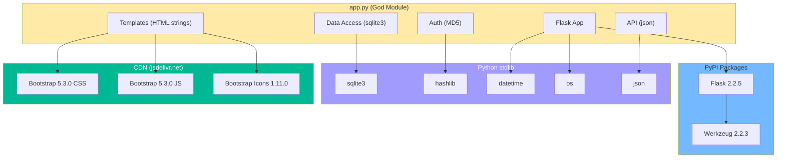

# Dependencias del Sistema — StockControl

## Dependencias Externas (Package Manager)

Fuente: `requirements.txt` (leído en Paso 1)

| Paquete | Versión Instalada | Tipo | Estado | Equivalente Moderno |
|---|---|---|---|---|
| **Flask** | 2.2.5 | Framework Web | Desactualizado (actual: ~3.1.x) | Flask 3.x o FastAPI |
| **Werkzeug** | 2.2.3 | HTTP toolkit | Desactualizado (actual: ~3.1.x) | Werkzeug 3.x (implícito con Flask 3.x) |

[PENDIENTE: verificar versiones exactas actuales en PyPI]

### Dependencias Implícitas (stdlib Python)

| Módulo | Uso | Evidencia |
|---|---|---|
| `sqlite3` | Acceso a base de datos | `app.py:37` — import directo |
| `os` | Paths de filesystem | `app.py:37` — `DATABASE` path |
| `sys` | `sys.exit(1)` en error fatal | `app.py:37`, `app.py:223` |
| `datetime` | Timestamps para movimientos | `app.py:37` — `now()` helper |
| `hashlib` | MD5 hashing de passwords | `app.py:37` — `md5pw()` |
| `json` | Serialización para JS (opciones HTML) | `app.py:37` — `json.dumps()` en movimientos |

### Dependencias de CDN (Frontend)

| Recurso | Versión | URL | Propósito |
|---|---|---|---|
| Bootstrap CSS | 5.3.0 | `cdn.jsdelivr.net/npm/bootstrap@5.3.0/dist/css/bootstrap.min.css` | Estilos UI |
| Bootstrap JS | 5.3.0 | `cdn.jsdelivr.net/npm/bootstrap@5.3.0/dist/js/bootstrap.bundle.min.js` | Interactividad (dismissable alerts) |
| Bootstrap Icons | 1.11.0 | `cdn.jsdelivr.net/npm/bootstrap-icons@1.11.0/font/bootstrap-icons.css` | Iconos |

Evidencia: `app.py:316-317` (template `TMPL_BASE`)

## Grafo de Dependencias

El diagrama muestra un sistema con **dependencias mínimas**: solo 2 paquetes PyPI, el resto es stdlib Python y CDN de frontend. La simplicidad del árbol de dependencias es una ventaja para la migración.

## Análisis de Riesgo por Dependencia

| Dependencia | Riesgo | Justificación |
|---|---|---|
| Flask 2.2.5 | **Medio** | ~2 major versions behind; path de migración claro a Flask 3.x |
| Werkzeug 2.2.3 | **Medio** | Se actualiza implícitamente con Flask |
| sqlite3 (stdlib) | **Bajo** | Estable, pero no apta para producción multi-usuario |
| hashlib MD5 | **Alto** | Criptográficamente roto; se usa para passwords (`app.py:265`) |
| Bootstrap 5.3.0 CDN | **Bajo** | Versión reciente, no tiene CVEs conocidos |

## Dependencias Internas (Acoplamiento entre Zonas)

| Zona | Depende de | Tipo de Dependencia |
|---|---|---|
| Todas las rutas | `db()` función global | Acoplamiento de contenido (variable global `_DB`) |
| Todas las rutas con UI | `render()` + `TMPL_BASE` | Acoplamiento de datos comunes |
| Rutas protegidas | `auth()` decorator | Acoplamiento de control |
| Movimientos | `get_stock()`, `actualizar_stock()` | Acoplamiento funcional |
| Login | `md5pw()` | Acoplamiento funcional |

## Inconsistencias de Versiones

No aplica — el proyecto tiene un solo `requirements.txt` con 2 dependencias. No hay conflictos ni pinning inconsistente.

Sin embargo, **no hay pinning de dependencias transitivas** (no existe `requirements.lock` ni equivalente), lo que significa que las dependencias de Flask/Werkzeug podrían variar entre instalaciones.

## Hallazgos Clave

1. **Dependencias mínimas** — Solo 2 paquetes PyPI, lo cual facilita la migración
2. **Flask desactualizado** — 2.2.5 está ~2 major versions detrás (actual Flask 3.x)
3. **MD5 para passwords** — Riesgo de seguridad crítico (no es un problema de dependencia sino de uso)
4. **Sin lock file** — No hay `requirements.lock`, `Pipfile.lock` ni `poetry.lock`
5. **CDN dependency** — Si jsdelivr.net no responde, la UI se rompe visualmente (sin fallback local)

## Referencias

- [system-overview.md](system-overview.md)
- [components.md](components.md)
- [../analysis/dependency-security-assessment.md](../analysis/dependency-security-assessment.md)
