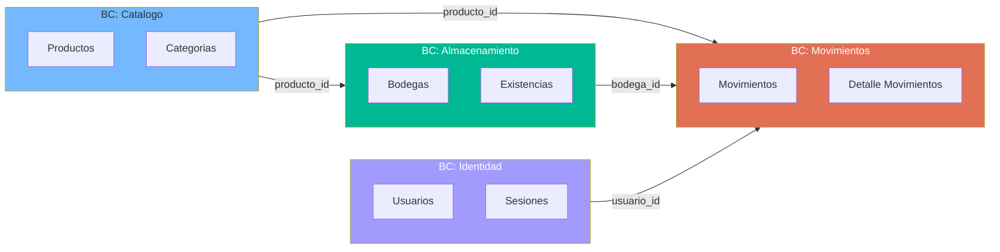

# Patrones Arquitectónicos — StockControl

## Patrones Detectados

| Patrón | Presente | Evidencia | Evaluación |
|---|---|---|---|
| MVC | ❌ No | Sin separación Model-View-Controller | Todo mezclado en rutas |
| Repository | ❌ No | SQL directo en funciones de ruta | Sin abstracción de datos |
| Service Layer | ❌ No | Lógica de negocio inline | Sin servicios separados |
| Dependency Injection | ❌ No | Variable global `_DB`, `new` implícito | Sin DI container |
| Decorator (Flask) | ✅ Parcial | `@auth` decorator para verificación de sesión | `app.py:298-306` |
| God Object / Module | ✅ Sí (Anti-patrón) | 1 archivo = todo el sistema | `app.py` |
| Transaction Script | ✅ Sí | Cada ruta es un procedimiento lineal completo | Todas las rutas |
| Template Method | ❌ No | Sin herencia, sin variación por tipo | Copy-paste en su lugar |

## Anti-Patrones Detectados

| Anti-Patrón | Severidad | Instancias | Evidencia |
|---|---|---|---|
| **God Module** | Crítica | 1 (todo el sistema) | `app.py` — 939 LOC, 15+ responsabilidades |
| **God Function** | Alta | 1 (`iniciar()`) | `app.py:62-222` — DDL + seed + config + conexión |
| **Copy-Paste Programming** | Alta | 4 rutas de movimientos | `mov_entrada`, `mov_salida`, `mov_traslado` son 80% idénticos |
| **SQL Injection** | Crítica | 6+ instancias | `app.py:460`, `725-731`, `1844-1847`, `1962-1974` |
| **Global State** | Alta | `_DB` variable global mutable | `app.py:47`, accedida via `db()` |
| **Magic Numbers** | Media | 5+ instancias | `MAX_ROWS=999`, `i>50`, `LIMIT 100`, `LIMIT 50`, `LIMIT 10` |
| **Catch-and-Swallow** | Alta | 4+ instancias | `except Exception: pass` en parseo de movimientos |
| **Spaghetti Code** | Alta | Todas las rutas | HTML + SQL + lógica en cada función |
| **Primitive Obsession** | Media | Roles como strings, estados como integers | `'ADMIN'`, `'AUXILIAR'`, `estado=1/0` |

## Evaluación DDD (Domain-Driven Design)

### Bounded Contexts Implícitos

A pesar de la ausencia de separación, se identifican **4 bounded contexts** naturales por dominio funcional:

El diagrama muestra los bounded contexts naturales. En el código actual, todos están mezclados. En una modernización, cada BC podría convertirse en un módulo/servicio independiente.

### Evaluación de Ubiquitous Language

| Término de Dominio | Presente en Código | Consistencia |
|---|---|---|
| Producto | `productos` (tabla), `prod` (variable) | ⚠️ Abreviaciones inconsistentes |
| Bodega | `bodegas` (tabla), `bod` (variable) | ⚠️ Abreviaciones |
| Movimiento | `movimientos` (tabla), `mov_entrada()` (función) | ✅ Consistente |
| Kardex | `kardex` (ruta) | ✅ Término de dominio correcto |
| Existencia | `existencias` (tabla), `stock_fisico` (columna) | ⚠️ Mezcla "existencia" con "stock" |
| Entrada/Salida/Traslado/Ajuste | Tipos de movimiento | ✅ Terminología de inventarios correcta |

### Clasificación DDD

| Aspecto | Evaluación |
|---|---|
| **Modelo de Dominio** | **Anémico** — Las tablas son data bags; toda la lógica está en las rutas (Transaction Scripts) |
| **Aggregates** | No existen — no hay consistencia transaccional garantizada entre entidades |
| **Value Objects** | No existen — todo es primitivo (strings, ints, floats) |
| **Domain Events** | No existen — no hay evento al registrar movimiento, solo INSERT |
| **Anti-Corruption Layer** | No aplica — no hay integraciones externas |

## Evaluación Clean Architecture (Dependency Rule)

| Criterio | Cumple | Evidencia |
|---|---|---|
| Dirección de dependencias (hacia adentro) | ❌ No | No hay capas definidas |
| Framework independence | ❌ No | Flask acoplado en toda ruta |
| Testabilidad sin infraestructura | ❌ No | `db()` global, no mockeable |
| Boundaries entre capas | ❌ No | HTML + SQL + lógica en misma función |

### Métricas de Component Principles

No calculables — el sistema tiene **1 solo componente** (el archivo completo). Las métricas I/A/D requieren múltiples componentes con dependencias entre sí.

[SUPUESTO: Si se separara en módulos, cada bounded context (Catálogo, Almacenamiento, Movimientos, Identidad) tendría Instability ~0.5 y Abstractness ~0 (sin interfaces)]

## Patrón Detectado: Transaction Script

El sistema implementa el patrón **Transaction Script** (Fowler, PoEAA): cada ruta HTTP es un procedimiento que:
1. Recibe input del form/querystring
2. Ejecuta queries SQL directamente
3. Aplica lógica de negocio inline
4. Genera HTML de respuesta
5. Retorna al cliente

Esto es aceptable para sistemas pequeños, pero el tamaño actual (19 rutas, 7 tablas) ya excede el límite donde Transaction Script es manejable.

## Recomendación de Modernización (Patrones Target)

| Patrón Actual | Patrón Target | Beneficio |
|---|---|---|
| God Module | **Modular Monolith** (blueprints Flask) | Separación sin microservicios |
| Transaction Script | **Service Layer + Repository** | Testabilidad, reutilización |
| SQL directo | **Repository Pattern + ORM** (SQLAlchemy) | Seguridad, portabilidad |
| HTML strings | **Template Engine** (Jinja2 files) | Mantenibilidad UI |
| Global state | **Application Factory + DI** | Testabilidad, concurrencia |
| Copy-paste movimientos | **Strategy Pattern** | DRY, extensibilidad |

## Hallazgos Clave

1. **Zero architecture** — No hay patrones de diseño implementados intencionalmente
2. **Transaction Script puro** — Cada ruta es un procedimiento lineal completo
3. **Bounded contexts naturales** — 4 dominios claros (Catálogo, Almacenamiento, Movimientos, Identidad) que facilitan una futura separación
4. **Copy-paste como patrón** — Las 4 rutas de movimientos comparten ~80% de código
5. **Modelo anémico** — Las tablas son pure data sin comportamiento

## Referencias

- [system-overview.md](system-overview.md)
- [components.md](components.md)
- [../behavior/business-logic.md](../behavior/business-logic.md)
- [../analysis/modernization-assessment.md](../analysis/modernization-assessment.md)
