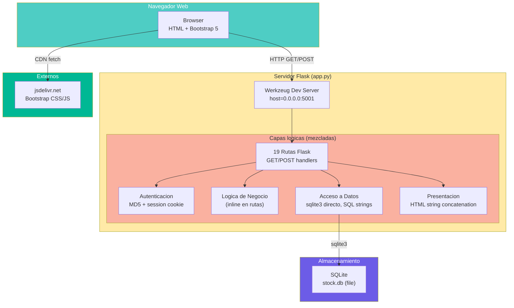

# Arquitectura del Sistema — StockControl

## Visión General

StockControl es un **monolito de archivo único** (God Module) que implementa una aplicación web de gestión de inventarios sin ninguna separación arquitectónica. Todo el sistema — presentación HTML, lógica de negocio, acceso a datos, autenticación y configuración — coexiste en un solo archivo Python de 939 LOC efectivas (`app.py`).

No existe una arquitectura diseñada intencionalmente. El sistema es un ejemplo de **Big Ball of Mud**: las responsabilidades están mezcladas en cada función, sin capas, sin módulos, sin abstracciones.

## Modelo Arquitectónico

| Aspecto | Valor | Evidencia |
|---|---|---|
| **Patrón** | Monolito de archivo único (God Module) | `app.py` contiene todo |
| **Separación de capas** | Inexistente | HTML, SQL, lógica en cada ruta (`app.py:442-2214`) |
| **Comunicación** | HTTP síncrono (Flask dev server) | `app.py:2221` |
| **Estado** | Session cookie (server-side) + BD global | `app.py:46-48`, `_DB` global |
| **Persistencia** | SQLite file-based, conexión global no thread-safe | `app.py:41`, `app.py:76` |
| **Rendering** | Server-side (render_template_string) | `app.py:399-410` |
| **Seguridad** | MD5 hashing + session cookie + SQL Injection vulnerable | `app.py:265`, `app.py:460` |

## Diagrama de Arquitectura

El diagrama muestra que NO hay separación real entre capas. Los bloques dentro del servidor son **zonas lógicas** del mismo archivo, no módulos independientes. Cada ruta accede directamente a la base de datos, genera HTML y ejecuta lógica de negocio.

## Modelo de Despliegue

| Componente | Instancia | Configuración |
|---|---|---|
| Application Server | Werkzeug (dev) | `app.py:2221` — `host='0.0.0.0', port=5001, debug=True` |
| Database | SQLite embedded | `stock.db` en mismo directorio que `app.py` |
| Static Assets | CDN externo | Bootstrap 5.3.0 + Bootstrap Icons 1.11.0 |
| Session Store | Cookie-based (server-side Flask session) | Secret key hardcoded `app.py:46` |

**No existe** modelo de despliegue formal: sin Docker, sin reverse proxy, sin gestión de ambientes, sin CI/CD.

## Decisiones Arquitectónicas Detectadas

| # | Decisión | Impacto | Evidencia |
|---|---|---|---|
| AD-01 | Todo en un archivo | Imposible de escalar, testear o mantener con equipo | `app.py` (2,221 líneas brutas) |
| AD-02 | SQLite como BD de producción | Sin concurrencia, sin networking, sin replicación | `app.py:41` |
| AD-03 | Conexión global `_DB` con `check_same_thread=False` | Race conditions bajo carga concurrente | `app.py:76` |
| AD-04 | HTML como strings Python | Sin cache de templates, difícil de modificar | `app.py:311-398` (`TMPL_BASE`) |
| AD-05 | Sin framework de validación | Toda validación es manual e incompleta | Múltiples rutas sin validar input |
| AD-06 | MD5 para passwords | Criptográficamente roto desde 2004 | `app.py:265` |
| AD-07 | SQL por concatenación de strings | SQL Injection en producción | `app.py:460`, `app.py:725-731` |
| AD-08 | Sin gestión de transacciones explícitas | Inconsistencia de datos posible | `actualizar_stock()` sin `BEGIN` |

## Limitaciones Arquitectónicas

1. **Sin escalabilidad horizontal** — SQLite es file-based, `_DB` global no soporta multi-process
2. **Sin tolerancia a fallos** — Un crash pierde la conexión, no hay reconnect ni health check
3. **Sin separación de concerns** — Imposible modificar la UI sin tocar la lógica de negocio
4. **Sin testabilidad** — Sin DI, sin interfaces, sin mocks posibles
5. **Sin seguridad** — SQL Injection + MD5 + secrets hardcoded + debug mode habilitado

## Referencias

- [components.md](components.md)
- [dependencies.md](dependencies.md)
- [patterns.md](patterns.md)
- [../project-overview.md](../project-overview.md)
