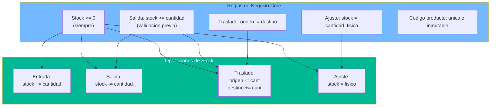

# Lógica de Negocio — StockControl

## Resumen

La lógica de negocio de StockControl está **completamente dispersa** en las funciones de ruta Flask. No existe una capa de servicios, domain model, ni business rules engine. Cada ruta implementa su propia lógica inline, mezclada con acceso a datos y generación de HTML.

## Reglas de Negocio Identificadas

### RN-01: Gestión de Stock (Core)

| Regla | Implementación | Evidencia |
|---|---|---|
| Stock nunca es negativo | `max(0.0, ...)` en `actualizar_stock()` | `app.py:281` |
| Salida requiere stock suficiente | Validación previa: `if stk < cant` | `app.py:1414-1418` |
| Traslado requiere stock en origen | Misma validación que salida | `app.py:1573-1577` |
| Ajuste establece valor absoluto | `stock_fisico = cantidad_fisica` | `app.py:1755-1760` |
| Entrada siempre suma | `delta` positivo en `actualizar_stock()` | `app.py:1306-1310` |

### RN-02: Movimientos de Inventario

| Regla | Descripción | Evidencia |
|---|---|---|
| Tipos válidos | ENTRADA, SALIDA, TRASLADO, AJUSTE_POS, AJUSTE_NEG | `app.py:619` (TIPO_BADGE dict) |
| Entrada registra costo | El costo unitario se pasa a `actualizar_stock()` | `app.py:1308` |
| Traslado requiere bodegas distintas | `bod_ori == bod_dst` → error | `app.py:1564` |
| Ajuste calcula diferencia | `diferencia = cant_fisica - stock_actual` | `app.py:1743` |
| Referencia automática en ajuste | `'AJ-' + fecha` | `app.py:1748` |

### RN-03: Trazabilidad (Kardex)

| Regla | Descripción | Evidencia |
|---|---|---|
| Cada movimiento registra antes/después | `existencia_antes`, `existencia_despues` | `app.py:1311-1313` |
| Historial limitado a 50 | `LIMIT 50` en kardex detalle | `app.py:2131` |
| Movimientos limitados a 100 | `LIMIT 100` en historial | `app.py:1846` |

### RN-04: Productos

| Regla | Descripción | Evidencia |
|---|---|---|
| Código único | Verificación antes de INSERT | `app.py:854` |
| Código inmutable | Campo `readonly` en edición | `app.py:909` |
| Estado binario | `estado=1` (activo), `estado=0` (inactivo) | `app.py:1037` |
| Soft delete | Toggle activo/inactivo, no DELETE | `app.py:1033-1040` |

### RN-05: Bodegas

| Regla | Descripción | Evidencia |
|---|---|---|
| Estado binario | `activa=1/0` | `app.py:1222` |
| Capacidad como límite visual | Se muestra % pero no se bloquea | `app.py:1068-1070` |
| Solo bodegas activas en operaciones | `WHERE activa=1` en selects para movimientos | `app.py:438` |

### RN-06: Costo Promedio

| Regla | Descripción | Evidencia |
|---|---|---|
| Actualización en entrada | Si `costo_nuevo > 0`, se actualiza | `app.py:289-291` |
| Sin fórmula de promedio ponderado | Sobreescribe el costo sin promediar | `app.py:291` (comentado como MALA PRACTICA) |

## Diagrama de Lógica Central

El diagrama muestra las 5 reglas de negocio principales y cómo aplican a cada tipo de operación de stock. Todas se implementan inline en las funciones de ruta, sin abstracción.

## Lógica Ausente (Gaps funcionales)

| Funcionalidad Esperada | Estado | Impacto |
|---|---|---|
| Autorización por rol | ❌ No implementada | Todos los usuarios pueden hacer todo |
| Validación de capacidad de bodega | ❌ Solo visual | Se puede exceder sin bloqueo |
| Promedio ponderado de costo | ❌ Sobrescritura directa | Cálculo de valor incorrecto |
| Auditoría de cambios | ❌ Solo movimientos | No hay log de quién editó productos/bodegas |
| Reserva de stock | ❌ Columna existe pero no se usa | `stock_reservado` siempre es 0 |
| Control de lote/vencimiento | ❌ Columnas existen pero no se validan | `lote`, `fecha_vencimiento` sin lógica |
| Paginación | ❌ No existe | Se cargan todos los registros |

## Hallazgos Clave

1. **Lógica dispersa** — No existe capa de dominio; las reglas están incrustadas en SQL + Python inline
2. **Reglas simples pero correctas** — La validación de stock funciona para el happy path
3. **Sin validación de input** — Campos del form se usan directamente sin sanitizar
4. **Race conditions** — `get_stock()` + `actualizar_stock()` sin transacción atómica
5. **Funcionalidad fantasma** — Columnas (`stock_reservado`, `lote`, `fecha_vencimiento`) sin lógica asociada

## Referencias

- [workflows.md](workflows.md)
- [decision-logic.md](decision-logic.md)
- [error-handling.md](error-handling.md)
- [../architecture/patterns.md](../architecture/patterns.md)
