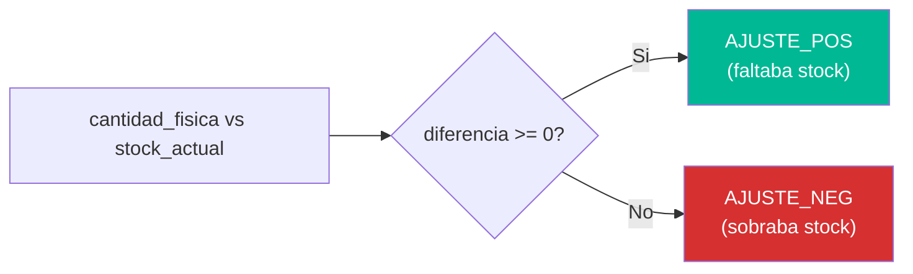
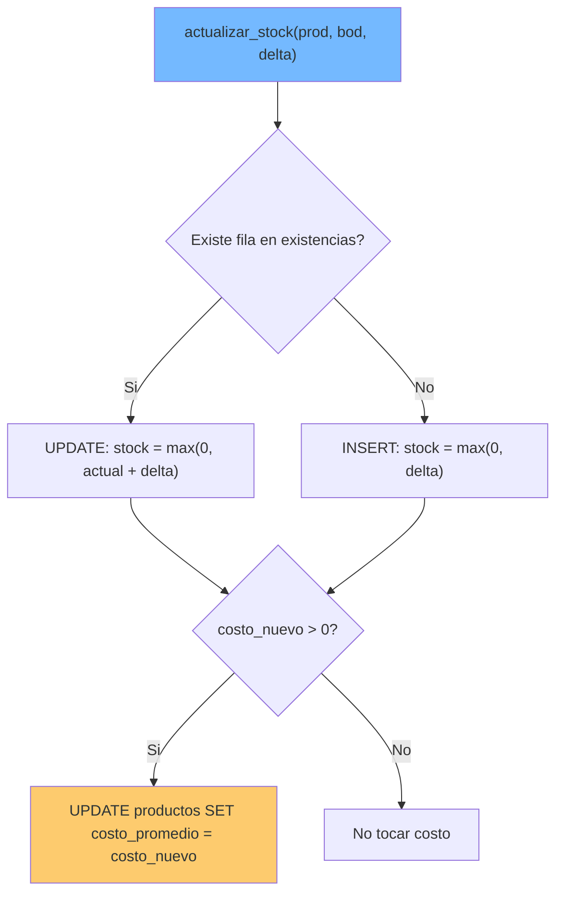
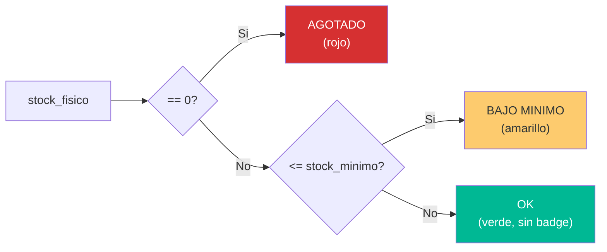

# Lógica de Decisión — StockControl

## Puntos de Decisión en el Sistema

### D-01: Tipo de Ajuste (Positivo vs Negativo)

**Ubicación:** `app.py:1742-1743`

```python
diferencia = cant_fisica - stock_actual
tipo = 'AJUSTE_POS' if diferencia >= 0 else 'AJUSTE_NEG'
```



---

### D-02: Validación de Stock Suficiente (Salida/Traslado)

**Ubicación:** `app.py:1414-1418` (salida), `app.py:1573-1577` (traslado)

```python
for pid, cant in items:
    stk = get_stock(pid, int(bod_id))
    if stk < cant:
        errores.append(f'{nombre}: disponible {stk}, solicitado {cant}')
```

**Decisión:** Se valida **TODOS** los items antes de ejecutar cualquiera. Si uno falla, ninguno se ejecuta. Esto es correcto (atomicidad lógica) pero la implementación no usa transacciones de BD.

---

### D-03: Actualizar Stock (UPDATE vs INSERT en existencias)

**Ubicación:** `app.py:276-286`

```python
fila = db().execute("SELECT id, stock_fisico FROM existencias WHERE ...")
if fila:
    nuevo = max(0.0, float(fila['stock_fisico']) + delta)
    db().execute("UPDATE existencias SET stock_fisico=? WHERE id=?", ...)
else:
    nuevo = max(0.0, delta)
    db().execute("INSERT INTO existencias (...) VALUES (...)")
```



**Problema:** Patrón UPSERT manual sin lock — race condition entre SELECT y UPDATE.

---

### D-04: Toggle de Estado (Productos/Bodegas)

**Ubicación:** `app.py:1033-1040` (productos), `app.py:1218-1226` (bodegas)

```python
nuevo = 0 if p['estado'] else 1
```

**Decisión simple:** flip binario del estado. Sin verificación de dependencias (ej: ¿desactivar producto con stock > 0?).

---

### D-05: Filtros SQL Dinámicos (SQL Injection)

**Ubicación:** `app.py:725-731`, `app.py:1844-1847`, `app.py:1962-1974`

```python
sql = "SELECT ... WHERE 1=1"
if fn:
    sql += " AND p.nombre LIKE '%" + fn + "%'"
if fc:
    sql += " AND p.categoria_id=" + fc
```

**Decisión de diseño (incorrecta):** Los filtros se construyen por concatenación de strings del request. No hay decisión de sanitización ni parameterización.

---

### D-06: Parseo de Items de Movimiento

**Ubicación:** `app.py:1267-1282`

```python
i = 0
while True:
    pid = request.form.get(f'prod_{i}')
    if pid is None:
        break
    # ... parsear cantidad, costo, lote
    try:
        if pid and float(cant or 0) > 0:
            items.append(...)
    except Exception:
        pass  # silenciar errores
    i += 1
    if i > 50:
        break
```

**Decisiones:**
- Items indexados (prod_0, prod_1, ...) — máximo 50 (magic number)
- Items con cantidad ≤ 0 se ignoran silenciosamente
- Errores de parseo se tragaron (`except: pass`)

---

### D-07: Estado del Stock para Alertas (Dashboard/Kardex)

**Ubicación:** `app.py:2061-2071`

```python
if stk == 0:
    slbl = 'Agotado'     # badge rojo
elif stk <= stock_minimo:
    slbl = 'Bajo Min.'   # badge amarillo
else:
    slbl = ''            # sin badge (OK)
```



## Lógica Condicional Compleja Ausente

El sistema **NO tiene** lógica condicional compleja. Las decisiones son todas binarias o ternarias simples. No hay:
- Máquinas de estado (los movimientos no tienen transiciones de estado)
- Reglas de negocio compuestas (AND/OR de múltiples condiciones)
- Workflows de aprobación
- Cálculos condicionales complejos

## Hallazgos Clave

1. **Decisiones simples** — Todo es if/else binario; no hay lógica de negocio compleja
2. **Race condition en UPSERT** — `actualizar_stock()` tiene ventana temporal entre SELECT y UPDATE
3. **Magic numbers** — `50` items máximo, `100` movimientos, `6` alertas — sin constantes nombradas
4. **Catch-and-swallow** — Errores de parseo se ignoran silenciosamente
5. **Sin validación de negocio** — No se verifica capacidad de bodega, lote, vencimiento, ni roles

## Referencias

- [business-logic.md](business-logic.md)
- [workflows.md](workflows.md)
- [error-handling.md](error-handling.md)
