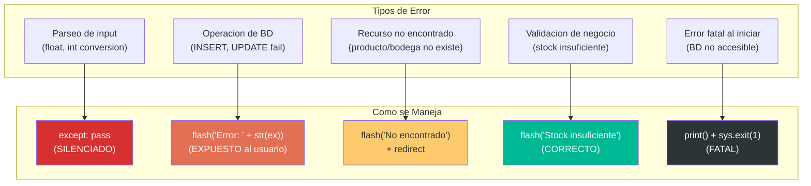

# Manejo de Errores — StockControl

## Estrategia de Manejo de Errores

El sistema **NO tiene** una estrategia de manejo de errores. Los errores se manejan de forma ad-hoc con patrones que exponen información interna, tragan excepciones, o ignoran condiciones de error completamente.

## Patrones de Error Detectados

### Patrón 1: Catch-and-Swallow (Silenciar errores)

**Instancias:** 4+ en parseo de movimientos

```python
# app.py:1277-1278, 1394-1395, 1555-1556
try:
    if pid and float(cant or 0) > 0:
        items.append(...)
except Exception:
    pass  # Error silenciado — el item se ignora
```

**Impacto:** Si un usuario ingresa datos inválidos, el sistema los ignora sin feedback. Puede resultar en movimientos parciales sin que el usuario lo sepa.

---

### Patrón 2: Catch-and-Expose (Exponer errores técnicos)

**Instancias:** 4+ en operaciones de BD

```python
# app.py:860-861 (producto nuevo), 1316-1317 (entrada), 1432-1433 (salida)
except Exception as ex:
    flash('Error tecnico: ' + str(ex), 'danger')
```

**Impacto:** El usuario ve mensajes de error con información interna (traceback, nombres de tablas, tipos de error SQL). Potencial information disclosure.

---

### Patrón 3: Fatal-and-Exit (Inicialización)

**Instancia:** 1 en `iniciar()`

```python
# app.py:222-223
try:
    iniciar()
except Exception as _e:
    print("ERROR FATAL al iniciar:", _e)
    sys.exit(1)
```

**Impacto:** Si la BD no es accesible al inicio, la aplicación muere. No hay retry, no hay fallback, no hay logging estructurado.

---

### Patrón 4: Error Handlers Flask (Exposición de info interna)

**Instancia:** 2 handlers globales

```python
# app.py:2203-2208
@app.errorhandler(404)
def not_found(e):
    html = f'<div class="alert alert-warning">404 - No encontrado<br>{e}</div>'
    return render('Error 404', html), 404

@app.errorhandler(500)
def server_error(e):
    html = f'<div class="alert alert-danger">500 - Error interno<br>{e}</div>'
    return render('Error 500', html), 500
```

**Impacto:** El error `{e}` puede contener stack traces, paths de sistema, nombres de tablas, etc.

## Diagrama de Flujo de Errores



El diagrama muestra que solo E4 (validación de stock) tiene un manejo correcto. Los demás tipos de error tienen manejo inadecuado.

## Ausencias Críticas

| Capacidad de Error Handling | Estado | Impacto |
|---|---|---|
| Logging estructurado | ❌ Ausente | Solo `print()` — se pierde en stdout |
| Retry con backoff | ❌ Ausente | BD falla → aplicación muere |
| Circuit breaker | ❌ Ausente (N/A sin servicios externos) | — |
| Graceful degradation | ❌ Ausente | Un error = página de error genérica |
| Error categorization | ❌ Ausente | Todos los errores son "Error técnico" |
| Error monitoring/alerting | ❌ Ausente | Nadie se entera cuando falla |
| Transaction rollback | ❌ Ausente | Fallo parcial deja datos inconsistentes |
| Input sanitization errors | ❌ Ausente | SQL Injection = sin defensa |
| Rate limiting errors | ❌ Ausente | Sin protección contra abuse |
| Health check endpoint | ❌ Ausente | No hay forma de saber si está vivo |

## Hallazgos Clave

1. **Sin estrategia** — Cada ruta maneja (o ignora) errores de forma diferente
2. **Information disclosure** — Los `except` exponen `str(ex)` al usuario final
3. **Catch-and-swallow** — Items de movimiento con error se ignoran silenciosamente
4. **Sin transacciones** — No hay rollback si un loop falla a mitad
5. **Sin logging** — Solo `print()` que se pierde (no hay logging framework)
6. **Debug mode siempre activo** — En producción esto expondría stack traces completos

## Referencias

- [business-logic.md](business-logic.md)
- [decision-logic.md](decision-logic.md)
- [../analysis/production-readiness.md](../analysis/production-readiness.md)
- [../analysis/security-patterns.md](../analysis/security-patterns.md)
