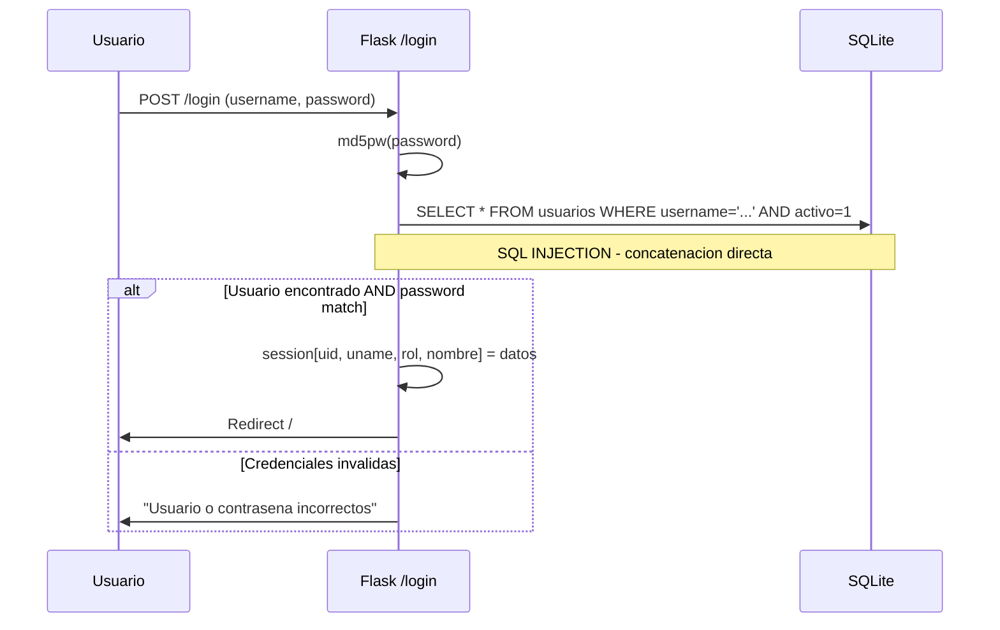
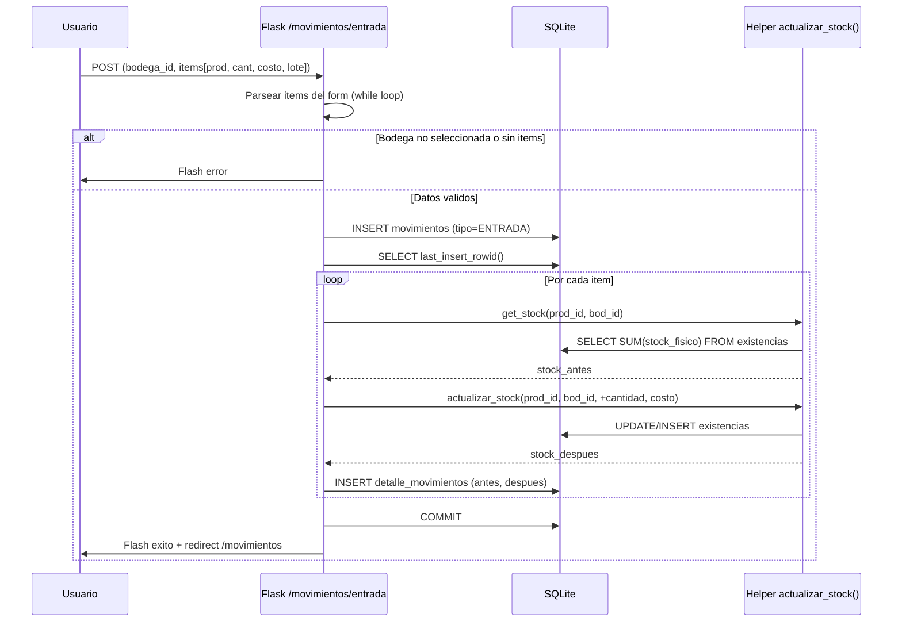
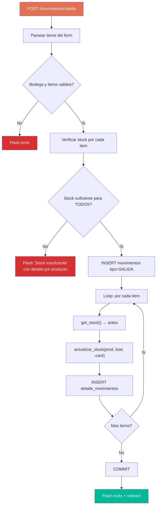
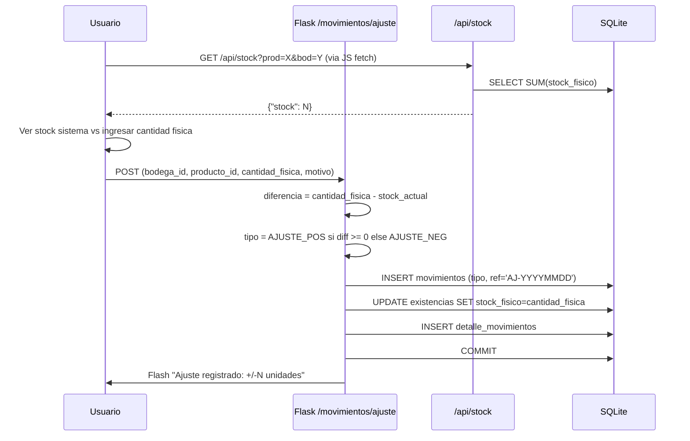

# Workflows del Sistema — StockControl

## Workflow 1: Autenticación de Usuario

**Entrada:** Username + Password via form POST
**Salida:** Redirect a Dashboard (éxito) o mensaje de error (fallo)

**Evidencia:** `app.py:442-498`
**Vulnerabilidad:** SQL Injection en la query de login (`app.py:460`) — el username se concatena directamente.

---

## Workflow 2: Registrar Entrada de Inventario

**Entrada:** Bodega destino + lista de productos con cantidades y costos
**Salida:** Movimiento registrado + stock actualizado

**Evidencia:** `app.py:1228-1370`
**Problema:** Sin transacción explícita — si falla a mitad del loop, los primeros items ya están actualizados.

---

## Workflow 3: Registrar Salida de Inventario

**Entrada:** Bodega origen + lista de productos con cantidades
**Salida:** Movimiento registrado + stock decrementado

**Evidencia:** `app.py:1372-1528`
**Diferencia con Entrada:** Valida stock ANTES de ejecutar + no registra costo.

---

## Workflow 4: Traslado entre Bodegas

**Entrada:** Bodega origen + Bodega destino + lista de productos
**Salida:** Stock decrementado en origen + incrementado en destino

**Flujo:** Idéntico a Salida (validación de stock en origen) + `actualizar_stock()` positivo en destino.

**Evidencia:** `app.py:1530-1690`
**Validación extra:** `bod_ori == bod_dst` → error "Origen y destino deben ser diferentes" (`app.py:1564`)

---

## Workflow 5: Ajuste de Inventario

**Entrada:** Bodega + Producto + Cantidad física contada
**Salida:** Stock ajustado al valor real + movimiento AJUSTE_POS/AJUSTE_NEG registrado

**Evidencia:** `app.py:1692-1808`
**Nota:** El ajuste es la única operación que **establece** un valor absoluto en vez de sumar/restar un delta.

---

## Workflow 6: Consulta de Kardex (Existencias cruzadas)

**Entrada:** Filtros opcionales (producto, bodega, categoría, estado de stock)
**Salida:** Tabla cruzada Producto × Bodega con stock, valor y alertas

**SQL principal:** CROSS JOIN entre `productos` y `bodegas` con LEFT JOIN a `existencias` — genera producto cartesiano de todas las combinaciones posibles.

**Evidencia:** `app.py:1952-2100`
**Problema de rendimiento:** Con 100 productos × 10 bodegas = 1,000 filas sin paginación.

---

## Workflow 7: Dashboard (KPIs)

**Entrada:** Request GET / (autenticado)
**Salida:** Página con 8+ indicadores calculados

| KPI | Query | Evidencia |
|---|---|---|
| Total productos activos | `SELECT COUNT(*)` | `app.py:519` |
| Total bodegas activas | `SELECT COUNT(*)` | `app.py:520` |
| Valor de inventario | SUM(stock × costo) en Python | `app.py:522-527` |
| Productos agotados | Subquery con GROUP BY HAVING | `app.py:529-534` |
| Bajo stock mínimo | Subquery similar | `app.py:536-542` |
| Entradas del mes | COUNT con LIKE mes | `app.py:544-546` |
| Salidas del mes | COUNT con LIKE mes | `app.py:547-549` |
| Últimos 10 movimientos | JOIN + ORDER BY DESC LIMIT 10 | `app.py:551-557` |
| Alertas de stock | GROUP BY HAVING tot <= min LIMIT 6 | `app.py:559-566` |
| Mayor rotación | COUNT detalle_movimientos | `app.py:568-573` |

**Problema:** 10+ queries separadas en una sola función de 205 líneas.

## Hallazgos Clave

1. **7 workflows principales** cubren toda la funcionalidad del sistema
2. **Copy-paste entre movimientos** — Entrada, Salida y Traslado son ~80% iguales
3. **Sin transacciones atómicas** — El loop de items puede fallar a mitad dejando datos inconsistentes
4. **Validación solo en salida/traslado** — Entrada no valida nada más que campos obligatorios
5. **Dashboard es el más costoso** — 10+ queries sin cache ni materialización

## Referencias

- [business-logic.md](business-logic.md)
- [decision-logic.md](decision-logic.md)
- [../architecture/components.md](../architecture/components.md)
- [../database/schema-analysis.md](../database/schema-analysis.md)
