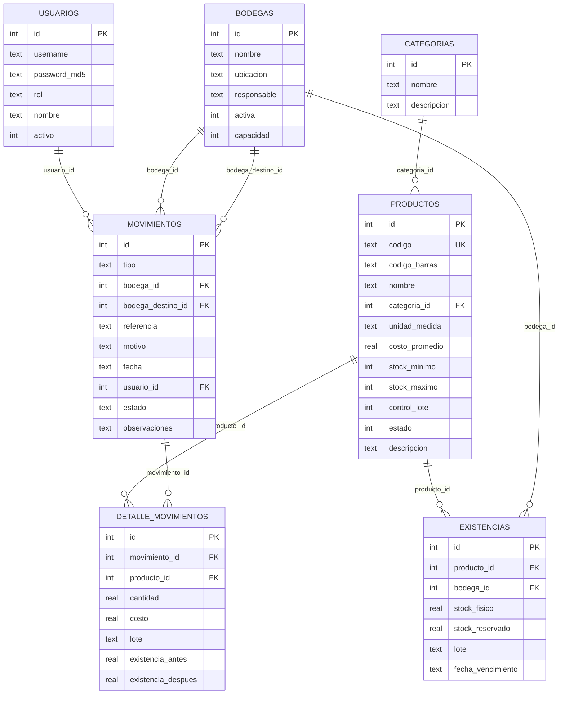

# Análisis de Esquema de Base de Datos — StockControl

## Resumen del Esquema

| Aspecto | Valor |
|---|---|
| **Motor** | SQLite 3 (embebido vía stdlib `sqlite3`) |
| **Nombre de BD** | `stock.db` (file-based, mismo directorio que `app.py`) |
| **Tablas** | 7 |
| **Stored Procedures** | 0 (SQLite no soporta SPs) |
| **Funciones** | 0 |
| **Vistas** | 0 |
| **Índices explícitos** | 0 (solo PKs implícitos) |
| **Foreign Keys declaradas** | 0 (relaciones por convención, sin REFERENCES) |
| **Migraciones** | 0 — DDL recreado en cada inicio (`CREATE TABLE IF NOT EXISTS`) |
| **Evidencia** | `app.py:79-143` (DDL completo inline) |

## Catálogo de Tablas

| Tabla | Tipo | Columnas | PK | FKs Lógicas | Propósito |
|---|---|---|---|---|---|
| `usuarios` | Maestro | 6 | `id` AUTO | — | Autenticación |
| `categorias` | Maestro | 3 | `id` AUTO | — | Clasificación productos |
| `productos` | Maestro | 12 | `id` AUTO | `categoria_id` → categorias | Catálogo |
| `bodegas` | Maestro | 6 | `id` AUTO | — | Ubicaciones |
| `existencias` | Transaccional | 7 | `id` AUTO | `producto_id` → productos, `bodega_id` → bodegas | Stock actual |
| `movimientos` | Transaccional | 10 | `id` AUTO | `bodega_id`, `bodega_destino_id` → bodegas, `usuario_id` → usuarios | Header movimientos |
| `detalle_movimientos` | Transaccional | 8 | `id` AUTO | `movimiento_id` → movimientos, `producto_id` → productos | Líneas de detalle |

## Diagrama ER

## Hallazgos de Calidad de BD

| # | Hallazgo | Severidad | Descripción | Impacto |
|---|---|---|---|---|
| 1 | **Sin Foreign Keys** | Alta | Ninguna tabla usa `REFERENCES` | Integridad referencial solo por código |
| 2 | **Sin índices** | Media | No hay `CREATE INDEX` en ninguna tabla | Queries de filtro hacen full table scan |
| 3 | **Sin UNIQUE compuesto en existencias** | Alta | `(producto_id, bodega_id)` no tiene constraint UNIQUE | Duplicados posibles |
| 4 | **Fechas como TEXT** | Baja | `fecha` en movimientos es TEXT, no tipo fecha nativo | No se puede usar funciones de fecha SQL |
| 5 | **Sin migraciones** | Alta | DDL ejecutado con `IF NOT EXISTS` en cada arranque | No hay versionamiento del esquema |
| 6 | **Columnas fantasma** | Baja | `stock_reservado`, `lote`, `fecha_vencimiento` sin uso | Confusión; sugieren funcionalidad no implementada |
| 7 | **Sin soft-delete en movimientos** | Media | No se puede anular/reversar un movimiento | Ajuste manual es la única opción |
| 8 | **Tipo como TEXT libre** | Baja | `tipo` en movimientos no tiene CHECK constraint | Permite tipos inválidos |

## Lógica de Negocio en BD

**No hay lógica de negocio en la base de datos.** SQLite no soporta stored procedures, triggers en uso, ni funciones definidas por el usuario. Toda la lógica reside en el código Python (100% en app code).

| Aspecto | Estado |
|---|---|
| Stored Procedures | N/A (SQLite no soporta) |
| Triggers | No definidos |
| Check Constraints | No definidos |
| Computed Columns | No definidas |
| Views | No definidas |

## Mapeo Tabla ↔ Código Python

| Tabla | Función(es) que la acceden | Operaciones |
|---|---|---|
| `usuarios` | `login()`, `iniciar()` (seed) | SELECT (login), INSERT (seed) |
| `categorias` | `producto_nuevo()`, `producto_editar()`, `kardex()` | SELECT (options) |
| `productos` | `productos()`, `producto_nuevo()`, `producto_editar()`, `producto_toggle()`, `dashboard()`, `kardex()` | SELECT, INSERT, UPDATE |
| `bodegas` | `bodegas()`, `bodega_nueva()`, `bodega_editar()`, `bodega_toggle()`, todo movimiento | SELECT, INSERT, UPDATE |
| `existencias` | `get_stock()`, `actualizar_stock()`, `kardex()`, `kardex_detalle()`, `dashboard()` | SELECT, INSERT, UPDATE |
| `movimientos` | `mov_entrada()`, `mov_salida()`, `mov_traslado()`, `mov_ajuste()`, `movimientos()`, `dashboard()` | INSERT, SELECT |
| `detalle_movimientos` | Todos los `mov_*()`, `movimientos()`, `kardex_detalle()`, `dashboard()` | INSERT, SELECT |

## Impacto en Modernización

| Factor | Evaluación |
|---|---|
| % lógica en BD vs código | **0% en BD, 100% en código** — facilita migración |
| Migración a ORM (SQLAlchemy) | **Directa** — schema simple, sin SPs ni triggers |
| Portabilidad a PostgreSQL | **Fácil** — DDL estándar, sin extensiones SQLite |
| Versionamiento de schema | **Requiere implementar** — Alembic o Flask-Migrate |
| Datos existentes | **Mínimos** — solo seed data, migración trivial |

## Referencias

- [../reference/data-models.md](../reference/data-models.md)
- [../architecture/dependencies.md](../architecture/dependencies.md)
- [../behavior/business-logic.md](../behavior/business-logic.md)
