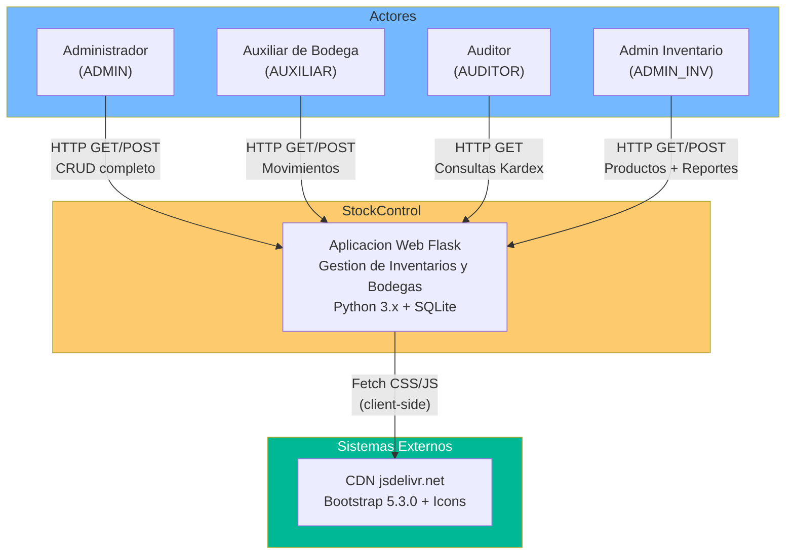
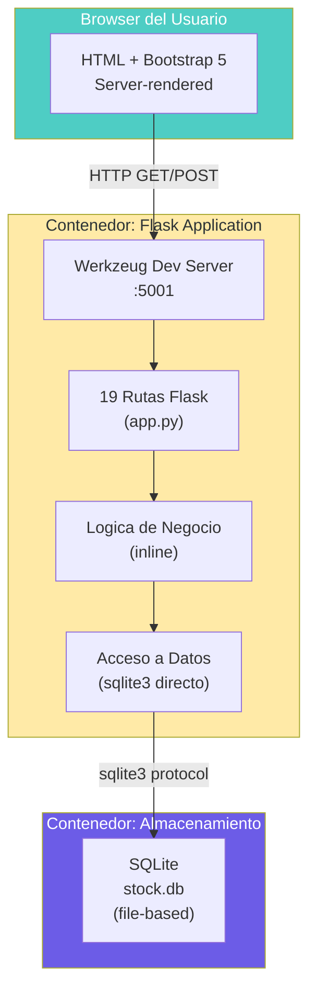
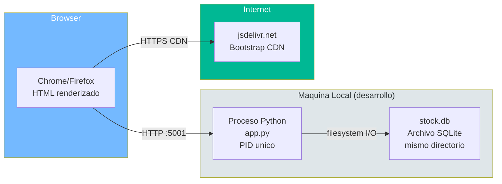

# Diagrama de Contexto del Sistema — StockControl

## Nivel 1: Contexto del Sistema (C4)

Este diagrama muestra StockControl y sus interacciones con actores externos y sistemas. Al ser un sistema completamente autocontenido, las interacciones externas son mínimas.

El diagrama muestra que StockControl es un sistema **island** sin integraciones server-side. La única dependencia externa es el CDN de Bootstrap, descargado por el browser del usuario (no por el servidor).

## Nivel 2: Contenedores (C4)

Al ser un monolito de archivo único, solo existen 2 "contenedores" reales:

Este diagrama refleja la realidad de que las "capas" son zonas lógicas dentro del mismo proceso, no contenedores separados. No hay boundaries reales entre ellas.

## Diagrama de Despliegue Actual (AS-IS)

**Evidencia:**
- Host: `app.py:2221` — `app.run(host='0.0.0.0', port=5001, debug=True)`
- Database path: `app.py:41` — `DATABASE = os.path.join(os.path.dirname(__file__), 'stock.db')`
- CDN: `app.py:316-317` — URLs de jsdelivr.net en template base

## Hallazgos del Contexto

- **Sin balanceador**: tráfico directo al proceso Flask
- **Sin reverse proxy**: Werkzeug development server expuesto
- **Sin TLS**: solo HTTP, sin certificado
- **Sin DNS**: acceso por IP directa o localhost
- **Sin separación de ambientes**: un único deployment

## Referencias

- [Arquitectura del Sistema](../../architecture/system-overview.md)
- [Componentes](../../architecture/components.md)
- [Dependencias](../../architecture/dependencies.md)
- [Production Readiness](../../analysis/production-readiness.md)
