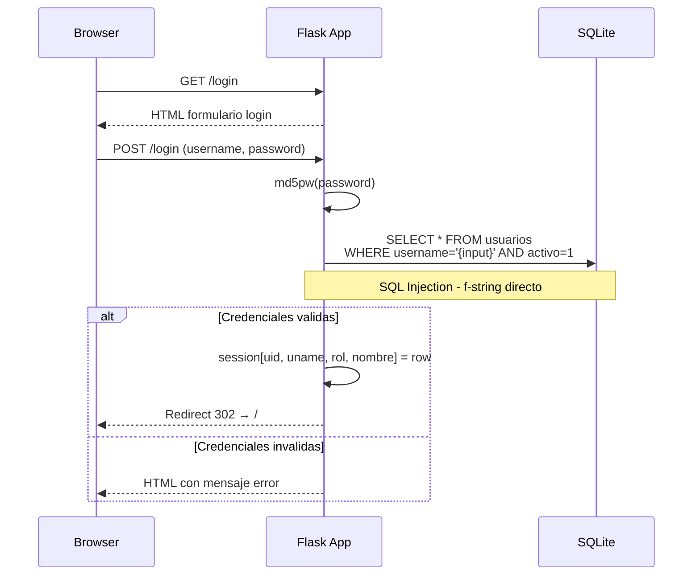
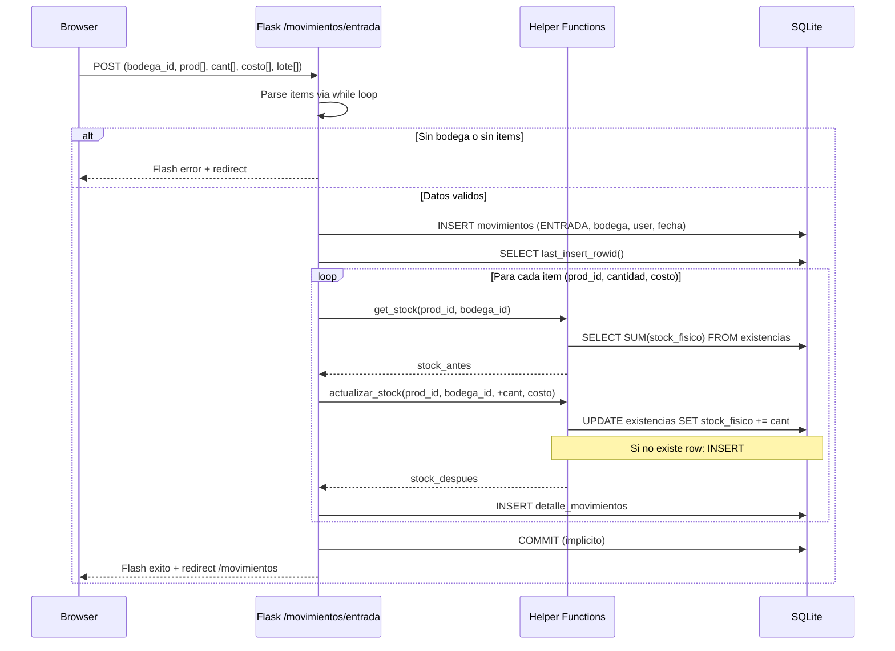
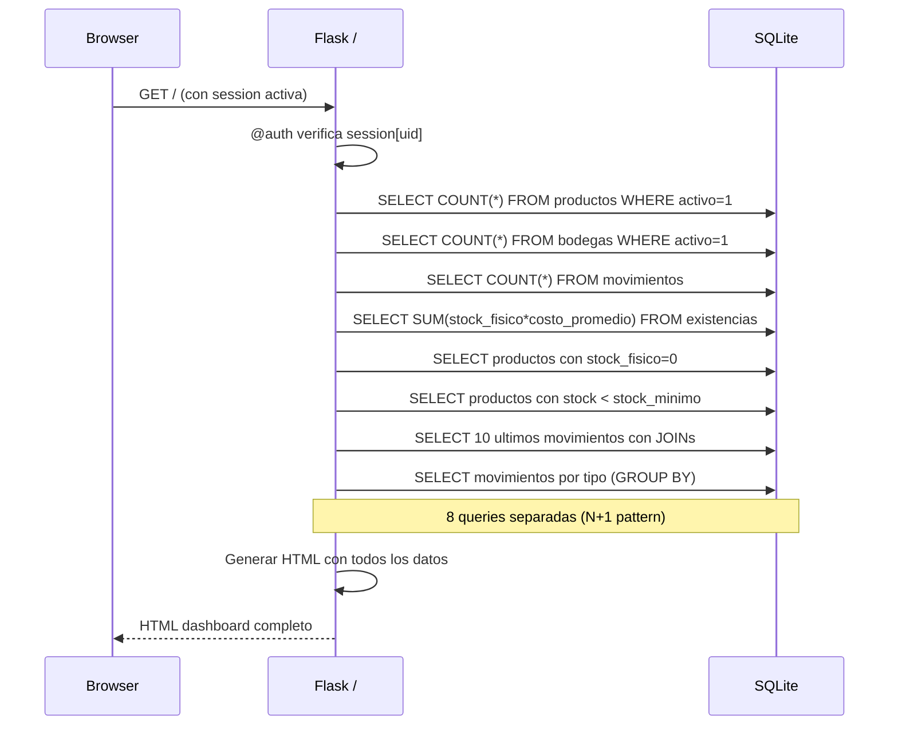
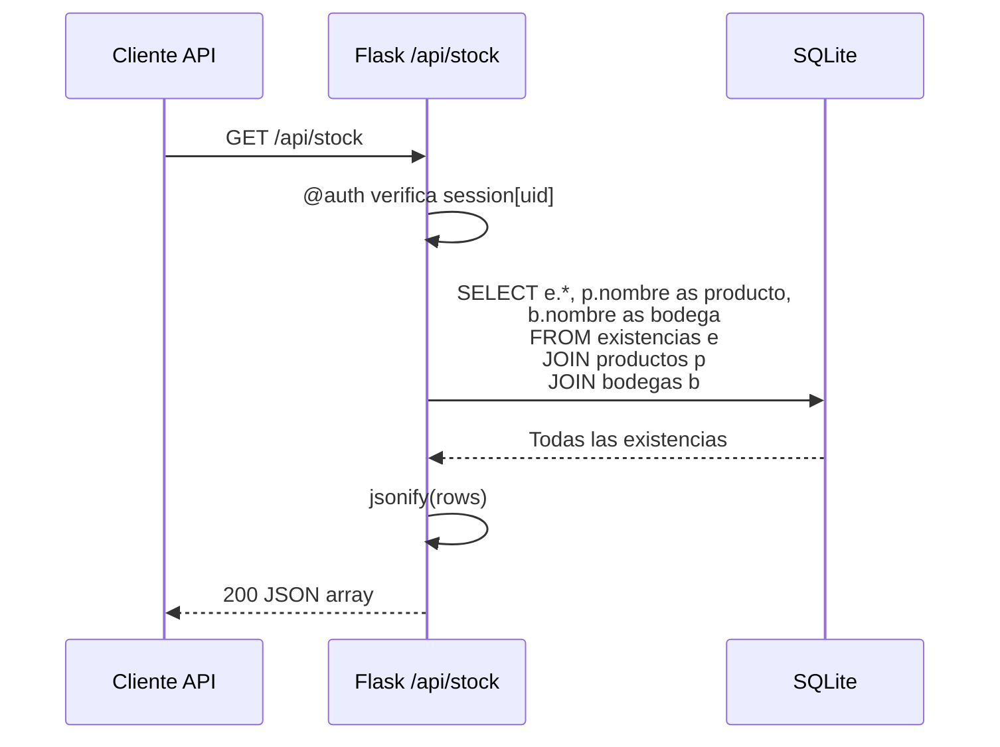
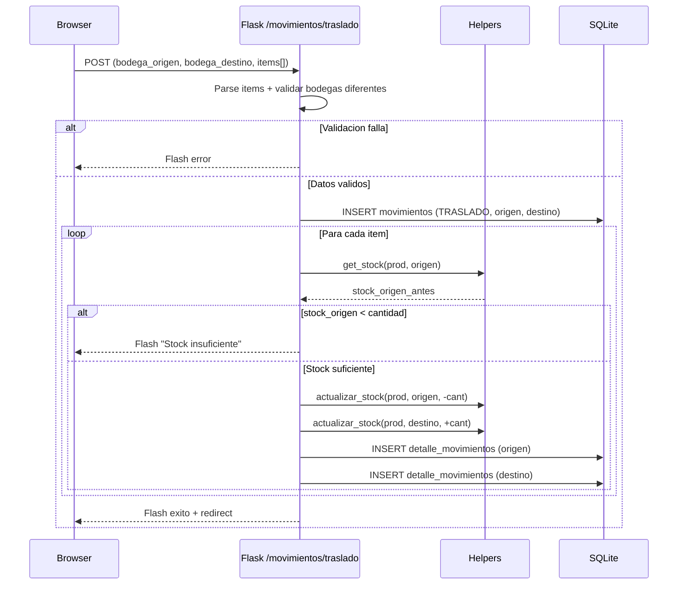

# Diagramas de Secuencia — StockControl

## Secuencia 1: Flujo de Login

**Evidencia:** `app.py:442-498`
**Vulnerabilidad:** Username se concatena directamente en SQL (`app.py:460`).

## Secuencia 2: Registrar Movimiento de Entrada

**Evidencia:** `app.py:1228-1370`
**Problemas detectados:**
- Sin transacción explícita (si falla a mitad, estado inconsistente)
- `except Exception: pass` — errores de parseo silenciados (`app.py:1252`)

## Secuencia 3: Consulta de Dashboard

**Evidencia:** `app.py:477-598`
**Problema:** 8 queries separadas al renderizar cada dashboard — sin cache ni optimización.

## Secuencia 4: API Stock (JSON endpoint)

**Evidencia:** `app.py:1810-1818`
**Problema:** Retorna TODAS las existencias sin paginación ni filtros.

## Secuencia 5: Traslado entre Bodegas

**Evidencia:** `app.py:1545-1720`
**Problemas:**
- Sin transacción: si falla entre decremento de origen e incremento de destino = stock perdido
- Validación item-por-item (debería validar todos ANTES de ejecutar)

## Hallazgos Clave de los Diagramas

1. **Sin transacciones atómicas**: Operaciones multi-paso sin BEGIN/COMMIT explícito
2. **N+1 queries**: Dashboard ejecuta 8 queries por request
3. **SQL Injection**: Parámetros de usuario inyectados directamente en SQL strings
4. **Error swallowing**: Excepciones capturadas y silenciadas en parseo
5. **Sin paginación**: Todos los endpoints retornan datos sin límite

## Referencias

- [Workflows](../../behavior/workflows.md)
- [Business Logic](../../behavior/business-logic.md)
- [Error Handling](../../behavior/error-handling.md)
- [Security Patterns](../../analysis/security-patterns.md)
