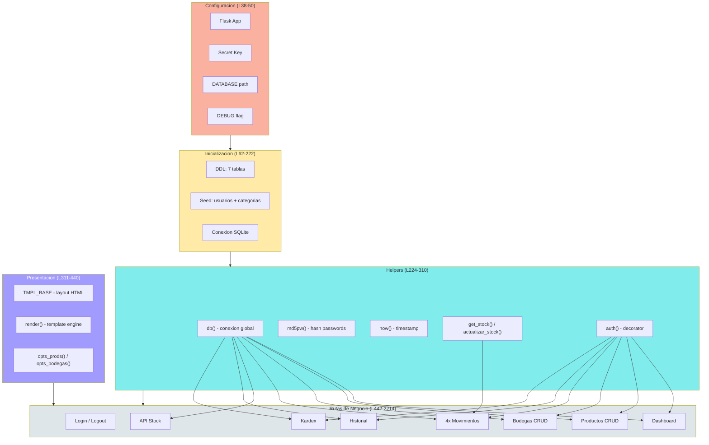
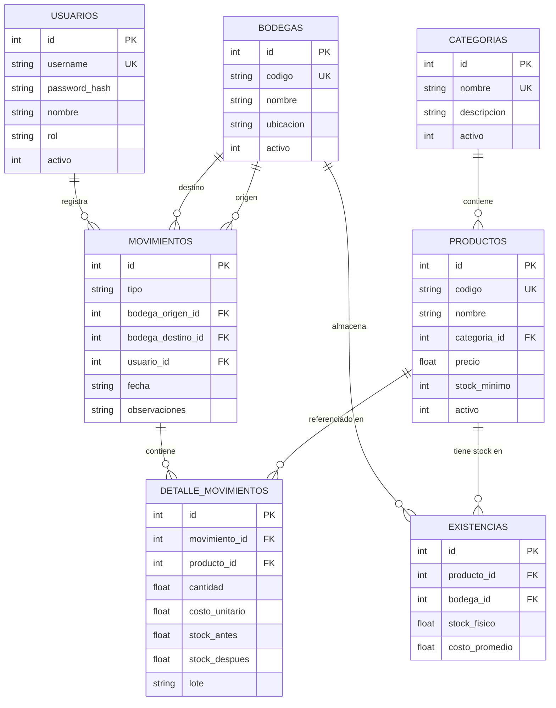
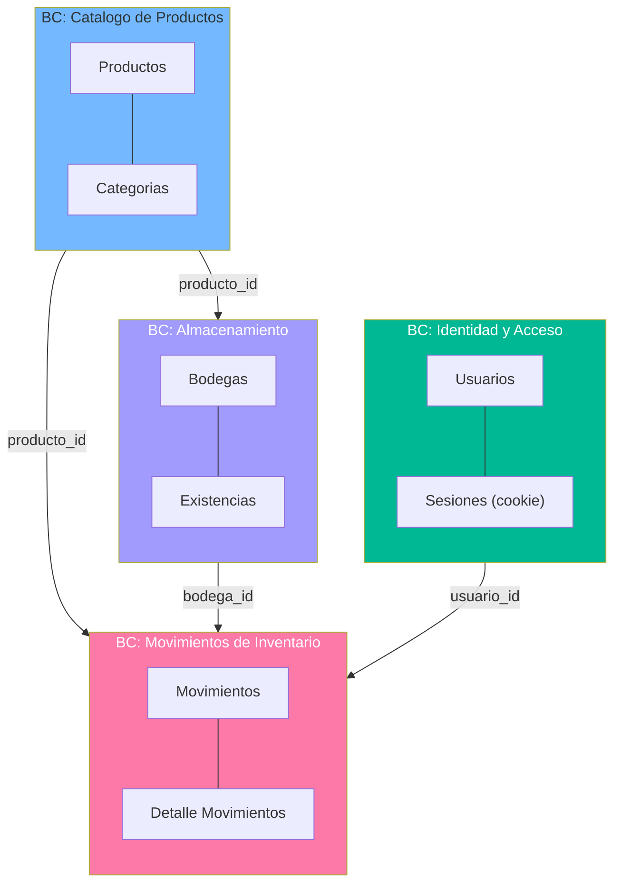
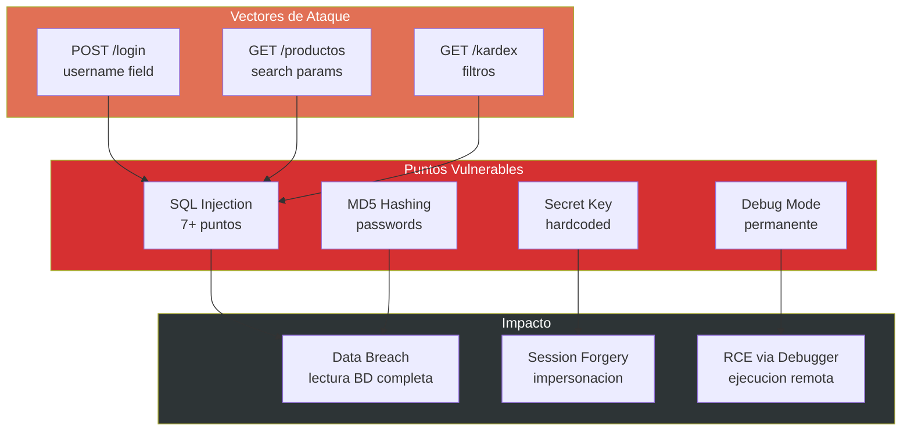

# Diagramas Estructurales — StockControl

## Diagrama de Componentes (Nivel 3 C4)

Dado que StockControl es un God Module, este diagrama muestra las **zonas lógicas** dentro del archivo único `app.py` y sus relaciones de dependencia interna.

El diagrama revela el patrón **estrella** de acoplamiento: `db()` y `auth()` son nodos centrales con fan-out a todas las rutas.

## Diagrama de Modelo de Datos (ER)

**Evidencia:** DDL en `app.py:82-160` (función `iniciar()`)

## Diagrama de Bounded Contexts

Los 4 bounded contexts son candidatos naturales a microservicios o módulos independientes en una modernización.

## Diagrama de Dependencias de Seguridad

## Hallazgos Clave Estructurales

1. **Estructura plana**: 0 módulos, 0 packages, 0 clases — todo en funciones a nivel de módulo
2. **Fan-in extremo**: `db()` es consumido por 100% de las rutas (19 de 19)
3. **Sin boundaries**: No hay ningún mecanismo de encapsulamiento entre bounded contexts
4. **Modelo de datos normalizado**: 7 tablas bien relacionadas — la BD es la parte más "sana" del sistema
5. **4 bounded contexts naturales**: La separación para modernización ya está implícita en el modelo de datos

## Referencias

- [Componentes](../../architecture/components.md)
- [Patrones](../../architecture/patterns.md)
- [Schema Analysis](../../database/schema-analysis.md)
- [Dependency Analysis](../../analysis/dependency-analysis.md)
