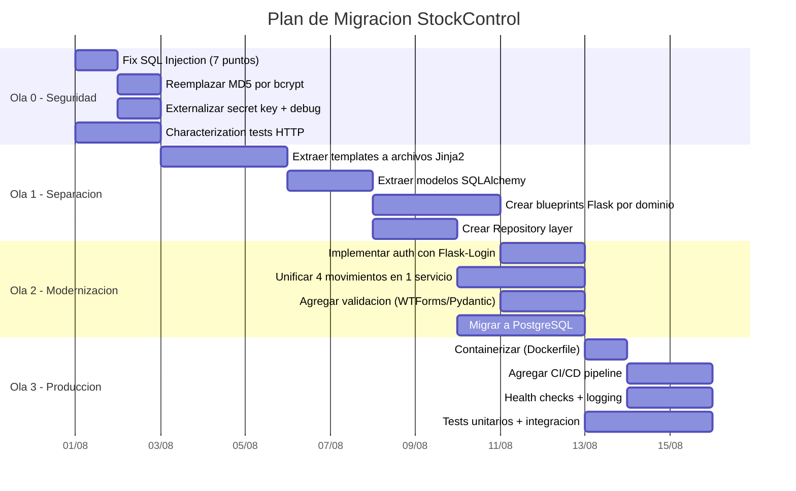
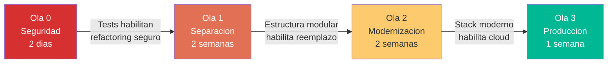

# Orden de Migración por Componentes — StockControl

## Estrategia de Migración: Strangler Fig + Refactor

Dado que el sistema es un God Module de 939 LOC con Legacy Readiness D, la estrategia recomendada es **Strangler Fig** combinado con **Refactor**: extraer módulos incrementalmente mientras se mantiene el sistema funcionando.

## Olas de Migración



## Detalle por Ola

### Ola 0: Quick Wins de Seguridad (2 días)

**Objetivo:** Eliminar vulnerabilidades críticas sin cambiar la arquitectura.

| # | Tarea | Componente | Dependencia | Esfuerzo |
|---|---|---|---|---|
| 0.1 | Parametrizar queries SQL (7 puntos) | `app.py:448,757,759,761,848,882,1962` | Ninguna | 2h |
| 0.2 | Reemplazar MD5 → bcrypt | `app.py:265` + login | 0.1 | 4h |
| 0.3 | Externalizar SECRET_KEY a env var | `app.py:44` | Ninguna | 15min |
| 0.4 | Externalizar DEBUG/HOST a env vars | `app.py:44, 2221` | Ninguna | 15min |
| 0.5 | Crear characterization tests HTTP | Todas las 19 rutas | Ninguna | 8h |

**Criterio de éxito:** 0 vulnerabilidades de inyección SQL + passwords seguros + tests pinean comportamiento actual.

### Ola 1: Separación Estructural (2 semanas)

**Objetivo:** Descomponer el God Module en estructura de proyecto Flask estándar.

| # | Tarea | Componente Origen | Componente Target | Esfuerzo |
|---|---|---|---|---|
| 1.1 | Extraer HTML a templates Jinja2 | `app.py:311-398` + inline HTML | `templates/base.html` + parciales | 3d |
| 1.2 | Crear modelos SQLAlchemy | DDL en `iniciar()` | `models/producto.py`, `models/bodega.py`, etc. | 2d |
| 1.3 | Crear Repository layer | SQL inline en rutas | `repositories/producto_repo.py`, etc. | 2d |
| 1.4 | Extraer rutas a Blueprints | Rutas en `app.py` | `routes/auth.py`, `routes/productos.py`, etc. | 3d |
| 1.5 | Crear servicios de negocio | Lógica inline en rutas | `services/inventario_service.py`, `services/auth_service.py` | 3d |

**Estructura target:**
```
app/
├── __init__.py          (Flask app factory)
├── config.py            (settings from env)
├── models/
│   ├── producto.py
│   ├── bodega.py
│   ├── movimiento.py
│   └── usuario.py
├── repositories/
│   ├── producto_repo.py
│   └── movimiento_repo.py
├── services/
│   ├── inventario_service.py
│   └── auth_service.py
├── routes/
│   ├── auth.py
│   ├── dashboard.py
│   ├── productos.py
│   ├── bodegas.py
│   └── movimientos.py
├── templates/
│   ├── base.html
│   ├── dashboard.html
│   └── ...
└── tests/
    ├── test_auth.py
    └── test_inventario.py
```

**Criterio de éxito:** Characterization tests siguen pasando + cada módulo tiene una sola responsabilidad.

### Ola 2: Modernización de Stack (2 semanas)

**Objetivo:** Reemplazar componentes obsoletos/inseguros por alternativas modernas.

| # | Tarea | De (actual) | A (target) | Esfuerzo |
|---|---|---|---|---|
| 2.1 | Auth moderna | MD5 + session manual | Flask-Login + bcrypt + RBAC | 2d |
| 2.2 | Unificar movimientos | 4 funciones copy-paste (~580 LOC) | 1 MovimientoService con Strategy pattern | 3d |
| 2.3 | Validación de inputs | Sin validación | WTForms o Pydantic | 2d |
| 2.4 | Migrar BD | SQLite (file-based) | PostgreSQL (client/server) | 3d |
| 2.5 | Actualizar Flask | 2.2.5 | 3.1.x | 1d |

**Criterio de éxito:** 0 copy-paste + inputs validados + BD escalable + auth robusta.

### Ola 3: Production Readiness (1 semana)

**Objetivo:** Hacer el sistema operable en un entorno real.

| # | Tarea | Entregable | Esfuerzo |
|---|---|---|---|
| 3.1 | Dockerfile + docker-compose | Container con app + Postgres | 1d |
| 3.2 | CI/CD pipeline (GitHub Actions) | Build + test + deploy | 2d |
| 3.3 | Health check endpoint | `/health` con status BD | 2h |
| 3.4 | Structured logging | Python `logging` + JSON formatter | 4h |
| 3.5 | Tests unitarios + integración | ≥80% cobertura en services + repos | 3d |
| 3.6 | Rate limiting + CORS | Flask-Limiter + Flask-CORS | 2h |

**Criterio de éxito:** Deployable en cloud (container) + observable + testable + resiliente.

## Dependencias entre Olas



## Aplicabilidad de Herramientas de Transformación

| Herramienta | Aplicabilidad | Razón |
|---|---|---|
| **AWS App2Container** | ❌ No aplica | No es una app containerizable as-is (SQLite, God Module) |
| **Azure Migrate** | ❌ No aplica | No hay infra on-premise para migrar |
| **Strangler Fig (manual)** | ✅ Recomendado | Extraer módulos gradualmente mientras el sistema corre |
| **2to3 / pyupgrade** | ⚠️ Parcial | Puede ayudar si se migra a Python 3.11+ syntax |
| **SQLAlchemy Alembic** | ✅ Recomendado | Para gestionar migrations de BD post-Ola 1 |
| **Flask-Migrate** | ✅ Recomendado | Wrapper de Alembic integrado con Flask |
| **Copilot/Kiro** | ✅ Recomendado | Para generar boilerplate de repos, services, tests |

## Estimación Total

| Ola | Duración | Equipo | Créditos estimados |
|---|---|---|---|
| Ola 0 | 2 días | 1 dev | 5 |
| Ola 1 | 2 semanas | 1 dev | 20 |
| Ola 2 | 2 semanas | 1-2 devs | 30 |
| Ola 3 | 1 semana | 1 dev + 1 devops | 15 |
| **Total** | **~5-6 semanas** | **1-2 personas** | **~70 créditos** |

[ESTIMADO: Basado en 939 LOC, complejidad D, y 17 items de deuda técnica. Para un equipo experimentado en Flask, los tiempos podrían reducirse 30%.]

## Referencias

- [Technical Debt](../technical-debt/remediation-plan.md)
- [Production Readiness](../analysis/production-readiness.md)
- [Components](../architecture/components.md)
- [Patterns](../architecture/patterns.md)
