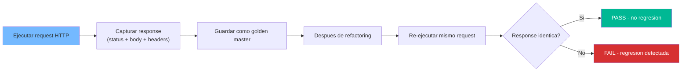
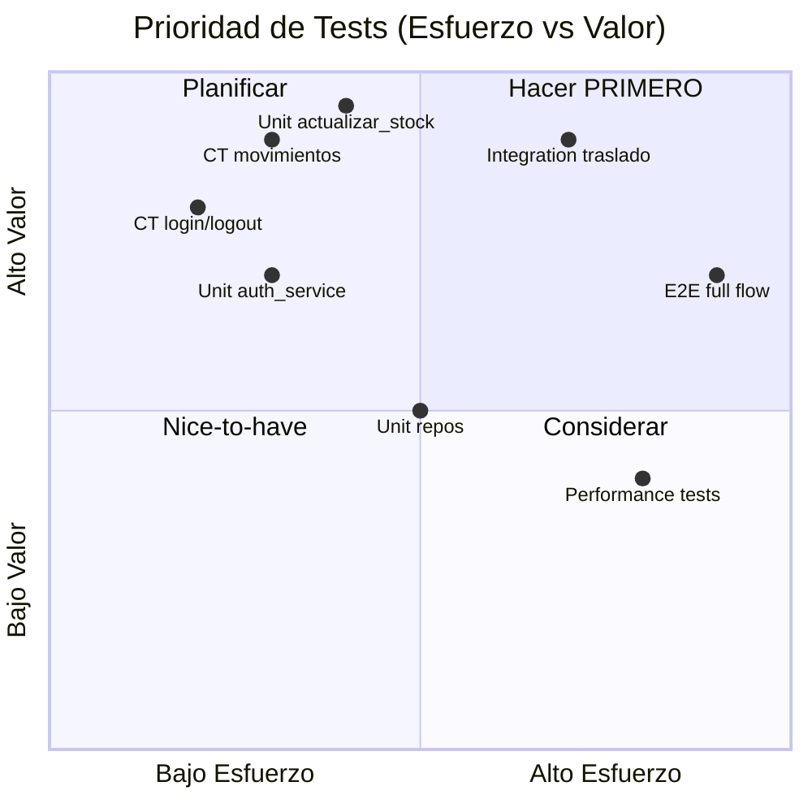

# Especificaciones de Testing — StockControl

## Estrategia de Testing para Migración

La migración de un sistema Legacy Readiness D requiere **pinear el comportamiento actual** antes de cualquier refactoring. La estrategia es: Characterization Tests → Unit Tests → Integration Tests.

## Characterization Tests (Ola 0 — Antes de tocar código)

### Propósito

Capturar el comportamiento exacto del sistema AS-IS para detectar regresiones durante el refactoring. Se basan en golden master: "el sistema hace X hoy, y DEBE seguir haciendo X después del cambio".



### Inventario de Characterization Tests

| # | Ruta | Método | Precondición | Qué validar |
|---|---|---|---|---|
| CT-01 | `/login` | GET | Sin sesión | Status 200 + HTML con formulario |
| CT-02 | `/login` | POST | Credenciales válidas (admin/admin123) | Redirect 302 → `/` + session cookie |
| CT-03 | `/login` | POST | Credenciales inválidas | Status 200 + mensaje error |
| CT-04 | `/` | GET | Con sesión válida | Status 200 + dashboard con KPIs |
| CT-05 | `/` | GET | Sin sesión | Redirect 302 → `/login` |
| CT-06 | `/productos` | GET | Con sesión | Status 200 + tabla de productos |
| CT-07 | `/productos/nuevo` | POST | Producto válido | Redirect + producto creado en BD |
| CT-08 | `/bodegas` | GET | Con sesión | Status 200 + tabla de bodegas |
| CT-09 | `/movimientos/entrada` | GET | Con sesión | Status 200 + formulario con opciones |
| CT-10 | `/movimientos/entrada` | POST | Entrada válida | Redirect + stock actualizado |
| CT-11 | `/movimientos/salida` | POST | Stock suficiente | Redirect + stock decrementado |
| CT-12 | `/movimientos/salida` | POST | Stock insuficiente | Flash error + redirect |
| CT-13 | `/movimientos/traslado` | POST | Traslado válido | Stock movido entre bodegas |
| CT-14 | `/kardex` | GET | Con sesión | Status 200 + tabla de existencias |
| CT-15 | `/api/stock` | GET | Con sesión | Status 200 + JSON array |
| CT-16 | `/historial` | GET | Con sesión | Status 200 + tabla movimientos |
| CT-17 | `/logout` | GET | Con sesión | Redirect + session eliminada |
| CT-18 | `/ruta-inexistente` | GET | Cualquiera | Status 404 |

**Fuente:** 19 rutas detectadas en `app.py:442-2214`. Total: 18 characterization tests mínimos.

### Framework Recomendado

```python
# tests/test_characterization.py
import pytest
from app import app

@pytest.fixture
def client():
    app.config['TESTING'] = True
    with app.test_client() as client:
        yield client

def test_ct01_login_page(client):
    """CT-01: GET /login retorna formulario"""
    response = client.get('/login')
    assert response.status_code == 200
    assert b'<form' in response.data
    assert b'username' in response.data
```

## Unit Tests (Ola 1 — Después de separación)

### Cobertura Target por Módulo

| Módulo (post-refactoring) | Tests necesarios | Prioridad |
|---|---|---|
| `services/inventario_service.py` | actualizar_stock, get_stock, validar_stock_suficiente | Alta |
| `services/auth_service.py` | hash_password, verify_password, create_session | Alta |
| `repositories/producto_repo.py` | create, get_by_id, list, update, toggle_activo | Media |
| `repositories/movimiento_repo.py` | create_movimiento, create_detalle, get_historial | Media |
| `models/*.py` | Validación de constructores, reglas de dominio | Media |

### Pinch Points (Feathers) — Tests de Mayor ROI

| Pinch Point | Qué cubre | ROI |
|---|---|---|
| `actualizar_stock()` | Toda la lógica de stock (entrada, salida, traslado, ajuste) | **Máximo** — 4 rutas dependen de esto |
| `get_stock()` | Cálculo de stock actual por producto/bodega | Alto — usado por dashboard + movimientos |
| `auth()` decorator | Autorización de todas las rutas protegidas | Alto — 17 de 19 rutas lo usan |
| `iniciar()` DDL | Creación correcta de schema | Medio — solo se ejecuta 1 vez |

## Integration Tests (Ola 2 — Después de modernización)

| Escenario | Componentes involucrados | Validación |
|---|---|---|
| Entrada completa | Route → Service → Repository → DB | Stock incrementado correctamente |
| Salida con stock insuficiente | Route → Service (validación) → Flash | Operación rechazada + mensaje |
| Traslado atómico | Route → Service → 2×Repository → DB | Consistencia: suma(stock) = constante |
| Login + operación + logout | Auth → Session → Route → Auth(logout) | Ciclo completo de sesión |
| API stock con datos | Route → Repository → JSON | Formato correcto + datos consistentes |

## Técnicas de Dependency-Breaking Recomendadas

Para pasar de Legacy D a testeable, aplicar estas técnicas (Feathers):

| Técnica | Dónde aplicar | Resultado |
|---|---|---|
| **Parameterize Constructor** | `db()` → inyectar conexión | Permite BD de test in-memory |
| **Extract and Override** | `auth()` → hacer overrideable en tests | Tests sin login |
| **Wrap Method** | `actualizar_stock()` → wrapping con validación | Testeable independientemente |
| **Sprout Class** | Rutas → extraer a Service classes | Unit-testeable sin HTTP |
| **Break Out Method Object** | `iniciar()` → clase `DatabaseInitializer` | Testeable sin side effects |

## Matriz de Prioridad



## Referencias

- [Complexity Analysis](../analysis/complexity-analysis.md)
- [Tech Debt](../analysis/tech-debt.md)
- [Component Order](./component-order.md)
- [Workflows](../behavior/workflows.md)
