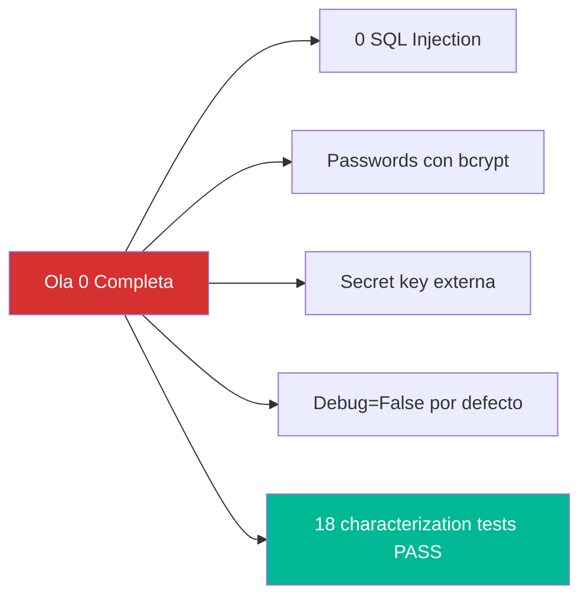
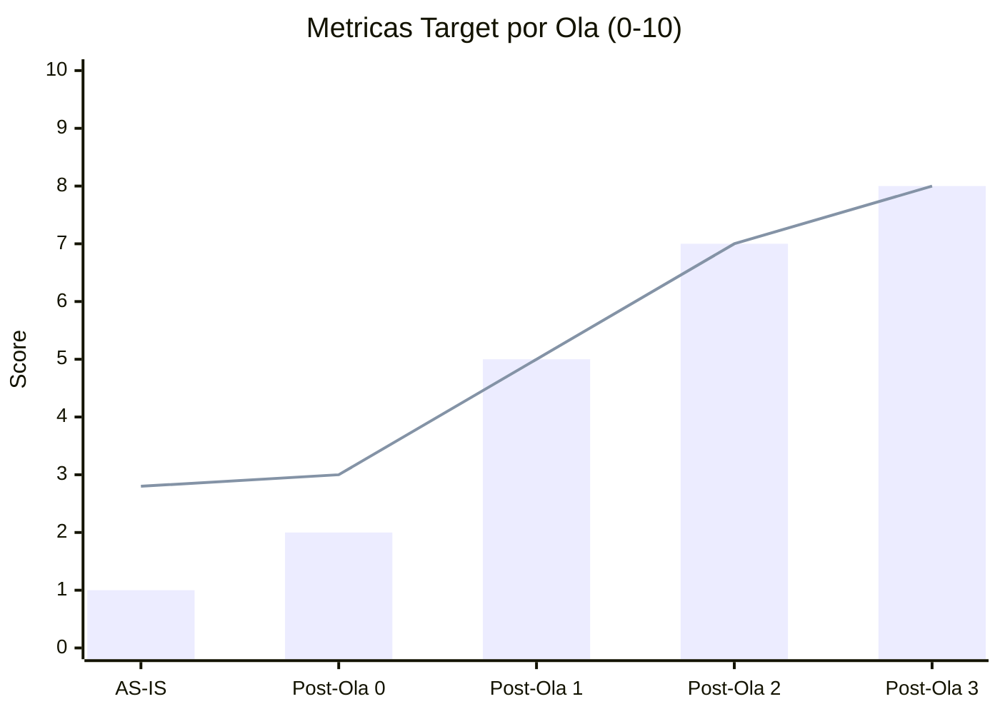

# Criterios de Validación — StockControl

## Propósito

Define los criterios de aceptación que deben cumplirse al finalizar cada ola de migración para considerar la modernización exitosa.

## Criterios por Ola

### Ola 0: Validación de Seguridad

| # | Criterio | Método de Validación | Evidencia Requerida |
|---|---|---|---|
| V0.1 | Cero concatenación SQL en código | `grep -n "f\".*SELECT\|f\".*INSERT\|f\".*UPDATE\|f\".*DELETE"` → 0 resultados | Reporte de grep |
| V0.2 | Passwords hasheados con bcrypt | Login exitoso con passwords en nuevo formato | Test CT-02 pasa con bcrypt |
| V0.3 | Secret key desde env var | `os.environ.get('SECRET_KEY')` en código; app funciona sin hardcoded | Test de arranque con env var |
| V0.4 | Debug deshabilitado por defecto | `DEBUG = os.environ.get('FLASK_DEBUG', 'false')` | Inspección de código |
| V0.5 | Characterization tests verdes | `pytest tests/test_characterization.py` → 18/18 PASS | Output de pytest |

### Ola 1: Validación de Separación

| # | Criterio | Método de Validación | Evidencia Requerida |
|---|---|---|---|
| V1.1 | 0 HTML inline en archivos Python | `grep -r "render_template_string" app/` → 0 resultados | Reporte grep |
| V1.2 | Modelos SQLAlchemy creados | ≥4 archivos en `models/` con `db.Column` | Listado de archivos |
| V1.3 | Blueprints separados por dominio | ≥4 blueprints registrados en app factory | Test de importación |
| V1.4 | Repository layer funcional | ≥2 archivos en `repositories/` con métodos CRUD | Tests unitarios de repos |
| V1.5 | Characterization tests siguen verdes | 18/18 PASS (no regresión) | Output pytest |
| V1.6 | `app.py` eliminado o vacío | Solo contiene `create_app()` factory | Inspección de código |

### Ola 2: Validación de Modernización

| # | Criterio | Método de Validación | Evidencia Requerida |
|---|---|---|---|
| V2.1 | Auth con Flask-Login + RBAC | Roles respetados en endpoints (ADMIN vs AUDITOR) | Tests de autorización por rol |
| V2.2 | 1 servicio de movimientos (no 4) | `MovimientoService.registrar(tipo, ...)` — único método | Test de 4 tipos via mismo service |
| V2.3 | Inputs validados | Forms con WTForms o schemas Pydantic | Test con datos inválidos → error 400 |
| V2.4 | PostgreSQL funcional | `DATABASE_URL` con `postgresql://` | docker-compose + test de conexión |
| V2.5 | Flask ≥3.0 | `flask --version` → 3.x | requirements.txt + pip freeze |
| V2.6 | Tests unitarios ≥60% cobertura | `pytest --cov=app --cov-report=term` | Coverage report |

### Ola 3: Validación de Production Readiness

| # | Criterio | Método de Validación | Evidencia Requerida |
|---|---|---|---|
| V3.1 | Container funcional | `docker build` + `docker run` exitoso | Container corriendo + health check |
| V3.2 | CI/CD ejecutándose | Push → build → test → deploy automático | Log de pipeline verde |
| V3.3 | Health check endpoint | `GET /health` → `{"status":"ok","db":"connected"}` | curl + response body |
| V3.4 | Structured logging | Logs en JSON con timestamp, level, request_id | Muestra de log output |
| V3.5 | Tests ≥80% cobertura | Coverage report de pytest-cov | HTML coverage report |
| V3.6 | Zero vulnerabilidades conocidas | `pip-audit` → 0 vulnerabilities | Output de pip-audit |

## Criterios de Aceptación Global (Modernización Completa)

| # | Criterio | Score Target |
|---|---|---|
| G1 | Clean Code Score | ≥6/10 (desde 2.8) |
| G2 | Production Readiness Score | ≥5/10 (desde 1) |
| G3 | Legacy Readiness Level | ≥B (desde D) |
| G4 | OWASP Top 10 mitigado | ≥7/10 categorías mitigadas |
| G5 | Test coverage | ≥80% |
| G6 | Zero copy-paste | 0 funciones duplicadas |
| G7 | Deployable en container | Docker image funcional |
| G8 | Separation of concerns | ≥4 módulos con responsabilidad única |

## Métricas de Progreso

## Rollback Criteria

Si durante una ola los characterization tests fallan y no se puede corregir en 4 horas:

1. Revertir los cambios de la ola actual (`git reset --hard`)
2. Analizar qué test falló y por qué
3. Crear un test más granular para el caso específico
4. Reintentar con un approach más conservador

## Referencias

- [Component Order](./component-order.md)
- [Test Specifications](./test-specifications.md)
- [Tech Debt Remediation](../technical-debt/remediation-plan.md)
- [Production Readiness](../analysis/production-readiness.md)
