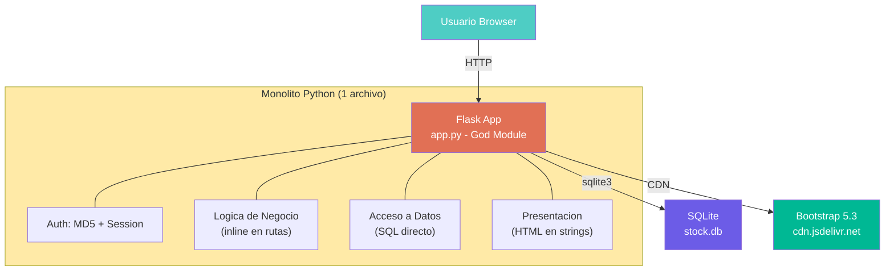

# StockControl — Aplicación de Inventarios y Bodegas

## Propósito del Sistema

StockControl es una aplicación web monolítica para la gestión de inventarios y bodegas. Permite el control de productos, categorías, bodegas/almacenes, y registra movimientos de inventario (entradas, salidas, traslados y ajustes). Incluye un dashboard con indicadores clave (stock agotado, bajo mínimo, valor de inventario) y un módulo de Kardex para trazabilidad de existencias por producto y bodega.

El sistema está diseñado como un **ejercicio de modernización** con antipatrones intencionales documentados en el código fuente.

## Stack Tecnológico

| Capa | Tecnología | Versión | Evidencia |
|---|---|---|---|
| **Lenguaje** | Python | Compatible 3.x (usa `from __future__`) | `app.py:1-2` |
| **Framework Web** | Flask | 2.2.5 | `requirements.txt:3` |
| **Servidor HTTP** | Werkzeug | 2.2.3 | `requirements.txt:4` |
| **Base de Datos** | SQLite | Embebida (sqlite3 stdlib) | `app.py:41` — variable `DATABASE` |
| **Frontend** | Bootstrap 5.3.0 (CDN) + Bootstrap Icons 1.11.0 (CDN) | — | `app.py:316-317` (template `TMPL_BASE`) |
| **Templates** | Jinja2 (render_template_string) | Bundled con Flask | `app.py:398-401` |
| **Autenticación** | Sesiones Flask (cookie) + MD5 para hashing | — | `app.py:46`, `app.py:265` |
| **Build/Package** | Sin build system; solo `requirements.txt` | — | `requirements.txt` |
| **Tests** | Script HTTP manual (`test_app.py`) | Sin framework | `test_app.py` |

## Integraciones Externas

| Integración | Tipo | Evidencia |
|---|---|---|
| CDN Bootstrap (cdn.jsdelivr.net) | Descarga de CSS/JS estáticos | `app.py:316-317` |
| Ninguna otra integración detectada | — | — |

[DECISIÓN AUTÓNOMA: No se detectaron integraciones con APIs externas, servicios SOAP, bases de datos remotas ni servicios de mensajería. El sistema es completamente autocontenido.]

## Ambientes de Despliegue

| Aspecto | Valor Detectado | Evidencia |
|---|---|---|
| Host | `0.0.0.0` (expuesto a toda la red) | `app.py:2221` |
| Puerto | 5001 | `app.py:2221` |
| Modo Debug | `True` (siempre habilitado) | `app.py:44` |
| Entorno | Único — sin separación dev/staging/prod | Sin archivos de config por ambiente |
| Deployment | Manual — sin Docker, sin CI/CD, sin scripts | Ausencia total de Dockerfile, pipeline, etc. |

## Estructura de la Solución

```
App/
├── app.py              ← God Module: 2,221 LOC — TODO el sistema en un archivo
├── test_app.py         ← Script de prueba manual (HTTP requests, sin framework)
├── requirements.txt    ← 2 dependencias (flask, werkzeug) — versiones antiguas
└── stock.db            ← Base de datos SQLite (generada en runtime)
```

## Multi-Tenancy

No aplica. El sistema es single-tenant sin ningún indicador de separación por empresa/organización.

## Metodología de Conteo LOC

| Fuente | LOC (según `_cloc-report.txt`) |
|---|---|
| **Python (app.py + test_app.py)** | **939** |
| **Total** | **939** |

Metodología: Conteo oficial proviene de `_cloc-report.txt` generado con `cloc v1.90`. Incluye 2 archivos Python. Excluye líneas en blanco (195) y comentarios (1,177).

> **Nota**: Los 1,177 comentarios son predominantemente documentación de antipatrones intencionales, no comentarios funcionales. El ratio comentarios/código es 1.25:1 — extremadamente alto, lo cual es consistente con su propósito didáctico.

## Roles del Sistema

Detectados en los datos seed (`app.py:163-170`):

| Rol | Descripción | Usuarios ejemplo |
|---|---|---|
| `ADMIN` | Administrador del sistema | admin |
| `AUXILIAR` | Operador de bodega | bodeguero1 |
| `AUDITOR` | Solo lectura / auditoría | auditor1 |
| `ADMIN_INV` | Administrador de inventario | inventario1 |

[SUPUESTO: Los roles están definidos pero NO hay lógica de autorización por rol en el código — el decorator `auth()` solo verifica sesión activa, no roles.]

## Modelo de Datos (Resumen)

7 tablas detectadas en el DDL inline (`app.py:73-143`):

| Tabla | Propósito | Tipo |
|---|---|---|
| `usuarios` | Autenticación y roles | Maestro |
| `categorias` | Clasificación de productos | Maestro |
| `productos` | Catálogo de productos/artículos | Maestro |
| `bodegas` | Ubicaciones de almacenamiento | Maestro |
| `existencias` | Stock actual por producto/bodega | Transaccional |
| `movimientos` | Header de movimientos de inventario | Transaccional |
| `detalle_movimientos` | Líneas de detalle por movimiento | Transaccional |

## Diagrama de Arquitectura de Alto Nivel



El diagrama muestra la arquitectura monolítica del sistema: un único archivo Python (`app.py`) que contiene todas las capas (presentación, negocio, datos, autenticación) sin separación alguna. La base de datos SQLite es local al filesystem y el frontend se renderiza como strings HTML con estilos vía CDN de Bootstrap.

## Hallazgos Clave

- **God Module**: Todo el sistema en un solo archivo de 2,221 líneas brutas (939 LOC efectivas)
- **Antipatrones intencionales**: El código documenta explícitamente 20+ malas prácticas como ejercicio didáctico
- **Sin separación de capas**: HTML, SQL, lógica de negocio y autenticación mezclados en cada ruta
- **Seguridad crítica**: SQL Injection directa en múltiples rutas, MD5 para passwords, secrets hardcoded
- **Sin infraestructura DevOps**: Sin Docker, CI/CD, logging, monitoring, ni gestión de ambientes
- **Dependencias mínimas pero desactualizadas**: Flask 2.2.5 y Werkzeug 2.2.3 (versiones de 2023)

## Referencias

- [reference/program-structure.md](reference/program-structure.md)
- [specialized/specialized-documentation.md](specialized/specialized-documentation.md)
