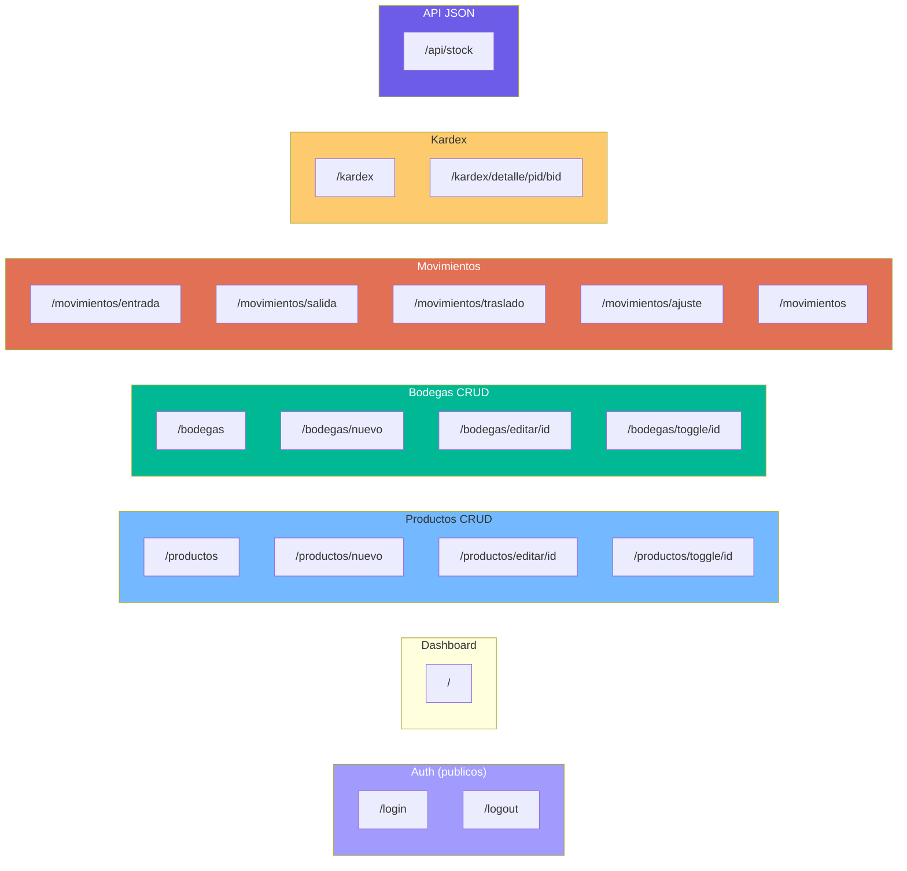

# Referencia de API — StockControl

## Endpoints del Sistema

El sistema expone **19 rutas HTTP** (HTML server-rendered) y **1 endpoint API JSON**.

### API JSON

| Método | Ruta | Auth | Request | Response | Evidencia |
|---|---|---|---|---|---|
| GET | `/api/stock` | Sí (session) | `?prod=<int>&bod=<int>` | `{"stock": <float>}` | `app.py:1810-1818` |

**Uso:** Llamado vía JavaScript `fetch()` desde el formulario de ajuste para mostrar stock actual en tiempo real.

**Limitaciones:**
- Sin rate limiting
- Sin CORS headers
- Sin versioning (`/api/v1/`)
- Auth por cookie session (no Bearer/JWT)
- Sin documentación OpenAPI/Swagger

### Rutas Web (Server-Side Rendered)

#### Autenticación

| Método | Ruta | Auth | Descripción | Evidencia |
|---|---|---|---|---|
| GET/POST | `/login` | No | Formulario de login | `app.py:442-492` |
| GET | `/logout` | No | Cierre de sesión | `app.py:495-498` |

#### Dashboard

| Método | Ruta | Auth | Descripción | Evidencia |
|---|---|---|---|---|
| GET | `/` | Sí | Panel con KPIs (10+ queries) | `app.py:500-706` |

#### Productos (CRUD)

| Método | Ruta | Auth | Descripción | Evidencia |
|---|---|---|---|---|
| GET | `/productos` | Sí | Listado con filtros (SQL Injection) | `app.py:714-810` |
| GET/POST | `/productos/nuevo` | Sí | Crear producto | `app.py:813-885` |
| GET/POST | `/productos/editar/<int:pid>` | Sí | Editar producto | `app.py:888-1030` |
| GET | `/productos/toggle/<int:pid>` | Sí | Toggle activo/inactivo | `app.py:1033-1040` |

#### Bodegas (CRUD)

| Método | Ruta | Auth | Descripción | Evidencia |
|---|---|---|---|---|
| GET | `/bodegas` | Sí | Listado con métricas | `app.py:1045-1100` |
| GET/POST | `/bodegas/nuevo` | Sí | Crear bodega | `app.py:1103-1146` |
| GET/POST | `/bodegas/editar/<int:bid>` | Sí | Editar bodega | `app.py:1149-1213` |
| GET | `/bodegas/toggle/<int:bid>` | Sí | Toggle activa/bloqueada | `app.py:1216-1226` |

#### Movimientos

| Método | Ruta | Auth | Descripción | Evidencia |
|---|---|---|---|---|
| GET/POST | `/movimientos/entrada` | Sí | Registrar entrada | `app.py:1233-1370` |
| GET/POST | `/movimientos/salida` | Sí | Registrar salida | `app.py:1377-1528` |
| GET/POST | `/movimientos/traslado` | Sí | Traslado entre bodegas | `app.py:1533-1690` |
| GET/POST | `/movimientos/ajuste` | Sí | Ajuste de inventario | `app.py:1695-1808` |
| GET | `/movimientos` | Sí | Historial con filtros (SQL Injection) | `app.py:1823-1950` |

#### Kardex

| Método | Ruta | Auth | Descripción | Evidencia |
|---|---|---|---|---|
| GET | `/kardex` | Sí | Existencias cruzadas (CROSS JOIN) | `app.py:1955-2100` |
| GET | `/kardex/detalle/<int:prod_id>/<int:bod_id>` | Sí | Historial por producto/bodega | `app.py:2103-2200` |

## Diagrama de Endpoints

## Métricas de API

| Métrica | Valor |
|---|---|
| Total endpoints | 20 (19 HTML + 1 JSON) |
| Endpoints protegidos | 18 (todos excepto login/logout) |
| Endpoints con SQL Injection | 6 (`/productos`, `/movimientos`, `/kardex` + 3 filtros) |
| Endpoints con validación | 8 (movimientos + productos/bodegas nuevo) |
| Endpoints sin validación | 12 |
| Endpoints JSON | 1 (`/api/stock`) |
| Endpoints que modifican estado via GET | 2 (`/productos/toggle`, `/bodegas/toggle`) |

## Hallazgos Clave

1. **API mínima** — Solo 1 endpoint JSON; el resto es server-rendered HTML
2. **Toggle via GET** — Los endpoints de activar/desactivar usan GET en vez de POST/PATCH
3. **SQL Injection en filtros** — 6+ endpoints con concatenación directa de querystring
4. **Sin CORS, rate limiting, versioning** — El endpoint `/api/stock` está desprotegido
5. **Auth por session cookie** — No hay token-based auth para la API

## Referencias

- [interfaces.md](interfaces.md)
- [data-models.md](data-models.md)
- [modules.md](modules.md)
- [../behavior/workflows.md](../behavior/workflows.md)
