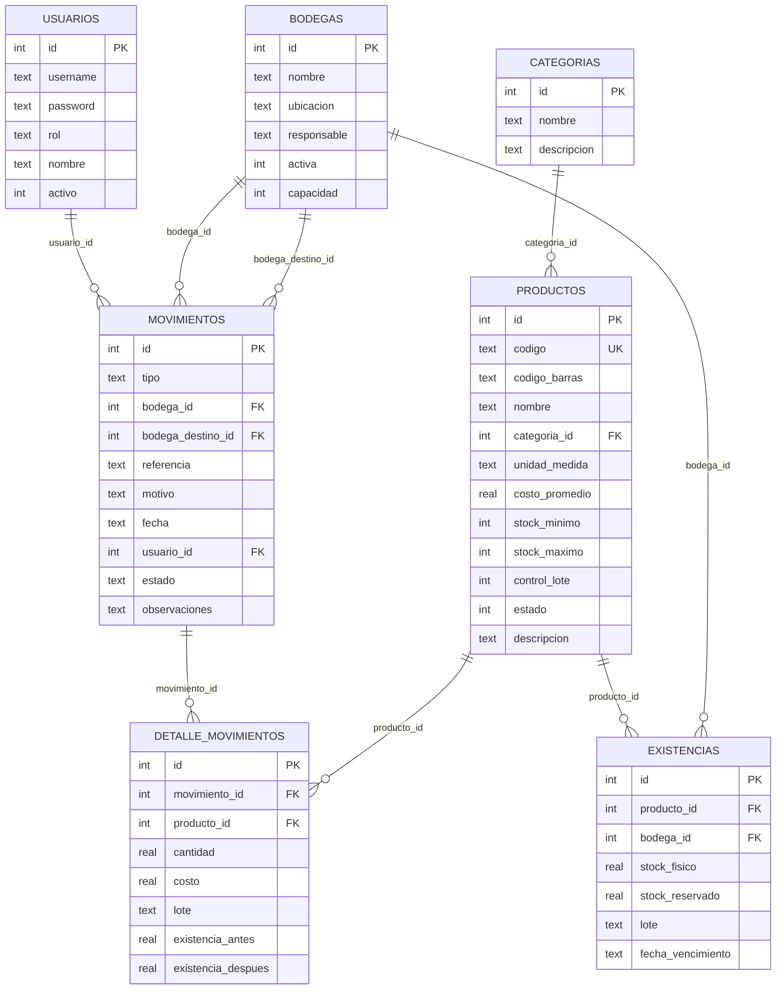

# Modelos de Datos — StockControl

## Diagrama Entidad-Relación

## Catálogo de Tablas

| Tabla | Tipo | Registros Seed | Propósito |
|---|---|---|---|
| `usuarios` | Maestro | 4 | Autenticación y roles de usuarios |
| `categorias` | Maestro | 5 | Clasificación de productos |
| `productos` | Maestro | 10 | Catálogo de artículos/productos |
| `bodegas` | Maestro | 4 | Ubicaciones de almacenamiento |
| `existencias` | Transaccional | 15 | Stock actual por producto × bodega |
| `movimientos` | Transaccional | 1 | Header de movimientos de inventario |
| `detalle_movimientos` | Transaccional | 4 | Líneas de detalle por movimiento |

## Detalle por Tabla

### `usuarios` (Maestro)

| Columna | Tipo | Constraints | Propósito |
|---|---|---|---|
| `id` | INTEGER | PK AUTOINCREMENT | Identificador |
| `username` | TEXT | NOT NULL | Login |
| `password` | TEXT | NOT NULL | Hash MD5 del password |
| `rol` | TEXT | DEFAULT 'AUXILIAR' | ADMIN, AUXILIAR, AUDITOR, ADMIN_INV |
| `nombre` | TEXT | — | Nombre display |
| `activo` | INTEGER | DEFAULT 1 | Soft delete flag |

### `productos` (Maestro)

| Columna | Tipo | Constraints | Propósito |
|---|---|---|---|
| `id` | INTEGER | PK AUTOINCREMENT | Identificador |
| `codigo` | TEXT | NOT NULL UNIQUE | Código interno (ej: PROD001) |
| `codigo_barras` | TEXT | — | EAN/UPC |
| `nombre` | TEXT | NOT NULL | Nombre descriptivo |
| `categoria_id` | INTEGER | — (FK lógica) | Referencia a categorías |
| `unidad_medida` | TEXT | — | Unidad, Caja, Kg... |
| `costo_promedio` | REAL | DEFAULT 0 | Último costo registrado |
| `stock_minimo` | INTEGER | DEFAULT 0 | Alerta de stock bajo |
| `stock_maximo` | INTEGER | DEFAULT 0 | Límite superior |
| `control_lote` | INTEGER | DEFAULT 0 | Flag 0/1 |
| `estado` | INTEGER | DEFAULT 1 | Activo/Inactivo |
| `descripcion` | TEXT | — | Texto libre |

### `existencias` (Transaccional)

| Columna | Tipo | Constraints | Propósito |
|---|---|---|---|
| `id` | INTEGER | PK AUTOINCREMENT | Identificador |
| `producto_id` | INTEGER | NOT NULL (FK lógica) | Producto |
| `bodega_id` | INTEGER | NOT NULL (FK lógica) | Bodega |
| `stock_fisico` | REAL | DEFAULT 0 | Stock actual |
| `stock_reservado` | REAL | DEFAULT 0 | Reservas (NO USADO) |
| `lote` | TEXT | DEFAULT '' | Número de lote (NO USADO activamente) |
| `fecha_vencimiento` | TEXT | DEFAULT '' | Vencimiento (NO USADO) |

### `movimientos` (Transaccional - Header)

| Columna | Tipo | Constraints | Propósito |
|---|---|---|---|
| `id` | INTEGER | PK AUTOINCREMENT | Número de movimiento |
| `tipo` | TEXT | NOT NULL | ENTRADA, SALIDA, TRASLADO, AJUSTE_POS, AJUSTE_NEG |
| `bodega_id` | INTEGER | — (FK lógica) | Bodega origen/principal |
| `bodega_destino_id` | INTEGER | — (FK lógica) | Solo para TRASLADO |
| `referencia` | TEXT | — | No. factura, orden, etc. |
| `motivo` | TEXT | — | Razón del movimiento |
| `fecha` | TEXT | NOT NULL | Timestamp ISO |
| `usuario_id` | INTEGER | — (FK lógica) | Quién registró |
| `estado` | TEXT | DEFAULT 'CONFIRMADO' | Estado (siempre CONFIRMADO) |
| `observaciones` | TEXT | — | Notas |

## Hallazgos de Calidad del Modelo

| Hallazgo | Severidad | Descripción |
|---|---|---|
| Sin FKs reales | Media | Todas las relaciones son por convención, sin `REFERENCES` |
| Columnas fantasma | Baja | `stock_reservado`, `lote`, `fecha_vencimiento` nunca se usan activamente |
| Sin índices | Media | No hay CREATE INDEX en ninguna tabla |
| Fechas como TEXT | Baja | `fecha` es TEXT, no DATE/DATETIME |
| Sin UNIQUE compuesto en existencias | Alta | Puede haber duplicados `(producto_id, bodega_id)` |
| `estado` como TEXT en movimientos | Baja | Siempre 'CONFIRMADO' — sin uso real |

## Referencias

- [interfaces.md](interfaces.md)
- [api-reference.md](api-reference.md)
- [../database/schema-analysis.md](../database/schema-analysis.md)
