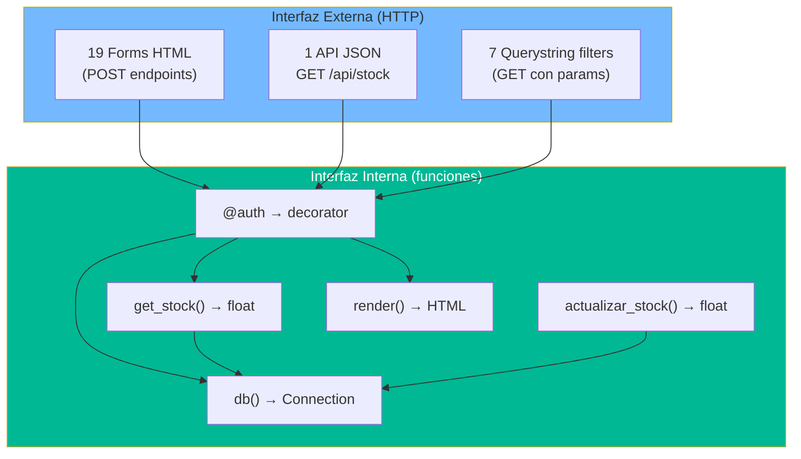

# Interfaces y Contratos — StockControl

## Interfaces del Sistema

El sistema **NO tiene interfaces formales** (no hay clases abstractas, protocolos, ni contratos tipados). La única "interfaz" es el contrato implícito HTTP entre el navegador y las rutas Flask.

## Contratos HTTP (Interfaz Usuario-Sistema)

### Formularios (Contratos de Input)

| Ruta | Método | Campos Requeridos | Campos Opcionales | Evidencia |
|---|---|---|---|---|
| `/login` | POST | `username`, `password` | — | `app.py:453-454` |
| `/productos/nuevo` | POST | `codigo`, `nombre` | `categoria_id`, `unidad_medida`, `costo_promedio`, `stock_minimo`, `stock_maximo`, `codigo_barras`, `descripcion`, `control_lote` | `app.py:841-851` |
| `/productos/editar/<id>` | POST | `nombre` | `categoria_id`, `unidad_medida`, `costo_promedio`, `stock_minimo`, `stock_maximo`, `codigo_barras`, `descripcion`, `control_lote` | `app.py:896-904` |
| `/bodegas/nuevo` | POST | `nombre` | `ubicacion`, `responsable`, `capacidad` | `app.py:1113-1116` |
| `/bodegas/editar/<id>` | POST | `nombre` | `ubicacion`, `responsable`, `capacidad` | `app.py:1164-1167` |
| `/movimientos/entrada` | POST | `bodega_id`, `prod_0`, `cant_0` | `referencia`, `motivo`, `observaciones`, `costo_N`, `lote_N` | `app.py:1263-1280` |
| `/movimientos/salida` | POST | `bodega_id`, `prod_0`, `cant_0` | `referencia`, `motivo`, `observaciones` | `app.py:1392-1405` |
| `/movimientos/traslado` | POST | `bodega_origen`, `bodega_destino`, `prod_0`, `cant_0` | `referencia`, `observaciones` | `app.py:1544-1556` |
| `/movimientos/ajuste` | POST | `bodega_id`, `producto_id`, `cantidad_fisica` | `motivo`, `observaciones` | `app.py:1716-1722` |

### API JSON

| Endpoint | Método | Parámetros | Respuesta | Evidencia |
|---|---|---|---|---|
| `/api/stock` | GET | `prod` (int), `bod` (int) | `{"stock": float}` | `app.py:1810-1818` |

## Interfaz Interna (Funciones Helper)

| Función | Firma Implícita | Retorno | Evidencia |
|---|---|---|---|
| `db()` | `() → sqlite3.Connection` | Conexión global | `app.py:225-229` |
| `md5pw(p)` | `(str) → str` | Hash MD5 hex | `app.py:232-234` |
| `now()` | `() → str` | Fecha formato `'%Y-%m-%d %H:%M:%S'` | `app.py:237-239` |
| `get_stock(prod_id, bod_id)` | `(int, int) → float` | Stock físico actual | `app.py:241-249` |
| `actualizar_stock(prod_id, bod_id, delta, costo_nuevo=None)` | `(int, int, float, Optional[float]) → float` | Nuevo stock | `app.py:252-294` |
| `auth(f)` | `(Callable) → Callable` | Decorator Flask | `app.py:297-306` |
| `render(titulo, contenido, activo='', scripts='')` | `(str, str, str, str) → str` | HTML completo | `app.py:399-410` |

## Diagrama de Interfaces

## Hallazgos Clave

1. **Sin interfaces formales** — No hay ABC, Protocol, ni type hints
2. **Sin contratos tipados** — Los parámetros se parsean con `request.form.get()` sin schema
3. **API mínima** — Solo 1 endpoint JSON (`/api/stock`)
4. **Sin versioning** — No hay `/api/v1/` ni headers de versión
5. **Sin validación de schema** — Los forms no tienen marshmallow, pydantic ni WTForms

## Referencias

- [data-models.md](data-models.md)
- [api-reference.md](api-reference.md)
- [../architecture/components.md](../architecture/components.md)
